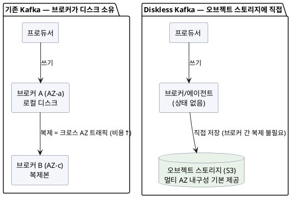

import {AnimatedBars} from '@site/src/components/blog/MonitorCharts';

<!-- truncate -->

카프카를 클라우드에서 운영하면 요금 청구서에서 주목할 만한 항목이 하나 있습니다 — **가용영역(AZ) 간 네트워크 요금**입니다. 카프카는 내구성을 위해 파티션을 여러 브로커에 복제하는데, 그 복제본이 서로 다른 AZ에 있으면 복제 트래픽이 전부 **크로스 AZ 유료 트래픽**이 됩니다. 여기에 브로커마다 붙는 로컬 디스크(EBS) 비용까지 더해집니다. **Diskless Kafka**는 이 구조를 뒤집습니다 — 브로커가 디스크를 소유하지 않고, 데이터를 **S3 같은 오브젝트 스토리지에 직접** 씁니다.

<mark>Diskless Kafka의 핵심은 "브로커 간 복제로 내구성을 만들지 말고, 이미 멀티 AZ 내구성을 가진 오브젝트 스토리지에 바로 저장하자"입니다 — 크로스 AZ 복제 비용과 로컬 디스크가 통째로 사라집니다.</mark>

## 왜 지금 이 이야기가 나오나

2026년 3월 2일, 아파치 카프카 커뮤니티가 **KIP-1150(Diskless Topics)** 를 채택했습니다(바인딩 9표·비바인딩 5표). 카프카 커뮤니티가 **오브젝트 스토리지를 데이터 계층의 미래로 공식 인정한 첫 사례**입니다. 다만 실제 동작을 구현하는 하위 제안(KIP-1163 Diskless Core, KIP-1164 Diskless Coordinator)은 2026년 8월 기준 아직 **논의 중**이라, 아파치 카프카 본체의 정식 기능은 아닙니다.

정식화 이전에도, 이미 여러 제품이 같은 아이디어를 구현해 운영에 쓰이고 있습니다. 그래서 "표준이 오기 전에 먼저 검증된" 흐름을 이해해 둘 가치가 있습니다.

## 기존 Kafka vs Diskless — 무엇이 다른가

기존 카프카에서 브로커는 **데이터의 주인**입니다. 프로듀서가 리더 브로커에 쓰면, 리더가 다른 브로커(대개 다른 AZ)로 복제해 내구성을 확보합니다. 이 복제 트래픽이 비용의 큰 축입니다.

Diskless는 브로커에서 **디스크와 복제 책임을 제거합니다.** 브로커(또는 상태 없는 에이전트)는 들어온 데이터를 곧바로 오브젝트 스토리지에 쓰고, 오브젝트 스토리지가 알아서 여러 AZ에 내구성 있게 보관합니다. 브로커는 상태가 없으니 아무 노드나 어떤 파티션도 처리할 수 있습니다.

PlantUML 코드

바뀌는 것을 한 줄씩 정리하면 이렇습니다.

- **복제 방식**: 브로커 간 복제(N배 쓰기·크로스 AZ) → 오브젝트 스토리지가 내구성 담당(복제 트래픽 제거).
- **브로커 상태**: 파티션 리더가 디스크를 소유(상태 있음) → 브로커 상태 없음(어느 노드나 처리, 리밸런싱·데이터 이동 부담↓).
- **확장**: 디스크 용량에 묶임 → 스토리지와 컴퓨트가 분리돼 독립 확장.

<mark>브로커가 상태를 잃으면, 카프카 운영에서 골치였던 파티션 재배치·디스크 관리·핫 브로커 문제의 상당 부분이 오브젝트 스토리지 쪽으로 넘어갑니다.</mark> 파티션·복제·리밸런싱의 기존 동작은 [Kafka 클러스터 종합 정리](./kafka-cluster-replication-consumer-group)에서 다뤘습니다.

## 비용이 줄어드는 이유 — 그리고 대가

가장 큰 동기는 **비용**입니다. 크로스 AZ 복제 트래픽이 사라지고 로컬 디스크(EBS)가 없어지면서, 여러 제품이 **총소유비용(TCO) 절감**을 내세웁니다. WarpStream은 아파치·매니지드 카프카(MSK) 대비 **48~90%** 절감을, AutoMQ는 약 **80%** 절감을 보고합니다(각 벤더 자체 수치이므로 워크로드로 검증 필요).

<AnimatedBars
  title="총소유비용(TCO) 상대 비교 — 벤더 보고치 기준(참고용)"
  data={[10, 3.5, 2]}
  labels={["기존 Kafka(기준)", "Diskless(중간)", "Diskless(최대 절감)"]}
  yMax={11}
  yLabel="상대 비용"
  tone="good"
/>

공짜는 아닙니다. **대가는 지연(latency)** 입니다. 오브젝트 스토리지는 로컬 디스크보다 응답이 느려, 쓰기 확정까지 **수백 밀리초**(WarpStream 기준 P99 대략 400~600ms)가 걸립니다. 로컬 디스크 카프카가 한 자리~두 자리 ms인 것과 대비됩니다.

<mark>Diskless는 "지연을 조금 감수하고 비용을 크게 아끼는" 트레이드오프입니다 — 로그·이벤트·분석 파이프라인처럼 수백 ms 지연이 문제없는 곳에 맞고, 실시간 저지연이 생명인 경로에는 맞지 않습니다.</mark>

## 어떤 구현체가 있나

같은 방향이지만 세부는 제각각입니다. 표준(KIP-1150) 이전에 이미 여러 제품이 시장에 나와 있습니다.

| 제품 | 방식 | 특징 |
|---|---|---|
| **WarpStream** | 상태 없는 에이전트, 로컬 WAL 없이 **S3 직행** | P99 약 400~600ms. 현재 Confluent(IBM) 소속. Grafana·Character.AI·Cursor·Robinhood 등 사용 |
| **Redpanda Cloud Topics** | 쓰기 경로 페이로드는 오브젝트 스토리지로, **메타데이터·Raft 합의는 로컬** | 기존 Redpanda 엔진에 얹은 하이브리드 |
| **AutoMQ** | S3 네이티브 재설계 | 카프카 프로토콜 호환, 비용 절감 강조 |
| **Aiven Inkless** | **KIP-1150의 오픈(AGPLv3) MVP 포크** | Kafka 4.x 기반, 코디네이터로 PostgreSQL 사용, S3·GCS·Azure Blob 지원 |

- **프로토콜 호환**이 공통점입니다. 대부분 기존 카프카 클라이언트를 그대로 쓸 수 있다고 표방합니다(검증은 필요).
- **완전 무상태(WarpStream) vs 하이브리드(Redpanda)** 로 나뉩니다. 무상태는 운영이 단순하지만 지연이 크고, 하이브리드는 메타데이터를 로컬에 둬 지연·기능 균형을 노립니다.

## 언제 쓰고, 언제 피하나

트렌드라고 무조건 갈아탈 이유는 없습니다. 성격에 맞춰 판단합니다.

- **맞는 경우**: 로그 수집·클릭스트림·CDC·분석/ETL 피드처럼 **처리량은 크지만 수백 ms 지연이 허용**되는 워크로드. 멀티 AZ로 크로스 AZ 복제비가 크게 나오는 클라우드 환경. 트래픽이 들쭉날쭉해 **컴퓨트·스토리지 분리 확장**이 이득인 경우.
- **피하거나 신중할 경우**: 주문·결제 이벤트처럼 **저지연이 중요한 경로**, 밀리초 단위 응답이 필요한 실시간 처리. 온프레미스라 크로스 AZ 비용 이점이 없는 환경. 아직 **아파치 본체 표준이 아니므로**(2026년 기준) 특정 벤더에 대한 종속·성숙도를 감안해야 하는 상황.

현실적으로는 **하이브리드**가 답인 경우가 많습니다 — 저지연 토픽은 기존 방식, 대용량·지연 둔감 토픽은 Diskless로 나누는 식입니다.

## 정리

- **Diskless Kafka**는 브로커가 로컬 디스크·복제를 버리고 **오브젝트 스토리지에 직접** 저장하는 방향입니다.
- 동기는 **비용** — 크로스 AZ 복제 트래픽과 로컬 디스크가 사라져 클라우드 TCO가 크게 줍니다(벤더 보고 48~90%).
- 대가는 **지연** — 수백 ms. 로그·분석엔 맞고, 실시간 저지연엔 안 맞습니다.
- 표준으로는 **KIP-1150이 2026-03 채택**됐지만 코어 구현은 논의 중입니다. 시장은 WarpStream·Redpanda·AutoMQ·Aiven Inkless가 먼저 구현했습니다.
- 판단은 **토픽 성격별로** — 저지연은 기존, 대용량·지연 둔감은 Diskless. 하이브리드가 현실적 답인 경우가 많습니다.

<mark>"브로커가 디스크를 소유한다"는 카프카의 오래된 전제가 클라우드 비용 앞에서 흔들리고 있습니다 — 카프카를 왜 빠르게 만들었는지([Kafka는 왜 빠른가](./kafka-why-fast))를 알면, 그 전제를 바꿀 때 무엇을 얻고 무엇을 포기하는지가 보입니다.</mark>

## 참고

- [KIP-1150: Diskless Topics (Apache Kafka Wiki)](https://cwiki.apache.org/confluence/display/KAFKA/KIP-1150%3A+Diskless+Topics)
- [Diskless Kafka: Object Storage, KIP-1150, and Kafka's Future (SoftwareMill)](https://softwaremill.com/diskless-kafka-object-storage-kip-1150-and-kafkas-future/)
- [A Fork in the Road: Deciding Kafka's Diskless Future (Jack Vanlightly)](https://jack-vanlightly.com/blog/2025/10/22/a-fork-in-the-road-deciding-kafkas-diskless-future)
