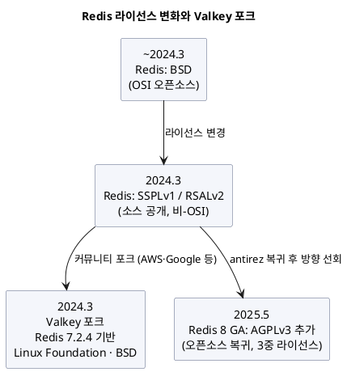

import {AnimatedBars} from '@site/src/components/blog/MonitorCharts';

<!-- truncate -->

캐시·분산 락·랭킹에 흔히 쓰는 그 Redis를 두고, 최근 몇 년 사이 **라이선스 분쟁과 포크**라는 큰 사건이 있었습니다. 결과적으로 지금은 **Redis**와 **Valkey**라는 사실상 형제 격 프로젝트 둘을 두고 고르게 됐습니다. 이름은 비슷하고 명령어도 거의 같지만, 태생과 방향이 다릅니다. 무슨 일이 있었고, 실무에서 지금 무엇을 고르면 되는지 정리합니다.

<mark>Valkey는 Redis 7.2.4에서 갈라져 나온 오픈소스 포크이고, Redis는 라이선스를 한 바퀴 돌아 다시 오픈소스(AGPLv3)로 돌아왔습니다 — 둘은 명령어 호환은 높지만 거버넌스·라이선스·기능 방향이 갈립니다.</mark>

## 무슨 일이 있었나 — 라이선스 타임라인

핵심 사건을 시간순으로 봅니다.

PlantUML 코드

- **2024년 3월** — Redis Inc.가 오랫동안 쓰던 **BSD**(상용·비공개 제품에 넣어 재배포해도 거의 의무가 없는 **허용적 오픈소스 라이선스**)를 버리고, **SSPLv1 / RSALv2** 이중 라이선스로 바꿉니다. 소스는 공개되지만 OSI가 인정하는 오픈소스는 아니고, 클라우드 사업자가 매니지드 서비스로 파는 것을 제약합니다.
- **2024년 3월** — 이에 반발한 커뮤니티(AWS·Google 등이 참여)가 마지막 BSD 버전인 **Redis 7.2.4를 포크**해 **Valkey**를 만들고, **Linux Foundation** 산하에 두어 **BSD**를 유지합니다.
- **2024년 11월** — Redis 원작자 **antirez(Salvatore Sanfilippo)** 가 Redis Inc.에 복귀합니다.
- **2025년 5월** — **Redis 8.0 GA**와 함께 **AGPLv3**(OSI 승인 오픈소스)를 라이선스 선택지로 추가합니다. 이제 Redis는 RSALv2·SSPLv1·AGPLv3의 **3중 라이선스**로, 사실상 **오픈소스로 복귀**했습니다.

<mark>정리하면, Redis는 "오픈소스 → 소스공개(비OSI) → 다시 오픈소스(AGPL)"로 한 바퀴 돌았고, 그 사이 생긴 Valkey는 BSD로 계속 남았습니다.</mark>

## 무엇이 어떻게 다른가

명령어·프로토콜은 Valkey가 Redis 7.2.4 포크라 **높은 호환성**을 유지합니다(기존 클라이언트·자료구조 대부분 그대로). 차이는 라이선스·거버넌스·그리고 이후 갈라진 기능·성능입니다.

| 항목 | Valkey | Redis (8+) |
|---|---|---|
| **라이선스** | BSD (OSI 오픈소스) | RSALv2 / SSPLv1 / **AGPLv3** 중 택1 |
| **거버넌스** | Linux Foundation, 여러 회사가 참여한 기술운영위(TSC) — 단일 지배 주체 없음 | Redis Inc. 주도 |
| **출발점** | Redis 7.2.4 포크 | 원조 코드베이스 계속 |
| **성능(방향)** | 8.0에서 **I/O 스레딩** 강화 — 높은 커넥션 수에서 처리량↑ | 8.0에서 명령 성능 개선(일부 최대 87%↑), 신기능 |
| **신기능** | 커뮤니티 중심(코어 안정성·성능) | **벡터 셋(Vector Sets)** 등 Redis Inc. 주도 기능 |
| **매니지드** | AWS ElastiCache·MemoryDB(Valkey), GCP Memorystore, Akamai | AWS/GCP의 Redis OSS 옵션 등 |

성능은 버전·워크로드에 따라 엎치락뒤치락합니다. Valkey 8.0은 **I/O 스레딩**을 개선해 커넥션이 많을 때 이득을 보고(합성 벤치에서 초당 100만 요청대 보고), Redis 8.0도 명령 경로를 최적화했습니다. **"어느 쪽이 절대적으로 빠르다"는 단정은 위험**하고, 합성 벤치마크·벤더 수치만 믿지 말고 **우리 서비스의 실제 트래픽 패턴으로 직접 성능을 측정해 비교**하는 게 맞습니다.

<AnimatedBars
  title="매니지드 캐시 비용 — 한 사례(Valkey로 이관 시 절감, 참고용)"
  data={[10, 4]}
  labels={["기존 Redis 클러스터", "ElastiCache Valkey 이관"]}
  yMax={11}
  yLabel="상대 비용"
  tone="good"
/>

실제로 **비용**이 이동을 이끄는 경우가 많습니다. 매니지드 Valkey가 대개 더 저렴하게 책정돼, 한 사례에서는 캐시 인프라의 상당 부분을 ElastiCache Valkey로 옮겨 **캐싱 비용을 약 60% 절감**한 보고도 있습니다(환경마다 다르므로 참고용).

## 실무에선 무엇을 골라야 하나

대부분의 애플리케이션 코드는 둘 중 무엇을 써도 **거의 그대로 동작**합니다(명령어 호환). 그래서 선택은 성능보다 **라이선스·운영·기능** 관점에서 갈립니다.

- **매니지드로 쓰는 대다수** — 클라우드 매니지드(ElastiCache 등)를 쓴다면, 콘솔에서 고르는 문제입니다. **가격·성능이 유리한 Valkey** 쪽이 기본 후보가 되는 경우가 많습니다. 애플리케이션 코드 변경은 사실상 없습니다.
- **라이선스가 중요한 조직** — 사내 배포·재배포·SaaS 임베드 등으로 **라이선스 조건이 걸리는** 곳이라면, **BSD(Valkey)** 가 가장 자유롭습니다. Redis의 AGPLv3는 오픈소스지만 네트워크 사용까지 소스 공개 의무가 미치는 조항이 있어 상용 임베드 시 검토가 필요합니다.
- **Redis 전용 신기능이 필요** — **벡터 셋** 같은 Redis Inc. 주도 기능이 꼭 필요하면 Redis 8을 봅니다. AI/검색 쪽에서 Redis가 밀고 있는 영역입니다.
- **드롭인 교체** — 기존 Redis(7.2 계열)를 쓰고 있고 라이선스·비용만 정리하고 싶다면, Valkey는 **거의 드롭인(drop-in — 코드·설정을 바꾸지 않고 그대로 갈아 끼울 수 있는 대체)** 입니다. 클라이언트([Redisson·RedisTemplate](./redisson-vs-redistemplate))도 그대로 붙습니다.

<mark>애플리케이션 입장에선 "무엇을 쓰든 명령어는 같다"가 핵심이라, 선택은 성능 경쟁보다 라이선스·비용·필요 기능으로 결정하는 게 맞습니다.</mark>

Redis의 자료구조 자체(무엇을 언제 쓰나)는 [Redis 자료구조 10가지](./redis-data-structures)에서, 싱글스레드인데 빠른 이유는 [Redis는 왜 싱글스레드인데 빠른가](./redis-single-thread-fast)에서 다뤘습니다 — 이 내용은 Valkey에도 그대로 적용됩니다.

## 정리

- **2024.3** Redis가 BSD→SSPL/RSAL로 바꾸자 커뮤니티가 **Valkey**(Redis 7.2.4 포크, BSD, Linux Foundation)를 만들었다.
- **2025.5** Redis 8이 **AGPLv3**를 추가해 오픈소스로 복귀(3중 라이선스). antirez 복귀가 계기.
- 명령어·프로토콜은 **호환성이 높다**. 선택은 성능보다 **라이선스·거버넌스·비용·필요 기능**으로 갈린다.
- 매니지드로 쓰면 대개 **가격·성능이 유리한 Valkey**가 무난, 라이선스 자유도가 중요하면 **BSD(Valkey)**, Redis 전용 기능(벡터 셋 등)이 필요하면 **Redis 8**.
- 성능은 버전·워크로드에 따라 다르니 **우리 서비스의 실제 트래픽으로 직접 측정**해 비교하는 게 맞다.

## 참고

- [Redis is open source again — antirez](https://antirez.com/news/151)
- [Redis 8 GA: Fast, scalable, and feature-rich (Redis Blog)](https://redis.io/blog/redis-8-ga/)
- [What is Valkey? A comparison with Redis (Redis Blog)](https://redis.io/blog/what-is-valkey/)
- [Valkey (Linux Foundation)](https://valkey.io/)
