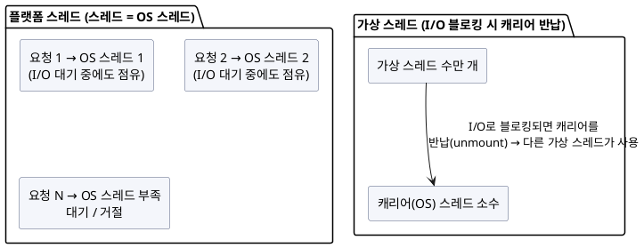

import {AnimatedLineChart} from '@site/src/components/blog/MonitorCharts';

<!-- truncate -->

스프링 부트 설정 한 줄(`spring.threads.virtual.enabled=true`)로 켤 수 있게 되면서, 가상 스레드(virtual thread)는 "일단 켜면 공짜로 빨라지는 옵션"처럼 소개되곤 합니다. 절반은 맞고 절반은 위험합니다. 가상 스레드는 **특정 종류의 워크로드**에서 극적인 확장성을 주지만, 엉뚱한 곳에 켜면 이득이 없거나 오히려 발목을 잡습니다. 언제 이득이고 언제 독인지 정리합니다.

<mark>가상 스레드는 "블로킹 I/O를 기다리는 동안 OS 스레드를 붙잡아 두지 않는다"가 전부입니다 — I/O 대기가 많은 서버는 스레드 풀 고갈에서 벗어나고, CPU를 태우는 작업은 아무 이득이 없습니다.</mark>

## 문제: 스레드 하나가 OS 스레드 하나

전통적인 스프링 MVC는 **요청 하나에 스레드 하나**(thread-per-request)를 씁니다. 이 스레드는 **플랫폼 스레드** — 즉 OS 스레드와 1:1입니다. 문제는 그 요청이 DB나 외부 API를 호출하고 **응답을 기다리는 동안에도 OS 스레드를 그대로 점유**한다는 점입니다.

OS 스레드는 비쌉니다(스택 메모리·컨텍스트 스위칭). 그래서 톰캣 스레드 풀은 보통 200개 안팎으로 제한됩니다. 외부 호출이 느려지면 200개가 전부 **대기 상태로 묶여** 새 요청을 못 받습니다 — 이게 [외부 API 하나가 느려지자 서버 전체가 멈춘](./external-api-timeout-server-hang) 그 상황입니다.

<details>
<summary>PlantUML 코드</summary>



</details>


## 가상 스레드가 하는 일

**가상 스레드**(JEP 444, **JDK 21에서 정식**)는 JVM이 관리하는 가벼운 스레드입니다. 수백만 개를 만들어도 됩니다. 핵심은 **블로킹 시 동작**입니다.

- 가상 스레드는 실행될 때 **캐리어(carrier) 스레드**(진짜 OS 스레드)에 잠깐 올라탑니다(mount).
- 그 안에서 DB·네트워크 I/O로 **블로킹되면**, JVM이 가상 스레드를 캐리어에서 **내려놓고(unmount)** 캐리어를 반납합니다. 그 캐리어는 곧바로 **다른 가상 스레드**를 실행합니다.
- I/O가 끝나면 가상 스레드는 다시 아무 캐리어에나 올라타 이어서 실행됩니다.

결과적으로 **소수의 OS 스레드로 수만 개의 동시 요청**을 처리할 수 있습니다. 코드는 여전히 익숙한 **동기·블로킹 스타일** 그대로입니다 — 리액티브(WebFlux)처럼 콜백·연산자로 뒤집을 필요가 없습니다. 이게 가상 스레드의 진짜 매력입니다.

```java
// 가상 스레드는 풀링하지 않는다 — 요청마다 새로 만든다
try (var executor = Executors.newVirtualThreadPerTaskExecutor()) {
    executor.submit(() -> {
        var user = userClient.fetch(id);   // 블로킹 호출이어도 캐리어는 반납된다
        var orders = orderClient.fetch(id); // 코드는 그냥 순차·동기 스타일
        return merge(user, orders);
    });
}
```

Spring Boot는 **3.2부터** 설정 한 줄로 톰캣·`@Async`·리스너 등에 가상 스레드를 적용합니다.

```yaml
spring:
  threads:
    virtual:
      enabled: true
```

<AnimatedLineChart
  title="I/O 바운드 서버 — 동시 요청↑에 따른 처리량"
  data={[20, 40, 60, 70, 72, 72, 71, 70]}
  data2={[20, 40, 80, 150, 260, 380, 480, 560]}
  yMax={600}
  tone="bad"
  tone2="good"
  xLabel="동시 요청 →"
  unit="처리량(상대)"
  legend={["플랫폼 스레드(풀 200 고갈)", "가상 스레드"]}
/>

<mark>가상 스레드의 이득은 "블로킹 I/O를 기다리는 시간"에서 나옵니다 — 그 시간 동안 OS 스레드를 놓아주므로, I/O 대기가 많을수록 이득이 큽니다.</mark>

## 언제 독인가 — 세 가지 주의점

### ① CPU 바운드 작업엔 이득이 없다

가상 스레드는 **OS 스레드를 더 만들어 주지 않습니다.** 실제 병렬 연산 능력은 CPU 코어 수에 묶여 있습니다. 이미지 변환·암호화·대량 계산처럼 **CPU를 계속 태우는** 작업은 블로킹으로 캐리어를 반납할 일이 없어, 가상 스레드로 바꿔도 빨라지지 않습니다. 이런 일은 기존 [스레드 풀](./spring-boot-thread-pools)로 코어 수에 맞춰 제한하는 게 맞습니다.

### ② synchronized 핀닝 (JDK 24에서 해결)

가상 스레드가 `synchronized` 블록 **안에서 블로킹**되면, 그 가상 스레드가 캐리어에 **고정(pinning)** 돼 반납되지 않는 문제가 있었습니다. 핫 경로의 `synchronized`(특히 내가 손 못 대는 라이브러리 내부)가 가상 스레드의 확장성을 갉아먹었습니다.

이건 **JDK 24(2025-03)의 JEP 491**에서 해결됐습니다. 모니터가 캐리어가 아니라 **가상 스레드 자신에 묶이도록** 바뀌어, `synchronized` 안에서 블로킹해도 캐리어를 반납합니다.

- **JDK 21~23**을 쓴다면: 핫 경로의 `synchronized`를 **`ReentrantLock`으로** 바꾸고, `jdk.VirtualThreadPinned` JFR 이벤트로 핀닝을 감시합니다.
- **JDK 24+** 라면: 이 걱정은 대부분 사라졌습니다 — 가상 스레드를 켜기 훨씬 편해진 이유입니다.

### ③ ThreadLocal·풀링 오해

- 가상 스레드는 **수만 개**가 존재할 수 있어, 각 스레드가 무거운 `ThreadLocal`을 들고 있으면 메모리가 급증합니다. 요청 컨텍스트 공유는 `ThreadLocal` 대신 [JDK 25에서 정식이 된 Scoped Values](./jdk-25-highlights) 같은 대안이 더 맞습니다.
- 가상 스레드는 **풀링하지 않습니다.** 값싼 자원이라 요청마다 새로 만드는 게 정석입니다(`newVirtualThreadPerTaskExecutor`). 기존처럼 풀에 넣어 재사용하려 들면 취지가 무색해집니다.

<mark>가상 스레드는 "블로킹 I/O가 많은 서버"의 특효약이지, CPU 바운드나 잘못된 동시성 습관까지 고쳐 주지는 않습니다 — 켜기 전에 내 병목이 I/O 대기인지부터 확인해야 합니다.</mark>

## 적용 판단 — 켤까 말까

- **켜면 좋은 경우**: 요청당 **외부 호출·DB·네트워크 대기가 많은** 전형적인 MVC 백엔드(마이크로서비스 게이트웨이, 조합 API 등). 동시 커넥션이 많아 톰캣 풀이 병목인 서비스. **JDK 24+**(핀닝 걱정이 적음).
- **신중할 경우**: **JDK 21~23** + 핫 경로에 `synchronized`가 많은 코드(핀닝 점검 필수). **CPU 바운드** 비중이 큰 워크로드. 이미 리액티브(WebFlux)로 잘 동작하는 시스템(굳이 갈아탈 이유는 약함).

리액티브와의 관계도 정리하면, 가상 스레드는 **"동기 코드의 단순함 + 높은 동시성"** 을 노립니다. 리액티브의 백프레셔·스트림 연산이 꼭 필요한 게 아니라면, 새 프로젝트에서 높은 동시성은 가상 스레드로 가는 편이 코드가 훨씬 단순합니다.

## 정리

- 가상 스레드(JEP 444, **JDK 21 정식**)는 **블로킹 I/O 대기 중 OS 스레드를 반납**해, 소수 OS 스레드로 수만 요청을 처리한다. 코드는 동기·블로킹 스타일 그대로.
- Spring Boot **3.2+**는 `spring.threads.virtual.enabled=true` 한 줄로 적용.
- **I/O 바운드**에 특효, **CPU 바운드**엔 이득 없음.
- `synchronized` **핀닝**은 **JDK 24(JEP 491)** 에서 해결 — 21~23이면 `ReentrantLock`·JFR로 대비.
- `ThreadLocal` 남용·풀링은 주의. 컨텍스트 공유는 **Scoped Values**, 스레드는 **풀링하지 말고** 요청마다 생성.
- 판단: 내 병목이 **I/O 대기**이고 **JDK 24+**라면 켤 이유가 충분하다.

## 참고

- [JEP 444: Virtual Threads (JDK 21)](https://openjdk.org/jeps/444)
- [JEP 491: Synchronize Virtual Threads without Pinning (JDK 24)](https://openjdk.org/jeps/491)
- [Spring Boot — Virtual Threads](https://docs.spring.io/spring-boot/reference/features/spring-application.html)
