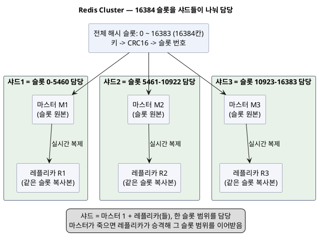
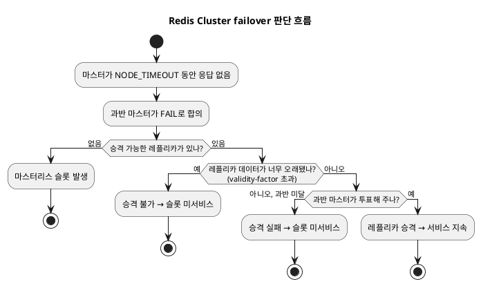
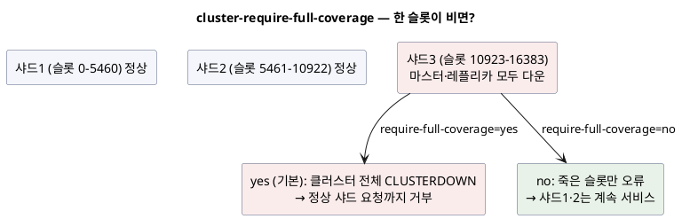

<!-- truncate -->

Redis Cluster는 마스터가 죽으면 레플리카가 자동으로 승격돼 서비스가 이어진다고 알려져 있습니다. 그런데 실제로 **failover가 일어나지 않아** 슬롯이 통째로 죽거나, 심지어 **정상 샤드까지 요청을 거부**하는 전면 장애가 나는 경우가 있습니다. 이건 버그라기보다 **Redis Cluster의 설계된 동작**을 이해하지 못했을 때 생기는 일이 많습니다 — 공식 클러스터 스펙에 그 조건이 명시돼 있고, 관련 이슈도 여러 건 보고돼 있습니다.

<mark>Redis Cluster의 failover는 "마스터가 죽으면 무조건 승격"이 아니라, **과반 마스터의 합의와 투표**·**레플리카의 자격**·**슬롯 커버리지 설정**이라는 여러 조건을 모두 통과해야 일어납니다 — 하나라도 어긋나면 승격이 안 되거나 클러스터 전체가 멈춥니다.</mark>

Redis 장애를 락 관점에서 본 [분산락과 Redis 장애](./distributed-lock-and-redis-failure), 대용량에서 주의할 점은 [대용량 트래픽에서 Redis](./redis-large-scale-pitfalls)에서 다뤘고, 이 글은 **클러스터 failover 자체**에 집중합니다.

## 먼저: 해시 슬롯이란?

Redis Cluster는 데이터를 여러 마스터(샤드)에 나눠 저장하는데, 그 배분 기준이 **해시 슬롯(hash slot)** 입니다. 전체 키 공간을 **16384개의 슬롯**으로 나누고, 각 마스터가 그중 일정 범위를 담당합니다.

먼저 **슬롯과 노드의 관계**를 정리합니다.

- **노드** = Redis 서버 하나(프로세스·인스턴스)로, **마스터**이거나 그 **레플리카**입니다.
- **슬롯** = 키를 나눈 논리적 칸(16384개). **한 마스터 노드가 여러 슬롯(범위)을 담당**하고, 그 마스터의 **레플리카 노드는 같은 슬롯의 복사본**을 갖습니다. (마스터 1 + 레플리카들 = **샤드**, 한 슬롯 범위를 담당)
- 즉 **슬롯은 논리적 구획, 노드는 실제 서버**입니다. 마스터 노드가 죽으면 그 노드가 담당하던 슬롯이 서비스되지 않고, 레플리카가 승격해야 그 슬롯을 이어받습니다.

그림으로 보면 이렇습니다. 전체 16384개 슬롯을 **샤드들이 범위로 나눠** 맡고, 한 샤드는 **마스터 1대 + 레플리카(복사본)** 로 이뤄집니다.

<details>
<summary>PlantUML 코드</summary>



</details>


그 밖의 규칙은 이렇습니다.

- 어떤 키가 어느 슬롯에 속하는지는 **`CRC16(key) % 16384`** 로 정해집니다.
- 예를 들어 마스터 3대면 대략 **슬롯 0–5460 / 5461–10922 / 10923–16383** 을 나눠 맡습니다.
- 클라이언트가 키를 요청하면, 그 키의 슬롯을 담당하는 마스터로 찾아갑니다(엉뚱한 노드에 물으면 `MOVED` 리다이렉트로 안내).

<mark>슬롯은 "키를 어느 마스터에 둘지" 정하는 배분 단위이고, "슬롯이 죽었다"는 건 그 범위의 키를 담당할 노드(마스터·레플리카)가 모두 사라졌다는 뜻입니다.</mark> 그래서 아래 이야기에서 "한 슬롯을 담당할 노드가 없어진다"는 곧 "그 키들을 아무도 서비스하지 못한다"가 됩니다.

## failover는 실제로 어떻게 일어나나

공식 스펙 기준으로, 마스터 하나가 죽었을 때 승격까지의 조건은 이렇습니다.

1. 마스터가 **과반(majority)의 마스터**들에게 `cluster-node-timeout` 이상 응답하지 않아야 합니다. 스펙 표현으로 *"a master to be failed over it must be unreachable by the majority of masters for at least NODE_TIMEOUT"*.
2. 과반 마스터가 그 노드를 `FAIL`로 합의합니다(가십으로 전파된 `PFAIL`이 임계를 넘으면 `FAIL`).
3. 죽은 마스터의 레플리카가 **승격 자격**을 갖추고, **과반 마스터의 투표**를 받아야 승격됩니다.

<details>
<summary>PlantUML 코드</summary>



</details>


이 흐름의 어느 단계에서든 막히면 "마스터가 죽었는데 승격이 안 되는" 상황이 됩니다. 단계별로 흔한 원인을 봅니다.

## 원인 ① 마스터 과반 부족 — AZ 장애에 가장 취약한 지점

failover는 **과반 마스터의 투표**로 승인됩니다. 여기서 핵심은 **레플리카가 살아 있어도, 투표해 줄 마스터가 과반이 안 되면 승격이 안 된다**는 점입니다.

- 마스터 3대(각 1 레플리카)인 클러스터에서 **한 AZ가 통째로 내려가** 마스터 2대가 동시에 사라지면, 남은 마스터는 1대뿐 — 과반(2/3)이 안 됩니다. 그 AZ의 레플리카들이 다른 AZ에 살아 있어도 **마스터 과반 미달로 승격 실패**합니다.
- 스펙상 **소수 파티션에 갇힌 마스터는 쓰기를 멈춥니다**. 과반을 확보한 쪽만 쓰기를 이어갑니다.

<mark>failover는 "죽은 마스터의 레플리카가 있느냐"가 아니라 "살아남은 마스터가 과반이냐"에 달려 있습니다 — 그래서 마스터를 홀수(최소 3, 권장 5)로, 그리고 AZ에 고르게 분산해야 한 AZ 장애에도 과반이 유지됩니다.</mark>

### 대응 방법

파라미터가 아니라 **구성**으로 해결합니다. **마스터를 홀수(3~5대)로, 여러 AZ에 고르게** 배치합니다. 매니지드(ElastiCache 등)라면 **Multi-AZ**를 켜고 노드를 여러 AZ에 나눠 만듭니다.

## 원인 ② cluster-require-full-coverage — 한 슬롯 때문에 전체가 멈춘다

가장 넓게 번지는 장애입니다. Redis Cluster는 16384개 해시 슬롯이 **모두** 서비스돼야 명령을 받습니다. `cluster-require-full-coverage`가 **기본값 `yes`** 이면, 슬롯 하나라도 담당 노드가 모두 사라지는 순간 **클러스터 전체가 `cluster_state:fail`**(CLUSTERDOWN)이 되어, **정상인 다른 샤드의 요청까지 거부**합니다.

<details>
<summary>PlantUML 코드</summary>



</details>


- 그래서 앞의 원인 ①(마스터 과반 미달로 한 샤드 승격 실패)이 벌어지면, 기본 설정에서는 그 한 샤드 때문에 **전 클러스터가 CLUSTERDOWN**으로 번집니다.
- `cluster-require-full-coverage no`로 두면, 죽은 슬롯의 키만 오류를 내고 **나머지 샤드는 계속 서비스**합니다. 부분 가용성을 택하는 것입니다.

<mark>기본값(`yes`)은 "일부만 잘못 응답하느니 전체를 멈춘다"는 정합성 우선 선택입니다 — 부분 장애가 전면 장애로 번지는 걸 막으려면 `no`로 두어 살아 있는 샤드라도 서비스하게 하는 편이 낫습니다.</mark>

### 대응 방법

**각 노드 `redis.conf`** 에 설정합니다. 매니지드(AWS ElastiCache 등)는 `redis.conf`를 직접 못 고치니 **파라미터 그룹**(설정값 묶음)에서 바꾸고, 직접 운영하는 Redis는 재시작 없이 **`CONFIG SET` 명령**으로 런타임에 바꿀 수도 있습니다.

```properties
# 부분 가용성을 원하면 no — 죽은 슬롯만 오류, 나머지 샤드는 계속 서비스
cluster-require-full-coverage no
```

```bash
# 재시작 없이 런타임 변경 (직접 운영 시)
redis-cli -c CONFIG SET cluster-require-full-coverage no
```

## 원인 ③ node-timeout — 짧으면 불필요한 failover, 길면 감지 지연

`cluster-node-timeout`(기본 `15000`ms)은 실패 감지의 기준 시계입니다. 뒤의 원인 ④(레플리카 자격)도 이 값을 기준으로 삼으므로 먼저 봅니다.

- **너무 짧으면**: 느린 네트워크·GC 스톱 등 일시적 지연을 장애로 오판해 **불필요한 failover**(false failover)가 일어납니다. 승격·재동기화가 반복되며 오히려 불안정해집니다.
- **너무 길면**: 진짜 장애를 늦게 감지해 **failover가 지연**됩니다. 그동안 해당 슬롯은 죽어 있습니다.
- 네트워크 품질과 허용 다운타임에 맞춰 잡습니다(빠른 감지 2~5초 vs 안정적 15초).

### 대응 방법

**각 노드 `redis.conf`** 에 설정합니다(단위 ms).

```properties
# 기본 15000. 멀티 AZ 등 지연이 있으면 너무 짧게 잡아 false failover 나지 않게
cluster-node-timeout 5000
```

## 원인 ④ 레플리카가 너무 뒤처져 승격 거부

레플리카가 살아 있고 과반도 충분한데 승격이 안 되기도 합니다. **데이터가 너무 오래됐을 때(stale)** 입니다. Redis는 마스터와의 연결이 오래 끊겼던 레플리카를 "믿을 수 없다"고 보고 **승격 후보에서 제외**합니다.

- `cluster-replica-validity-factor`(구 `cluster-slave-validity-factor`, 기본 `10`)가 이 기준입니다. 레플리카가 마스터와 끊긴 시간이 **`cluster-node-timeout`(원인 ③의 그 값) × factor** 를 넘으면 승격하지 않습니다. 예: `cluster-node-timeout 5000` + `factor 10` → **50초** 넘게 끊겼던 레플리카는 제외.
- 실제 이슈들에서 *"마스터와 허용치보다 오래 끊겨 있어 레플리카가 failover하지 못했다"* 는 보고가 나옵니다(예: 복제가 밀린 상태에서 마스터가 죽은 경우).
- 이 값을 `0`으로 두면 "아무리 뒤처져도 승격"이 됩니다 — 가용성은 오르지만 **오래된 데이터로 서비스**하는 위험을 감수하는 것입니다.

### 대응 방법

**각 노드 `redis.conf`** 에 설정합니다.

```properties
# 기본 10. 마스터와 (cluster-node-timeout × 10) 넘게 끊긴 레플리카는 승격 제외
# 0으로 두면 아무리 뒤처져도 승격(가용성↑, 오래된 데이터 위험)
cluster-replica-validity-factor 10
```

## 원인 ⑤ split-brain / 옛 마스터 복귀

마스터가 죽어 레플리카가 승격된 뒤, **옛 마스터가 돌아와 자기가 여전히 마스터라고 우기는** 상황(두 마스터가 같은 슬롯을 주장)이 걱정됩니다. Redis Cluster는 이를 **`configEpoch`**(설정 세대 번호)로 해소합니다 — 하트비트마다 `configEpoch`와 담당 슬롯이 실려, 더 낮은(오래된) epoch를 가진 노드는 `UPDATE`를 받고 자기 상태를 갱신해 **레플리카로 강등**됩니다. 그래서 클러스터 모드에서는 영구적 split-brain이 잘 남지 않습니다.

다만 다음은 실제로 문제가 보고된 지점입니다.

- **Redis Sentinel** 구성(클러스터가 아닌)에서는 승격 후 옛 마스터 복귀로 인한 split-brain 사례가 더 흔합니다.
- 특정 버전·배포 환경(예: 쿠버네티스 롤링 업그레이드로 노드들이 동시에 재배치될 때)에서 **노드들이 서로 다른 마스터를 가리키며 재동기화에 실패**하는 사례가 이슈로 보고됐습니다.

<mark>클러스터 모드는 `configEpoch`로 옛 마스터를 자동 강등해 split-brain을 대개 막지만, Sentinel 구성이나 대량 동시 재기동(쿠버네티스 업그레이드 등)에서는 여전히 조심해야 합니다.</mark>

### 대응 방법

클러스터 모드는 `configEpoch`가 **자동** 처리라 켤 설정은 없습니다. 대신 **재기동은 순차로**(전 노드를 동시에 재배치하지 않기), Sentinel이라면 **컷오버 절차**(옛 마스터가 돌아오기 전 승격 확정)를 지킵니다.

## 원인 ⑥ 클라이언트(드라이버)가 새 토폴로지를 못 따라간다

여기까지는 서버 쪽 이야기였는데, **클라이언트가 failover를 못 따라가는** 경우가 실무에서 가장 자주 만나는 원인입니다. 서버는 정상적으로 승격했는데도 앱이 계속 죽은(또는 강등된) 노드로 요청하는 상황이죠. Spring Boot 기본 Redis 클라이언트인 **Lettuce**가 대표적입니다.

- Lettuce는 **클러스터 토폴로지를 기본적으로 자동 갱신하지 않습니다.** failover로 리더가 바뀌어도 예전 토폴로지를 붙잡고 있어, `RedisCommandTimeoutException`이나 `READONLY`(강등된 옛 리더에 쓰기 시도) 오류가 **failover가 끝난 뒤에도 계속** 납니다 — "서버는 복구됐는데 앱만 안 낫는" 상태.
### 대응 방법

**토폴로지 갱신을 켭니다.** **주기적 갱신**(`enablePeriodicRefresh`)과 **적응형 트리거**(`enableAllAdaptiveRefreshTriggers` — MOVED·ASK·재연결 타임아웃 이벤트가 오면 즉시 갱신)를 함께 켭니다. Spring Boot 3.x는 설정으로 노출합니다.

```yaml
spring:
  data:
    redis:
      lettuce:
        cluster:
          refresh:
            adaptive: true    # MOVED/ASK/재연결 이벤트에 토폴로지 갱신
            period: 30s       # 주기적 갱신(짧을수록 빠른 감지, 부하는 늘어남)
```

코드로 직접 구성한다면 이렇습니다.

```java
var topologyRefresh = ClusterTopologyRefreshOptions.builder()
        .enableAllAdaptiveRefreshTriggers()          // MOVED·ASK·재연결 타임아웃에 갱신
        .enablePeriodicRefresh(Duration.ofSeconds(30))
        .dynamicRefreshSources(true)                 // 여러 seed 노드에서 최신 토폴로지 수집
        .build();
```

**"failover 되려면 AWS wrapper를 써야 하나?"** — Redis/Valkey에는 Aurora용 **AWS Advanced JDBC Wrapper** 같은 별도 드라이버가 필요하지 않습니다. ElastiCache에서 failover가 매끄럽게 되게 하려면 **표준 Lettuce를 AWS 권장 설정대로** 구성하면 됩니다(토폴로지 갱신 켜기, seed 노드 여럿, `dynamicRefreshSources`). 한 가지 더:

- **클러스터 모드 비활성**(단일 프라이머리 + 레플리카)이면, failover 시 **프라이머리 엔드포인트의 DNS**가 새 노드를 가리키도록 바뀝니다. 이때 JVM의 DNS 캐시 TTL(`networkaddress.cache.ttl`)이 길면 옛 노드로 계속 접속합니다 — TTL을 짧게 둬야 새 프라이머리로 재접속합니다. 강등된 옛 프라이머리에 쓰기가 가서 `READONLY`가 지속되면 `LettuceConnectionFactory#resetConnection()`으로 커넥션을 리셋하는 대응이 알려져 있습니다.

<mark>서버가 failover해도 클라이언트가 토폴로지를 갱신하지 않으면 장애는 계속됩니다 — Lettuce의 토폴로지 갱신(주기 + 적응형)을 켜는 것이 Spring + Redis 클러스터 운영의 사실상 필수 설정입니다.</mark>

토폴로지 갱신을 켜는 것 외에도, 앱이 **failover 창**(승격까지 걸리는 몇 초)을 견디게 하는 대응을 함께 갖춥니다.

- **타임아웃을 짧고 명확하게** — 커맨드 타임아웃이 없거나 길면, 죽은 노드의 응답을 오래 기다리며 요청 스레드가 묶여 [외부 지연이 서버 전체를 멈춘](./external-api-timeout-server-hang) 것과 같은 연쇄가 납니다. `spring.data.redis.timeout`(커맨드)과 커넥트 타임아웃을 짧게 잡아 **빨리 실패**하게 합니다.

```yaml
spring:
  data:
    redis:
      timeout: 300ms          # 커맨드 타임아웃 — 죽은 노드에 오래 매달리지 않게
      connect-timeout: 200ms
      lettuce:
        cluster:
          refresh:
            adaptive: true
            period: 30s
```

- **읽기는 레플리카로도 흘리기** — 프라이머리 승격 중에도 읽기는 이어지게 `ReadFrom`을 조정할 수 있습니다(예: `REPLICA_PREFERRED`). 단, 레플리카는 복제 지연이 있어 최신성이 꼭 필요한 읽기에는 신중히.
- **캐시 실패에 견디기(graceful degradation)** — 캐시는 대개 필수 자원이 아닙니다. Redis가 잠깐 안 되면 **요청을 실패시키지 말고 원본(DB)으로 폴백**해야 합니다. Spring Cache라면 `CacheErrorHandler`로 캐시 오류를 삼키고 진행하게 합니다.

```java
@Configuration
class CacheConfig implements CachingConfigurer {
    @Override
    public CacheErrorHandler errorHandler() {
        return new CacheErrorHandler() {
            public void handleCacheGetError(RuntimeException e, Cache cache, Object key) {
                log.warn("캐시 조회 실패 — 예외를 던지지 않고 원본으로 진행", e);
            }
            // put / evict / clear 오류도 동일하게 로깅만 하고 넘어간다
        };
    }
}
```

- **서킷 브레이커·폴백** — failover 창 동안 Redis 호출이 계속 타임아웃 나면, Resilience4j 서킷 브레이커로 잠시 **호출을 차단하고 폴백**해 스레드·지연 누적을 막습니다. [다층 캐시](./multi-layer-caching)의 로컬 캐시가 이 완충을 돕습니다.
- **재시도는 멱등·짧게** — 일시적 `MOVED`·타임아웃은 짧은 재시도로 넘어가지만, 멱등하지 않은 쓰기의 재시도는 중복을 낳을 수 있어 신중히.
- **지표로 감시** — Redis 커맨드 지연·커넥션 오류·`master_link_status`를 대시보드에 올려, failover가 실제로 매끄럽게 넘어가는지 확인합니다.

<mark>클라이언트 설정(토폴로지 갱신 + 짧은 타임아웃)과 어플리케이션 방어(캐시 폴백·서킷 브레이커)를 함께 갖춰야, 몇 초의 failover 창이 서비스 장애로 번지지 않습니다.</mark>

## 실무 대비 체크리스트

- **마스터는 홀수·최소 3(권장 5), AZ에 고르게** — 한 AZ 장애에도 **과반 마스터**가 남아 투표가 성립하게. 레플리카만 늘리는 것으로는 과반 문제가 안 풀립니다.
- **`cluster-require-full-coverage`를 의식적으로 선택** — 부분 장애가 전면 장애로 번지는 게 더 나쁘면 `no`. 정합성이 우선이면 `yes`(기본).
- **복제 지연을 모니터링** — `validity-factor`에 걸릴 만큼 뒤처진 레플리카는 승격 못 한다. 복제 랙·`master_link_status`를 감시.
- **`node-timeout`을 네트워크에 맞게** — 클라우드 멀티 AZ면 너무 짧게 잡아 false failover가 나지 않게.
- **클라이언트 토폴로지 갱신을 켠다** — Lettuce는 기본이 꺼져 있다. `spring.data.redis.lettuce.cluster.refresh.adaptive=true` + 주기 갱신을 설정해, 서버 failover를 앱이 따라가게 한다. ElastiCache 단일 프라이머리면 JVM DNS TTL도 짧게.
- **failover를 실제로 테스트** — 마스터를 죽여 보고 승격 시간·CLUSTERDOWN 여부·**앱이 새 노드로 붙는지**를 확인(카오스 테스트). 설정이 의도대로 동작하는지는 죽여 봐야 안다.
- **버전·매니지드 동작 확인** — 특정 버전의 승격 버그, 매니지드(ElastiCache 등)의 자체 failover 정책은 문서·릴리스 노트로 확인.

## 정리

- Redis Cluster failover는 **과반 마스터의 합의·투표**, 레플리카의 **자격(staleness)**, **슬롯 커버리지**를 모두 통과해야 일어난다 — "마스터 죽으면 무조건 승격"이 아니다.
- **마스터 과반 상실**(AZ 장애로)이면 레플리카가 살아도 승격 실패. → 마스터 홀수·AZ 분산.
- **`require-full-coverage=yes`**(기본)면 한 슬롯이 담당 노드를 모두 잃으면 **전 클러스터 CLUSTERDOWN**으로 번진다. → 필요하면 `no`.
- **레플리카 staleness**(`validity-factor`)로 뒤처진 레플리카는 승격 거부.
- **`node-timeout`** 은 짧으면 false failover, 길면 감지 지연.
- split-brain은 클러스터의 **`configEpoch`** 로 대개 해소되나 Sentinel·대량 재기동은 주의.
- **클라이언트도 원인**이다 — Lettuce는 토폴로지 자동 갱신이 **기본 꺼짐**이라, 켜지 않으면 서버가 failover해도 앱이 계속 죽은 노드를 붙잡는다. (별도 AWS 드라이버가 아니라 Lettuce 설정 문제)
- **failover는 반드시 죽여서 테스트**한다.

## 참고

- [Redis cluster specification (공식)](https://redis.io/docs/latest/operate/oss_and_stack/reference/cluster-spec/)
- [redis.conf 설정 문서 — cluster-require-full-coverage / cluster-node-timeout / cluster-replica-validity-factor](https://redis.io/docs/latest/operate/oss_and_stack/management/config-file/)
- [redis/redis Issue #13234 — redis cluster can not failover](https://github.com/redis/redis/issues/13234)
- [redis/redis Issue #6604 — master failover not working](https://github.com/redis/redis/issues/6604)
- [Amazon ElastiCache — Lettuce client configuration (토폴로지 갱신 권장 설정)](https://docs.aws.amazon.com/AmazonElastiCache/latest/dg/BestPractices.Clients-lettuce.html)
- [lettuce Issue #955 — Lettuce via Spring Data Redis does not refresh cluster topology](https://github.com/redis/lettuce/issues/955)
