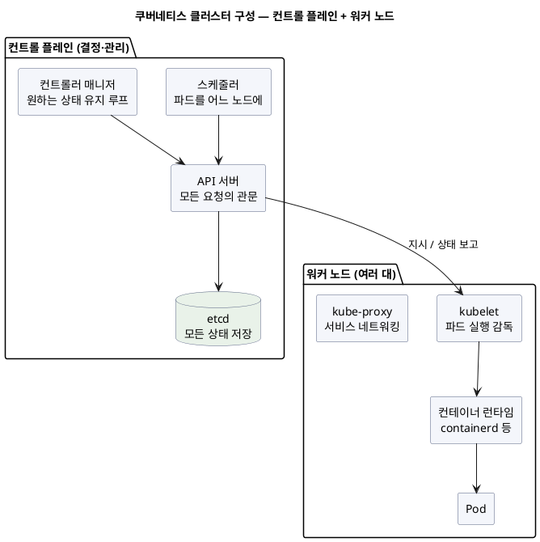
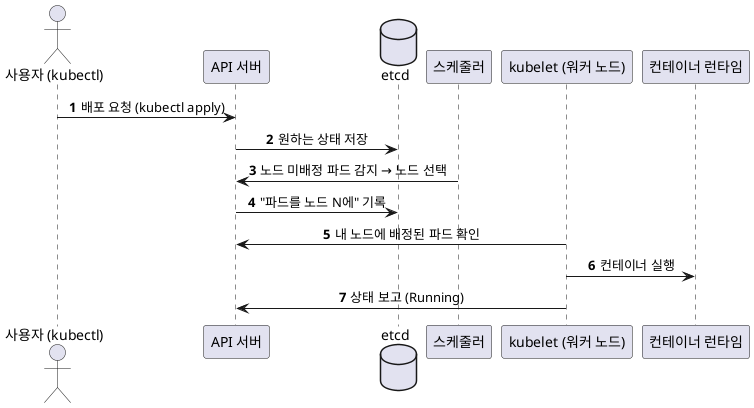

<!-- truncate -->

쿠버네티스를 처음 보면 `kubectl apply` 한 줄로 컨테이너가 기동하는 게 어떻게 되는 일인지 잘 안 보입니다. 그런데 그 안에서는 **여러 부품이 각자 역할을 나눠 맡아** 협업하고 있습니다. 이 글은 쿠버네티스 지식이 거의 없어도 이해하도록, **클러스터가 어떤 구성 요소로 이루어지고 각 부품이 무슨 일을 하는지**를 그림으로 풀어씁니다. (Pod·Deployment 같은 오브젝트를 실제로 어떻게 쓰는지와 GitOps 배포는 별도 주제이므로, 이 글은 **클러스터 내부 구조**에 집중합니다.)

<mark>쿠버네티스 클러스터는 크게 **결정을 내리는 컨트롤 플레인**과 **컨테이너를 실제로 실행하는 워커 노드**로 나뉩니다 — 이 두 층과 각 부품의 역할만 알면 나머지가 쉽게 이해됩니다.</mark>

## 전체 구조 — 컨트롤 플레인과 워커 노드

**클러스터**는 여러 대의 서버(노드)를 하나로 묶은 것입니다. 노드는 역할에 따라 두 종류입니다.

- **컨트롤 플레인(control plane)** — 클러스터의 **결정·관리 담당**. "무엇을 어디에 얼마나 띄울지"를 결정하고, 전체 상태를 관리합니다. 직접 컨테이너를 실행하지는 않습니다.
- **워커 노드(worker node)** — 실제 **실행 담당**. 컨트롤 플레인의 결정을 받아 **컨테이너(파드)를 실제로 실행**합니다.

<details>
<summary>PlantUML 코드</summary>



</details>


import ArchifyEmbed from '@site/src/components/ArchifyEmbed';

<ArchifyEmbed src="/diagrams/k8s-architecture.html" title="쿠버네티스 클러스터 구성 요소 (인터랙티브)" height="620px" />

## 컨트롤 플레인 — 결정·관리 부품들

컨트롤 플레인은 네 개의 부품으로 나뉩니다. 각각 하는 일이 뚜렷합니다.

### API 서버 (kube-apiserver) — 모든 요청의 관문

클러스터의 **정문**입니다. `kubectl`, 대시보드, 다른 부품까지 **모든 요청이 API 서버를 거칩니다.** 요청을 인증·검증하고, 결과를 저장소에 반영합니다. **다른 부품끼리 직접 대화하지 않고, 항상 API 서버를 통해서만** 소통합니다.

### etcd — 모든 상태를 저장하는 곳

클러스터의 **장부**입니다. "지금 어떤 파드가 몇 개, 어느 노드에 있어야 하는지" 같은 **모든 상태를 저장**하는 키-값 데이터베이스입니다. **오직 API 서버만 etcd에 접근**합니다. etcd가 사라지면 클러스터는 자기 상태를 잃으므로, 보통 여러 대로 이중화합니다.

### 스케줄러 (kube-scheduler) — 파드를 어느 노드에

새로 만들어졌지만 **아직 노드가 정해지지 않은 파드**를 발견하면, **어느 워커 노드에 놓을지** 결정합니다. 노드의 남은 CPU·메모리, 배치 규칙(어피니티) 등을 따져 가장 알맞은 노드를 고른 뒤, "이 파드는 노드 N에"라고 API 서버에 기록합니다. **결정만 하고, 실제 실행은 하지 않습니다.**

### 컨트롤러 매니저 (kube-controller-manager) — 원하는 상태를 유지

여러 개의 **컨트롤러(제어 루프)** 를 돌립니다. 각 컨트롤러는 "원하는 상태와 현재 상태를 비교해, 다르면 맞추는" 일을 끊임없이 반복합니다. 예를 들어 **레플리카를 3개로 선언했는데 하나가 중단되면**, 컨트롤러가 그걸 감지해 새 파드를 만들도록 API 서버에 요청합니다. 클라우드에서는 로드밸런서·볼륨을 다루는 **클라우드 컨트롤러 매니저**가 따로 붙기도 합니다.

<mark>컨트롤 플레인의 규칙은 단순합니다 — 모든 소통은 API 서버를 통하고, 모든 상태는 etcd에 있고, 스케줄러는 배치를 결정하고, 컨트롤러는 원하는 상태를 계속 맞춥니다.</mark>

## 워커 노드 — 실행 부품들

워커 노드에는 실제로 컨테이너를 실행하기 위한 세 부품이 있습니다.

### kubelet — 노드의 현장 관리자

각 워커 노드에 하나씩 있는 **현장 감독**입니다. API 서버에게 "내 노드에 배정된 파드가 뭐냐"를 물어보고, 그 파드의 컨테이너가 **실제로 기동해 정상 동작하는지** 책임집니다. 컨테이너가 중단되면 다시 기동시키고, 상태를 API 서버에 보고합니다. **kubelet은 컨테이너를 직접 만들지 않고, 컨테이너 런타임에게 시킵니다.**

### 컨테이너 런타임 — 실제로 컨테이너를 실행

이미지를 내려받아 **컨테이너를 실제로 실행**하는 소프트웨어입니다. 요즘은 **containerd**나 CRI-O를 씁니다(예전의 도커 엔진 역할). kubelet이 표준 인터페이스(CRI)로 런타임에게 "이 이미지로 컨테이너 띄워"라고 지시합니다.

### kube-proxy — 서비스 네트워킹

파드는 중단되고 다시 기동하며 IP가 계속 바뀝니다. 그래서 앞에 고정 진입점인 **Service**를 두는데, **kube-proxy**가 각 노드에서 **"이 서비스로 온 트래픽을 실제 파드들에게 어떻게 나눠 보낼지"** 네트워크 규칙을 관리합니다. 이것이 **L4(포트 단위) 라우팅**입니다(외부 HTTP 노출을 맡는 Service 타입·Ingress는 아래에서 따로 정리합니다).

<mark>워커 노드는 kubelet이 지휘하고, 컨테이너 런타임이 실제 실행을 맡고, kube-proxy가 서비스 트래픽을 라우팅합니다 — 세 부품이 파드를 "실제로 실행되게" 만듭니다.</mark>

## 외부 트래픽 경로 — Service 타입과 Ingress

앞의 kube-proxy가 하는 L4 라우팅 위에, 외부 노출 방식이 더해집니다. Service는 타입에 따라 노출 범위가 다릅니다.

- **ClusterIP**(기본) — 클러스터 **내부에서만** 접근(서비스 간 통신용).
- **NodePort** — 각 노드의 특정 포트로 노출.
- **LoadBalancer** — 클라우드 로드밸런서를 **서비스마다 하나씩** 붙여 노출 → 서비스가 많으면 LB 비용이 커집니다.

여기서 **Ingress**가 등장합니다. **하나의 진입점(HTTP/HTTPS, L7)에서 호스트·경로 기준으로 여러 Service에 라우팅**하는 규칙입니다.

```yaml
apiVersion: networking.k8s.io/v1
kind: Ingress
metadata:
  name: web
spec:
  rules:
    - host: shop.example.com
      http:
        paths:
          - path: /api                # shop.example.com/api → api 서비스
            pathType: Prefix
            backend:
              service: { name: api, port: { number: 80 } }
          - path: /                    # 그 외 경로 → web 서비스
            pathType: Prefix
            backend:
              service: { name: web, port: { number: 80 } }
  tls:                                 # HTTPS 인증서 종료(TLS termination)
    - hosts: [ shop.example.com ]
      secretName: shop-tls
```

구성 요소 관점의 핵심은, **Ingress 자체는 규칙일 뿐**이고 실제 처리는 **Ingress Controller**(nginx·AWS Load Balancer Controller 등)가 맡는다는 점입니다 — 이 컨트롤러는 별도 부품이 아니라 **워커 노드 위에서 파드로 실행되어** Ingress 규칙을 읽어 L7 라우팅을 수행합니다. 그 아래에서 kube-proxy가 **Service → 파드(L4)** 를 처리하므로, 외부 트래픽은 `Ingress Controller(파드) → Service → 파드` 순으로 전달됩니다.

<mark>Service는 L4(포트 단위 파드 부하 분산), Ingress는 L7(도메인·경로 라우팅 + TLS 종료)입니다 — Ingress는 규칙일 뿐이라, 이를 실행하는 Ingress Controller(파드)가 있어야 실제로 동작합니다.</mark>

<ArchifyEmbed src="/diagrams/k8s-ingress-path.html" title="외부 트래픽 경로 Ingress→Service→파드 (인터랙티브)" height="440px" />

## 오브젝트는 무엇인가 — 부품이 다루는 대상

지금까지가 **클러스터를 이루는 부품(프로세스)** 이라면, 우리가 `kubectl`로 만드는 **Pod·Deployment·Service** 등은 그 부품들이 **다루는 대상(리소스)** 입니다. 아주 짧게만 정리합니다.

| 오브젝트 | 한 줄 |
|---|---|
| **Pod** | 컨테이너를 감싼 가장 작은 실행 단위(일회성) |
| **ReplicaSet** | 파드를 정해진 개수만큼 유지 |
| **Deployment** | 원하는 레플리카·버전을 선언(내부적으로 ReplicaSet 관리) |
| **Service / Ingress** | 파드 앞의 고정 진입점·부하 분산 / 외부 트래픽 경로 |
| **Namespace** | 리소스를 환경·팀별로 나누는 격리 단위 |

즉 **부품(API 서버·스케줄러·kubelet…)이 일을 하고, 오브젝트(Deployment·Pod…)는 그 일의 대상**입니다.

## 배포 요청 한 번이 처리되는 과정

부품들이 어떻게 협업하는지, `kubectl apply`로 파드 하나를 기동시키는 과정으로 따라가 봅니다.

<details>
<summary>PlantUML 코드</summary>



</details>


1. **사용자**가 `kubectl apply`로 "이런 파드를 원한다"를 **API 서버**에 보냅니다.
2. API 서버가 그 원하는 상태를 **etcd**에 저장합니다. (이 시점엔 아직 어느 노드에 뜰지 미정)
3. **스케줄러**가 노드 미배정 파드를 발견해, 가장 알맞은 워커 노드를 골라 API 서버에 기록합니다.
4. 배정된 노드의 **kubelet**이 "내 노드에 새 파드가 있다"를 확인하고, **컨테이너 런타임**에게 실행을 지시합니다.
5. 컨테이너가 기동하면 kubelet이 상태를 API 서버에 보고하고, 그 결과가 etcd에 반영됩니다.

<mark>모든 단계가 API 서버를 중심으로 돌아갑니다 — 각 부품은 서로 직접 명령하지 않고, "API 서버에 기록된 원하는 상태"를 각자 보고 자기 일을 합니다. 이 느슨한 협업이 쿠버네티스가 견고한 이유입니다.</mark>

## 정리

- 클러스터는 **컨트롤 플레인(결정·관리) + 워커 노드(실행)** 로 나뉜다.
- **컨트롤 플레인**: **API 서버**(모든 요청의 관문) · **etcd**(모든 상태 저장) · **스케줄러**(파드를 어느 노드에) · **컨트롤러 매니저**(원하는 상태 유지 루프).
- **워커 노드**: **kubelet**(파드 실행 감독) · **컨테이너 런타임**(실제 실행, containerd 등) · **kube-proxy**(서비스 네트워킹).
- **오브젝트**(Pod·Deployment·Service)는 부품들이 다루는 **대상**이다.
- 배포는 **API 서버 → etcd → 스케줄러 → kubelet → 런타임** 으로 이어지고, 모든 소통은 API 서버를 통한다.

<mark>쿠버네티스는 저절로 되는 게 아니라 "역할을 나눈 부품들이 API 서버를 통해 원하는 상태를 맞추는" 구조입니다 — 각 부품이 무슨 일을 하는지 알면, 장애를 진단할 때 어디를 봐야 할지도 보입니다.</mark>

## 용어 한 줄 정리

| 용어 | 쉬운 뜻 |
|---|---|
| 클러스터 | 여러 노드(서버)를 하나로 묶은 것 |
| 컨트롤 플레인 | 클러스터의 결정·상태 관리 담당 |
| 워커 노드 | 실제로 컨테이너(파드)를 실행하는 노드 |
| API 서버 | 모든 요청이 거치는 관문 |
| etcd | 클러스터의 모든 상태를 저장하는 곳 |
| 스케줄러 | 파드를 어느 노드에 놓을지 결정 |
| 컨트롤러 매니저 | 원하는 상태와 현재 상태를 계속 맞추는 루프 |
| kubelet | 노드에서 파드 실행을 감독하는 현장 관리자 |
| 컨테이너 런타임 | 이미지를 받아 컨테이너를 실제 실행(containerd 등) |
| kube-proxy | 서비스 트래픽을 파드로 라우팅하는 네트워크 규칙 관리 |
