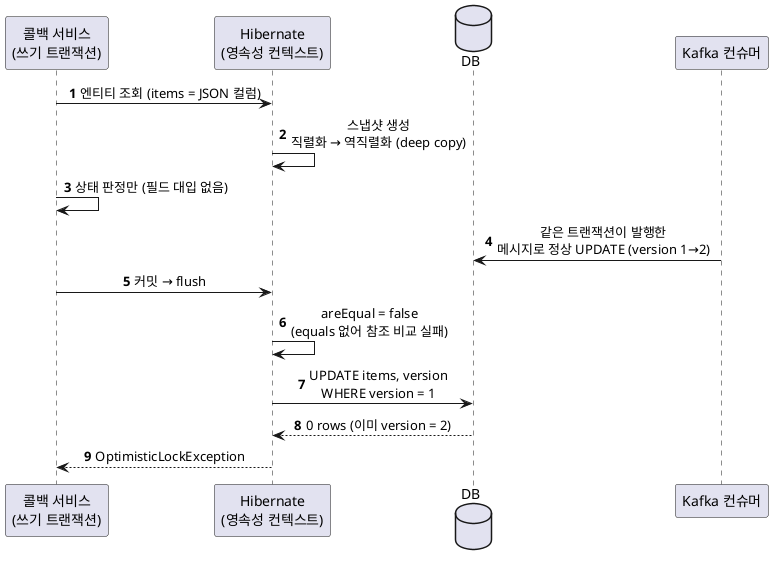

<!-- truncate -->

[Spring Boot 4로 올리는 작업](/blog/spring-boot-4-highlights) 중, 특정 엔티티에서 **읽기만 했는데 커밋 시점에 UPDATE가 나가고 `version`이 1씩 오르는** 현상이 생겼습니다. 낙관적 락 충돌 알람이 분당 여러 건씩 올라왔죠. 코드는 엔티티를 조회해 상태만 판정할 뿐 어떤 필드도 대입하지 않는데도요. 원인은 **`@JdbcTypeCode(SqlTypes.JSON)` 컬럼의 dirty check 방식이 Hibernate 6.2 → 7.x에서 바뀐 것**이었습니다.

<mark>Hibernate 7.x는 flush마다 JSON 컬럼 값을 **직렬화했다가 다시 역직렬화해** 스냅샷을 만든다(deep copy). 이때 값 객체에 `equals`가 없으면 **값이 같아도 서로 다른 객체로 취급**되어, 조회만 했는데도 매번 변경(dirty)으로 판정됩니다.</mark>

## 현상

에러 로그에 같은 문구가 반복됐습니다. 실패한 SQL은 JSON 컬럼(`items`) 하나와 감사 컬럼, `version`만 바꾸는 UPDATE인데, 해당 코드는 조회해서 판정만 합니다.

```
Unexpected row count (expected row count 1 but was 0)
[update delivery_request
   set items=?, updated_at=?, updated_by=?, version=?
 where id=? and version=?]
```

표면적으로는 "다른 트랜잭션과의 버전 경합"이지만, 경합의 한쪽이 **존재하지 않아야 할 UPDATE**였다는 점이 핵심입니다. 전환 이후 `version` 평균 증가량도 뚜렷하게 늘었습니다.

## 원인 — 스냅샷을 뜨는 방식이 바뀌었다

Hibernate는 엔티티를 로딩할 때 필드별 **스냅샷**을 떠 두고, flush 시점에 현재 값과 비교해 변경 여부(dirty)를 판정합니다. JSON 컬럼에 매핑된 값(예: `List<OrderItem>`)의 스냅샷을 만드는 방식이 두 버전 사이에서 달라졌습니다.

| 구분 | Hibernate 6.2(초기) | Hibernate 7.x |
|---|---|---|
| 스냅샷 생성 | 리스트 껍데기만 새로, 원소는 **같은 참조** | JSON으로 **직렬화 → 역직렬화**(deep copy) → 원소까지 **전부 새 인스턴스** |
| 비교 결과 | `areEqual = true` → UPDATE 없음 | `areEqual = false` → 매 flush마다 UPDATE |

문제의 값 객체(`OrderItem`)에는 `equals`/`hashCode`가 없었습니다. 그러면 비교가 `Object.equals`, 즉 **참조(주소) 비교**로 이뤄집니다. 6.2 초기 버전은 스냅샷이 원본과 참조를 공유해 **우연히** 통과했고, 7.x는 매번 다른 인스턴스라 통과할 수 없습니다.

<mark>결함(값 객체에 `equals` 부재)은 원래 있었고, 버전업이 그것을 드러냈을 뿐입니다 — 6.2 초기 버전이 참조를 공유하며 결함을 가려 주고 있었습니다.</mark>

### 왜 바뀌었나

원래 Hibernate에는 **JSON 객체의 필드를 제자리에서(in-place) 바꿔도 변경을 감지하지 못하는 버그**가 있었습니다(예: [HHH-16682](https://hibernate.atlassian.net/browse/HHH-16682) "Changes in `@JdbcTypeCode(SqlTypes.JSON)` are not written to DB"). 스냅샷이 원본과 참조를 공유하니, 같은 객체를 수정하면 스냅샷도 같이 바뀌어 "차이 없음"으로 보였던 것이죠.

이를 고치려고 **FormatMapper(Jackson)로 deep copy**하도록 바꿨습니다. Hibernate 공식 블로그 [*Hibernate JSON dirty checking performance*](https://in.relation.to/2026/05/29/hibernate-json-dirty-checking-performance/)의 설명대로, flush마다 `FormatMapperBasedJavaType.deepCopy`가 값을 문자열로 직렬화했다가 다시 역직렬화해 스냅샷을 만듭니다. 그 부작용이 바로 **"`equals` 없는 원소는 항상 dirty"** 이고, 반대 방향으로는 [HHH-18971](https://hibernate.atlassian.net/browse/HHH-18971) "`@JdbcTypeCode(SqlTypes.JSON)`가 불필요한 SQL을 만든다"로도 보고됐습니다.

## 연쇄 — 조회 한 번이 version을 1 올린다

이 유령 UPDATE가 왜 장애로 이어졌는지, 콜백 처리 흐름으로 따라가 봅니다.

<details>
<summary>PlantUML 코드</summary>



</details>


- **콜백 서비스가 쓰기 트랜잭션에서 조회한다.** 상태 콜백 서비스가 클래스 레벨 `@Transactional`이라, 읽기 경로도 쓰기 트랜잭션입니다. 이때 `items` 스냅샷이 JSON 왕복으로 떠집니다.
- **아무것도 바꾸지 않았는데 dirty로 판정된다.** 호출되는 것은 상태 판정 메서드뿐인데, flush 시 `areEqual`이 false를 반환합니다.
- **`items` UPDATE + `version` 증가.** `@DynamicUpdate`라 바뀐 컬럼만 나가지만, `version`은 항상 SET·WHERE 양쪽에 포함됩니다.
- **컨슈머의 정상 UPDATE와 충돌.** 같은 트랜잭션 안에서 발행한 메시지를 컨슈머가 먼저 처리해 행을 갱신하면, 뒤늦게 커밋되는 콜백 트랜잭션은 낡은 `version`으로 0건을 맞습니다. **자기가 트리거한 작업과 자기가 충돌하는** 구조입니다.

## 검증

전환 직전 커밋으로 worktree를 만들어 같은 테스트를 두 버전에서 돌렸습니다. 저장 → 영속성 컨텍스트 비움 → 재조회 → **아무것도 건드리지 않고 flush**.

| 환경 | version 변화 | 결과 |
|---|---|---|
| Hibernate 6.2(초기) | 1 → 1 | UPDATE 없음 |
| Hibernate 7.x | 1 → 2 | 조회만 했는데 UPDATE 발생 |
| 7.x · `items` 빈 리스트(대조군) | 1 → 1 | 원인이 `items`임을 분리 확인 |
| 7.x · `OrderItem`에 `equals` 추가 | 1 → 1 | 통과 |

## 해결 — 스냅샷 비교를 값 기반으로 되돌린다

두 가지 방향이 있습니다. **값을 제자리에서 바꾸지 않고 항상 새 참조로 교체**한다면 deep copy 자체를 끌 수 있고, 그렇지 않다면 값 비교가 되도록 `equals`를 넣습니다.

### ① `@Mutability(Immutability.class)` — deep copy 자체를 끈다

공식 블로그가 첫 번째로 권하는 방법입니다. "이 값은 제자리에서 변경되지 않는다(항상 새 참조로 교체한다)"를 Hibernate에 알려, 원본 참조를 그대로 스냅샷으로 쓰게 합니다. deep copy(직렬화 왕복)가 사라져 dirty check 비용도 크게 줄어듭니다.

```java
@Column(columnDefinition = "JSONB")
@JdbcTypeCode(SqlTypes.JSON)
@Mutability(Immutability.class)   // org.hibernate.type.descriptor.java.Immutability
private List<OrderItem> items;
```

<mark>단, 전제 조건이 있다 — 이 값을 절대 제자리에서 수정하지 않고 항상 통째로 새 리스트/객체로 교체해야 한다. 이 규약을 어기면 다시 "변경 감지 못 함" 버그로 돌아갑니다.</mark>

### ② 값 객체에 `equals`/`hashCode`

제자리 수정을 허용해야 한다면, JSON에 저장되는 값 객체에 `equals`/`hashCode`를 정의합니다. 스냅샷이 새 인스턴스여도 값이 같으면 동일로 판정되어 유령 UPDATE가 사라집니다.

```java
@Override
public boolean equals(Object o) {
    if (this == o) return true;
    if (!(o instanceof OrderItem other)) return false;
    return Objects.equals(name, other.name)
        && Objects.equals(price, other.price)
        && Objects.equals(quantity, other.quantity);
}

@Override
public int hashCode() {
    return Objects.hash(name, price, quantity);
}
```

- **Lombok이면** `@EqualsAndHashCode` 한 줄로 같은 효과입니다. 값 객체 안에 다른 객체가 중첩돼 있으면 그 타입에도 필요합니다 — 비교는 끝까지 값 기반이어야 합니다.
- **`record`는 이미 값 기반 `equals`를 갖습니다.** 다만 기존 클래스를 record로 바꾸면 Jackson 역직렬화 경로가 달라지니, 기존 JSON 데이터 호환을 따로 검증해야 합니다.

### 함께 손볼 것 — 트랜잭션·재시도

원인을 없앤 뒤, 재발과 파급을 줄이는 두 가지를 같이 봅니다.

- **읽기 경로는 `@Transactional(readOnly = true)`로.** 읽기만 하는 메서드가 쓰기 트랜잭션에 포함돼 있으면 flush가 일어나 이 부류의 문제에 노출됩니다. readOnly면 flush 자체가 없어 유령 UPDATE가 원천 차단됩니다. (이력 INSERT 하나 때문에 클래스 전체 `@Transactional`이 풀려 있었다면, 그 메서드만 분리하는 게 낫습니다.)
- **낙관적 락 재시도.** 정당한 경합은 언제든 생깁니다. 쓰기 경로에 `@Retryable(OptimisticLockingFailureException.class)` 같은 재시도를 두면, 진짜 경합이 예외로 그대로 올라오는 것을 막습니다.

## 점검 — 내 서비스도 해당되는가

Hibernate가 deep-copy 방식으로 바뀐 버전(6.2 후기·6.3·6.4 이상, 7.x 포함)으로 올라간(또는 올라갈) 서비스는 아래 셋을 확인하면 됩니다.

- **JSON 컬럼 전수 조사.** `@JdbcTypeCode(SqlTypes.JSON)`이 붙은 필드를 모두 찾습니다. 컬렉션이든 단일 POJO든 모두 대상입니다.

  ```bash
  grep -rn "SqlTypes.JSON" --include="*.java" --include="*.kt" src/main
  ```

- **원소·값 타입에 `equals`/`hashCode`가 있는지.** 없으면 추가하거나 `@Mutability(Immutability.class)`를 검토합니다. Lombok `@Data`·`@Value`·`record`는 이미 있습니다 — `@Getter`만 있는 클래스가 위험 신호입니다.
- **회귀 테스트 한 줄.** 저장 → `em.clear()` → 조회 → flush 후 `version`이 그대로인지 단언합니다. 이 한 줄이 재발을 막습니다.

<mark>증상으로 찾는 법 — 읽기만 하는 API를 호출한 뒤 `version`이 올라가거나, 특정 JSON 컬럼만 SET하는 UPDATE가 반복되면 같은 건입니다. 전환 전후로 `version` 평균 증가량을 비교하면 빠르게 드러납니다.</mark>

## 곁가지 — 같은 전환에서 나온 다른 JSON 이슈

원인은 다르지만 걸리는 자리가 같은(`@JdbcTypeCode(JSON)` 컬럼) 건이 하나 더 있습니다. **Spring Boot 4는 어플리케이션 JSON 라이브러리를 Jackson 3로 바꾸지만, Hibernate의 JSON 컬럼 매퍼는 여전히 Jackson 2 기반**입니다. 이 과정에서 `spring-boot-starter-web`이 `jackson-datatype-jsr310`을 더 이상 전이(transitive) 의존성으로 넘겨주지 않는 경우가 있어, JSON 컬럼 안에 `LocalDate`/`LocalDateTime`이 있으면 `Java 8 date/time type not supported`로 실패할 수 있습니다.

```gradle
implementation 'com.fasterxml.jackson.datatype:jackson-datatype-jsr310'
```

전이 의존성에 기대지 말고 `build.gradle`에 **명시적으로** 추가하는 게 안전합니다. (Swagger/springdoc가 있는 모듈은 우연히 이 의존성을 갖고 있어 증상이 가려지기도 합니다.)

## 정리

- Hibernate가 JSON 컬럼 스냅샷을 **deep copy(직렬화 왕복)** 로 뜨도록 바뀌면서, 값 객체에 `equals`가 없으면 **조회만 해도 dirty**로 판정됩니다.
- 이는 원래 있던 "in-place 변경 미감지" 버그([HHH-16682])를 고치며 생긴 부작용([HHH-18971])입니다. 결함(값 객체 `equals` 부재)은 전부터 있었고 버전업이 드러냈을 뿐입니다.
- 해결: **① `@Mutability(Immutability.class)`**(항상 새 참조로 교체할 때·deep copy 자체를 끔) 또는 **② 값 객체에 `equals`/`hashCode`**. 읽기 경로 `readOnly`, 낙관적 락 재시도를 함께 손봅니다.
- 6.2 후기·6.3·6.4·7.x로 올라가는 서비스는 **JSON 컬럼 전수 조사 + 회귀 테스트 한 줄**로 선제 점검할 수 있습니다.
