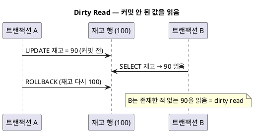
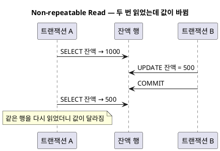
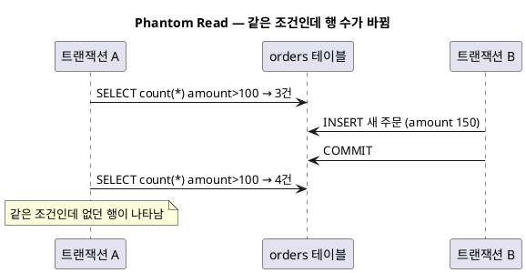
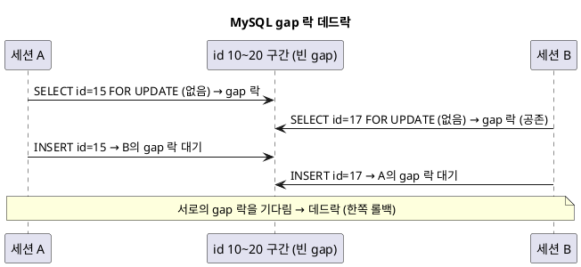

<!-- truncate -->

여러 트랜잭션이 **동시에** 같은 데이터를 읽고 쓰면 서로 간섭해 이상한 결과가 나옵니다. 완전히 격리(한 줄로 줄 세워 실행)하면 안전하지만 동시성이 떨어져 느립니다. <mark>그래서 DB는 "어디까지 간섭을 허용할지"를 **격리 수준(isolation level)** 이라는 몇 단계로 구분합니다 — 격리 수준이 높을수록 안전하지만 동시성은 떨어집니다. ACID의 **I**(격리성)에 해당합니다.</mark> 이 글은 이상 현상 → 표준 4단계 → DB별 구현 → 스프링 적용 순서로 살펴봅니다.

## 격리가 약하면 생기는 이상 현상

세 가지가 대표적입니다. 각각 "무엇이 문제인지"를 두 트랜잭션의 타임라인으로 봅니다.

### ① Dirty Read — 커밋 안 된 값을 읽음

<details>
<summary>PlantUML 코드</summary>



</details>


<mark>커밋되지 않아 언제든 되돌려질 수 있는 값을 읽는 것이 dirty read입니다.</mark>

### ② Non-repeatable Read — 같은 행을 두 번 읽었는데 값이 바뀜

<details>
<summary>PlantUML 코드</summary>



</details>


한 트랜잭션 안에서 **같은 행**을 두 번 읽었는데, 그 사이 다른 트랜잭션의 **수정**이 커밋돼 값이 달라지는 경우입니다.

### ③ Phantom Read — 같은 조건인데 행 수가 바뀜

<details>
<summary>PlantUML 코드</summary>



</details>


non-repeatable read가 **한 행의 값**이 바뀌는 문제라면, phantom read는 **조건에 맞는 행의 집합**이 바뀌는(없던 행이 새로 삽입되는) 문제입니다.

## SQL 표준 4단계

격리 수준이 높아질수록 위 현상을 더 많이 막지만, 그만큼 **동시성은 떨어집니다**. SQL 표준은 4단계로 정의합니다.

| 격리 수준 | Dirty Read | Non-repeatable Read | Phantom Read |
|---|---|---|---|
| **READ UNCOMMITTED** | 가능 | 가능 | 가능 |
| **READ COMMITTED** | 차단 | 가능 | 가능 |
| **REPEATABLE READ** | 차단 | 차단 | 가능(표준상) |
| **SERIALIZABLE** | 차단 | 차단 | 차단 |

<mark>격리 수준이 높을수록(표에서 아래로 갈수록) 안전하지만 잠금·검증 비용이 커져 동시 처리량이 줄어듭니다 — "얼마나 안전해야 하나"와 "얼마나 빨라야 하나"의 트레이드오프입니다.</mark>

## 구현은 DB마다 다르다

여기서 **자주 하는 오해**가 하나 있습니다. 같은 이름의 격리 수준이라도 **DB마다 실제 막아 주는 범위가 다릅니다.**

- **MySQL (InnoDB)**
  - 기본: `REPEATABLE READ`
  - `REPEATABLE READ`에서 **next-key 락(gap 락)** 으로 새 행이 삽입되는 것까지 막아 **phantom read도 차단**합니다(표준 초과).
  - `READ COMMITTED`로 낮추면 gap 락이 없어 phantom이 다시 생길 수 있습니다.
- **PostgreSQL**
  - 기본: `READ COMMITTED`
  - `REPEATABLE READ`는 **스냅샷 격리(Snapshot Isolation)** 라 **phantom read도 막습니다**(표준 최소치 초과).
  - `READ UNCOMMITTED`를 요청해도 내부적으론 `READ COMMITTED`로 동작 → 실제로는 3단계.
  - `SERIALIZABLE`은 **SSI**(Serializable Snapshot Isolation)입니다.
- **Oracle**
  - 기본: `READ COMMITTED`
  - 전용 `REPEATABLE READ`·`READ UNCOMMITTED` 레벨이 **없습니다**.
  - `SERIALIZABLE`(스냅샷 기반)과 **`READ ONLY`**(읽기 전용) 모드를 제공합니다.

| DB | 기본 격리 | REPEATABLE READ | SERIALIZABLE |
|---|---|---|---|
| **MySQL(InnoDB)** | REPEATABLE READ | 있음 — next-key 락으로 **phantom까지 차단** | 있음(잠금 기반) |
| **PostgreSQL** | READ COMMITTED | 있음 — 스냅샷 격리, **phantom 차단** | SSI |
| **Oracle** | READ COMMITTED | **없음**(전용 레벨 X) | 있음(스냅샷) |

<mark>그래서 "REPEATABLE READ로 맞췄다"는 말은 DB를 밝히지 않으면 정확하지 않습니다 — MySQL의 RR과 Oracle(RR 없음)은 동작이 아예 다릅니다.</mark> (근거: [PostgreSQL 문서](https://www.postgresql.org/docs/current/transaction-iso.html) · [MySQL 문서](https://dev.mysql.com/doc/refman/8.0/en/innodb-transaction-isolation-levels.html) · [Oracle 문서](https://docs.oracle.com/en/database/oracle/oracle-database/19/cncpt/data-concurrency-and-consistency.html))

DB별 라이선스·성격 차이는 [MySQL·PostgreSQL·Oracle 비교](./rdbms-comparison)에서 다뤘습니다.

## REPEATABLE READ는 데드락이 더 잘 생길까 — MySQL의 gap 락

<mark>MySQL InnoDB에서는 그렇습니다. REPEATABLE READ가 phantom을 막으려고 쓰는 **gap(next-key) 락**이 잠금 대기·데드락을 늘립니다.</mark> RR은 "행"만이 아니라 **"그 행 앞의 빈 구간(gap)"** 까지 잠가 새 행이 삽입되는 것을 막는데, 구간을 잠그다 보니 충돌 범위가 넓어집니다.

여기서 중요한 점 하나. <mark>gap 락은 **특정 값이 아니라, 인접한 두 인덱스 레코드 사이의 "구간" 전체**에 걸립니다.</mark> 예를 들어 테이블에 `id = 10`과 `id = 20`만 있으면 그 사이 **10~20이 하나의 gap**이고, 이 구간 안의 어떤 값(15든 17이든)으로 없는 행을 잠그면 **모두 같은 gap 락**을 잡습니다.

문제가 되는 조합은 **gap 락 + INSERT**입니다. gap 락끼리는 서로 **공존**할 수 있지만, `INSERT`가 잡는 **insert intention 락**은 남이 보유한 gap 락과 **충돌해 대기**합니다.

```sql
-- (테이블엔 id = 10, 20만 있음 → 그 사이 10~20이 하나의 gap)
-- 세션 A                                   -- 세션 B
BEGIN;                                      BEGIN;
SELECT * FROM t WHERE id = 15 FOR UPDATE;   SELECT * FROM t WHERE id = 17 FOR UPDATE;
-- 15는 (10,20) gap → 그 gap에 락             -- 17도 같은 (10,20) gap → 같은 gap에 락(공존)
INSERT INTO t(id) VALUES (15);              INSERT INTO t(id) VALUES (17);
-- B가 보유한 gap 락 때문에 대기                    -- A가 보유한 gap 락 때문에 대기 → 데드락!
```

<mark>즉 15와 17은 **값은 다르지만 둘 다 같은 gap(10~20) 안**이라 같은 gap 락을 공유합니다.</mark> 그래서 각자 그 gap에 INSERT하려는 순간 서로의 gap 락을 기다려 데드락이 됩니다.

<details>
<summary>PlantUML 코드</summary>



</details>


**READ COMMITTED로 낮추면** 검색·인덱스 스캔에서 **gap 락이 비활성화**(외래키·중복키 검사에만 사용)되어, 이런 gap 데드락이 크게 줄어듭니다. 대신 phantom read가 다시 가능해지는 트레이드오프가 있습니다.

- **잠금 대기·데드락이 자주 생긴다** → READ COMMITTED를 검토(단, phantom 재등장 감안). 실제로 gap 락 부담을 줄이려 RC로 운영하는 팀이 많습니다.
- **RR을 유지**한다면 → 트랜잭션이 여러 행을 **항상 같은 순서로** 접근하고, 범위 조건보다 **유니크 키 동등 조건**을 써 gap 경합을 줄입니다.
- 이건 **MySQL InnoDB 특유**입니다 — PostgreSQL·Oracle은 스냅샷 MVCC라 gap 락이 없어 이 데드락은 없습니다(대신 SERIALIZABLE에서는 직렬화 실패가 나 재시도로 처리). 근거: [InnoDB Locking](https://dev.mysql.com/doc/refman/8.0/en/innodb-locking.html).

접근 순서·인덱스 때문에 생기는 또 다른 데드락은 [세컨더리 인덱스와 데드락](./index-deadlock)에서 다뤘습니다.

## 스프링에서 격리 수준이 로직에 미치는 영향

스프링에서는 `@Transactional(isolation = ...)` 으로 격리 수준을 지정합니다. **같은 로직도 격리 수준에 따라 결과가 달라질 수 있습니다.** 잔액을 한 트랜잭션 안에서 두 번 조회하는 예를 보겠습니다.

```java
@Service
@RequiredArgsConstructor
public class BalanceService {

    private final AccountRepository accountRepository;

    // READ COMMITTED — 매 조회가 "그 시점의 최신 커밋"을 본다
    @Transactional(isolation = Isolation.READ_COMMITTED)
    public boolean isStable(Long id) {
        int first  = accountRepository.findBalance(id);   // 예: 1000
        heavyWork();                                       // 이 사이 다른 Tx가 500으로 UPDATE·COMMIT
        int second = accountRepository.findBalance(id);   // 500  ← 값이 달라짐
        return first == second;                            // false (non-repeatable read)
    }

    // REPEATABLE READ — 트랜잭션 시작 시점의 스냅샷을 끝까지 유지
    @Transactional(isolation = Isolation.REPEATABLE_READ)
    public boolean isStableRR(Long id) {
        int first  = accountRepository.findBalance(id);   // 1000
        heavyWork();                                       // 다른 Tx가 커밋해도
        int second = accountRepository.findBalance(id);   // 1000 ← 그대로
        return first == second;                            // true
    }
}
```

<mark>READ COMMITTED에서는 한 트랜잭션 안에서도 조회할 때마다 값이 달라질 수 있어, "읽은 값이 트랜잭션 내내 유지된다"고 가정한 로직(집계·검증·조건 분기)이 깨질 수 있습니다.</mark>

### 주의할 점 하나 — 스프링 기본값은 "DB 기본값"이다

격리 수준을 지정하지 않으면 `Isolation.DEFAULT`이고, 이는 **연결된 DB의 기본값**을 그대로 따릅니다.

```java
@Transactional  // = @Transactional(isolation = Isolation.DEFAULT) = DB 기본값
public boolean report(Long id) { ... }
```

그래서 **똑같은 코드**가 DB에 따라 다르게 동작합니다 — **MySQL(기본 REPEATABLE READ)** 에서는 두 조회가 일치하지만, **PostgreSQL·Oracle(기본 READ COMMITTED)** 에서는 흔들릴 수 있습니다. 격리 수준에 의존하는 로직이라면 **명시적으로 지정**해 DB가 바뀌어도 같은 동작을 보장해야 합니다.

### REPEATABLE READ도 못 막는 것 — Lost Update

격리 수준을 높여도 **"읽고 → 계산 → 쓰기"** 패턴의 경합은 막지 못합니다.

```java
// REPEATABLE READ라도 아래 경합(lost update)은 그대로 발생
@Transactional(isolation = Isolation.REPEATABLE_READ)
public void withdraw(Long id, int amount) {
    int balance = accountRepository.findBalance(id);   // 1000 (스냅샷)
    // 그 사이 다른 Tx가 300을 인출·커밋 → 실제 잔액은 700
    accountRepository.updateBalance(id, balance - amount);  // 1000 - 200 = 800 으로 덮어씀
    // → 다른 Tx의 300 인출이 사라짐 (lost update)
}
```

스냅샷은 "읽은 값"을 고정할 뿐, 그 값을 근거로 한 쓰기가 남의 쓰기를 덮어쓰는 것은 막지 않습니다. 이때는 **잠금**이 필요합니다.

```java
// 해결 1) 비관적 락 — 조회 시점에 행을 잠가 다른 Tx를 대기시킨다 (SELECT ... FOR UPDATE)
@Lock(LockModeType.PESSIMISTIC_WRITE)
@Query("select a from Account a where a.id = :id")
Account findByIdForUpdate(@Param("id") Long id);
```

```java
// 해결 2) 낙관적 락 — @Version으로 충돌을 감지해 재시도한다
@Entity
class Account {
    @Version
    private long version;   // 갱신 시 버전이 다르면 예외 → 잡아서 재시도
}
```

<mark>격리 수준은 "읽기 일관성"을 다루고, 동시 갱신 경합은 **잠금(비관적·낙관적)** 으로 따로 막아야 합니다.</mark> 잠금이 얽혀 생기는 데드락은 [인덱스와 데드락](./index-deadlock)에서 다뤘습니다.

## 실무에서는 어떻게 정하나

- **대부분의 웹 서비스**는 기본값(READ COMMITTED 또는 REPEATABLE READ)으로 충분합니다. 무작정 SERIALIZABLE로 올리면 잠금·재시도가 늘어 처리량이 떨어집니다.
- **한 트랜잭션 내내 읽은 값이 고정돼야 하는 로직**(집계 리포트, 여러 번 참조하는 검증)은 REPEATABLE READ가 안전합니다.
- **금전·재고처럼 불변식이 깨지면 안 되는 갱신**은 격리 수준만 믿지 말고 **명시적 잠금**(FOR UPDATE)이나 **낙관적 락(@Version)**, 또는 **원자적 UPDATE**(`SET stock = stock - 1 WHERE stock >= 1`)로 처리합니다.

## 정리

- 격리 수준은 **dirty·non-repeatable·phantom read**를 어디까지 막을지의 단계입니다(READ UNCOMMITTED → SERIALIZABLE).
- <mark>같은 이름이라도 DB마다 다릅니다 — MySQL(기본 RR·phantom까지 차단), PostgreSQL(기본 RC·RR은 스냅샷), Oracle(기본 RC·RR 없음).</mark>
- 스프링 `@Transactional`의 기본은 **DB 기본값**을 따르므로, 격리에 의존하는 로직은 **수준을 명시**한다.
- 격리 수준으로 **읽기 일관성**을 잡고, **동시 갱신 경합(lost update)** 은 잠금으로 따로 막는다.
