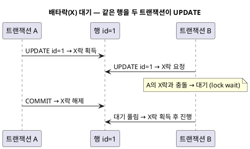
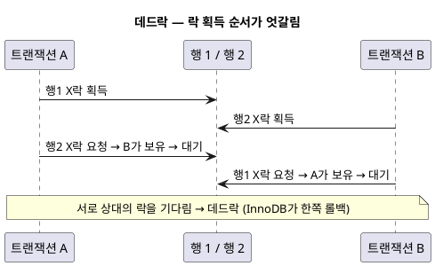
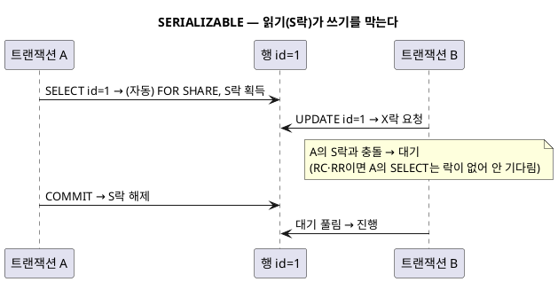
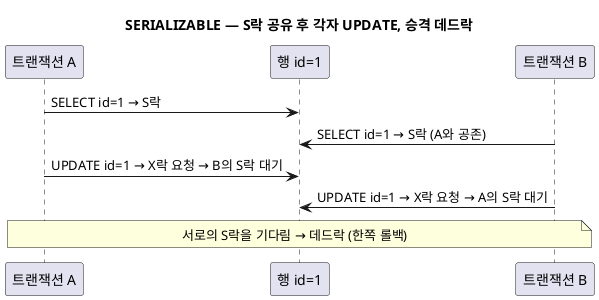

<!-- truncate -->

DB는 여러 트랜잭션이 같은 데이터를 동시에 건드릴 때 **락(lock)** 으로 순서를 정리합니다. 락에는 읽기용 **공유락(S)** 과 쓰기용 **배타락(X)** 이 있고, <mark>어떤 락을 언제 획득하느냐는 **격리 수준에 따라 달라져** 대기·데드락 양상도 바뀝니다.</mark> 개념부터 격리 수준별 동작, SERIALIZABLE의 구체적 상황까지 MySQL InnoDB 기준으로 정리합니다. (격리 수준 자체는 [DB 트랜잭션 격리 수준](./db-isolation-levels) 참고.)

## 공유락(S)과 배타락(X)

- **공유락(S, shared)** — **읽기**용. 여러 트랜잭션이 같은 행에 **동시에 S락을 획득할 수 있습니다**(읽기끼리는 서로 방해 안 함). `SELECT ... FOR SHARE`(구 `LOCK IN SHARE MODE`).
- **배타락(X, exclusive)** — **수정·삭제**용. **한 트랜잭션만** 획득할 수 있고, 다른 트랜잭션은 S든 X든 획득하지 못합니다. `UPDATE`·`DELETE`·`INSERT`, `SELECT ... FOR UPDATE`.

호환성은 이 한 표로 요약됩니다(공식: [InnoDB Locking](https://dev.mysql.com/doc/refman/8.0/en/innodb-locking.html)).

| 이미 걸린 락 → / 요청 ↓ | S락 보유 중 | X락 보유 중 |
|---|---|---|
| **S락 요청** | 허용(공존) | 대기 |
| **X락 요청** | 대기 | 대기 |

<mark>S–S만 공존하고, X가 끼면 무조건 대기입니다.</mark> 충돌하는 락을 남이 보유하고 있으면 해제될 때까지 기다리는데(lock wait), 기본 대기 한도는 `innodb_lock_wait_timeout`(기본 50초)이고 넘으면 오류가 납니다.

### S락은 왜 필요할까?

일반 `SELECT`는 MVCC 스냅샷을 락 없이 읽으니 보통 S락이 필요 없습니다. 하지만 <mark>**읽은 값이 커밋까지 남에게 바뀌지 않도록 보장**해야 할 때</mark>가 있습니다 — 예를 들어 재고를 읽고 그 값을 근거로 주문을 만들 때, 읽는 순간부터 커밋까지 그 행을 남이 못 바꾸게 해야 안전합니다.

이때 `SELECT ... FOR SHARE`로 S락을 획득하면 다른 트랜잭션의 **쓰기(X락)는 막으면서도 다른 읽기(S락)는 허용**합니다. "쓰기만 차단하고 읽기는 공유"하는 중간 강도라, 여러 읽기를 동시에 허용해 X락(`FOR UPDATE`)보다 동시성이 좋습니다.

외래키 검사에서 자식 행을 넣을 때 부모 행이 사라지지 않도록 InnoDB가 부모에 S락을 거는 것도 같은 이유입니다.

## 대기와 데드락은 다르다

- **대기(lock wait)** — 한 방향으로 기다리는 상태. 상대가 커밋·롤백해 락을 해제하면 이어서 진행합니다. 너무 오래면 타임아웃 오류.
- **데드락(deadlock)** — 둘 이상이 **서로 상대의 락을 기다리는 순환**. 아무도 해소하지 못해 InnoDB가 감지해 **한쪽을 롤백**합니다(오류 1213). 롤백된 쪽은 재시도합니다.

가장 단순한 대기 — 같은 행을 두 트랜잭션이 UPDATE(둘 다 X락):

<details>
<summary>PlantUML 코드</summary>



</details>


순환이 생기면 대기가 데드락이 됩니다 — 두 트랜잭션이 **락을 서로 반대 순서로** 획득할 때가 대표적입니다.

<details>
<summary>PlantUML 코드</summary>



</details>


## 격리 수준에 따라 락이 달라진다

같은 SQL이라도 격리 수준에 따라 **획득하는 락이 다릅니다.** (InnoDB 기준, 일반 `SELECT`는 잠그지 않는 조회를 말합니다.)

| 격리 수준 | 일반 SELECT | 잠그는 읽기·UPDATE·DELETE | 대기·데드락 경향 |
|---|---|---|---|
| **READ COMMITTED** | 락 없음(MVCC 스냅샷) | **레코드 락만**(gap 락 없음) | 적음 |
| **REPEATABLE READ** | 락 없음(MVCC 스냅샷) | **next-key 락**(레코드+gap) | gap 때문에 넓음 |
| **SERIALIZABLE** | **S락(FOR SHARE)으로 승격** | next-key 락 | 읽기도 충돌해 급증 |

- **READ COMMITTED** — 일반 `SELECT`는 락 없이 스냅샷을 읽고, 잠그는 읽기·쓰기도 **레코드(행) 락만** 획득합니다(gap 락은 외래키·중복키 검사에만). 그래서 대기·데드락이 가장 적습니다.
- **REPEATABLE READ** — 일반 `SELECT`는 스냅샷이지만, 잠그는 읽기·쓰기는 **next-key 락(레코드+그 앞 gap)** 을 획득합니다. gap까지 잠가 phantom을 막는 대신, 잠금 충돌·데드락 범위가 넓습니다(gap 락 데드락은 [격리 수준 글](./db-isolation-levels)에서 다룸).
- **SERIALIZABLE** — 결정적 차이는 **일반 `SELECT`까지 자동으로 공유락으로 바뀐다**는 점입니다.

## SERIALIZABLE은 언제 대기·데드락이 생기나

SERIALIZABLE에서는 (autocommit이 꺼진 트랜잭션이면) InnoDB가 **모든 일반 `SELECT`를 `SELECT ... FOR SHARE`로 자동 변환**합니다 — 즉 **읽기만 해도 S락**을 잡습니다([공식 문서](https://dev.mysql.com/doc/refman/8.0/en/innodb-transaction-isolation-levels.html)). 그래서 RC·RR에서는 안 생기던 대기·데드락이 생깁니다.

### 케이스 A — 읽기가 쓰기를 막는다(대기)

<details>
<summary>PlantUML 코드</summary>



</details>


A가 그냥 조회만 했는데도 S락이 걸려, B의 `UPDATE`가 대기합니다. <mark>RC·RR이면 A의 일반 `SELECT`는 락이 없어 B가 기다리지 않지만, SERIALIZABLE에서는 읽기가 쓰기를 막습니다.</mark>

```sql
-- 세션 A (SERIALIZABLE, autocommit off)     -- 세션 B
BEGIN;                                        BEGIN;
SELECT * FROM account WHERE id = 1;           -- (A가 id=1에 S락)
-- 자동 FOR SHARE → id=1에 S락                UPDATE account SET balance=0 WHERE id=1;
                                              -- X락 요청 → A의 S락과 충돌 → 대기
COMMIT;  -- S락 해제                           -- 그제서야 진행
```

### 케이스 B — 읽고 나서 각자 쓰면 데드락(승격)

<details>
<summary>PlantUML 코드</summary>



</details>


두 트랜잭션이 같은 행을 **먼저 읽어 S락을 공유**한 뒤, 둘 다 그 행을 **UPDATE(X락)** 하려 하면, 서로 상대의 S락이 해제되길 기다려 **데드락**이 됩니다(S→X 승격 데드락).

```sql
-- 세션 A (SERIALIZABLE)               -- 세션 B (SERIALIZABLE)
BEGIN;                                 BEGIN;
SELECT * FROM account WHERE id=1;      SELECT * FROM account WHERE id=1;
-- A: id=1 S락                         -- B: id=1 S락 (A와 공존)
UPDATE account SET balance=100         -- A: X락 요청 → B의 S락 대기
  WHERE id=1;                          UPDATE account SET balance=200 WHERE id=1;
                                       -- B: X락 요청 → A의 S락 대기 → 데드락!
```

<mark>SERIALIZABLE은 가장 안전하지만, 읽기까지 락을 획득해 이렇게 대기·데드락이 급증합니다 — 정말 강한 일관성이 필요한 구간에만 쓰고, 평소엔 RC·RR로 두는 편이 낫습니다.</mark>

## 데드락이 발생하면: 어떤 메시지가 뜨고 무엇이 롤백되나

InnoDB는 데드락을 **자동으로 감지**해 스스로 풉니다([공식 문서](https://dev.mysql.com/doc/refman/8.0/en/innodb-deadlocks.html)). 순환에 걸린 트랜잭션 중 <mark>**작업량이 가장 적은 쪽(바꾼 행 수가 적은 쪽)을 victim으로 골라, 그 트랜잭션 전체를 롤백**하고 나머지는 그대로 진행시킵니다</mark> — 둘 다 죽는 게 아닙니다.

victim이 받는 오류는 이렇습니다.

```
ERROR 1213 (40001): Deadlock found when trying to get lock; try restarting transaction
```

- 오류 코드 **1213**, SQLSTATE **40001**. 메시지 그대로 "**재시도하라**"입니다 — 데드락은 이상 상황이 아니라 정상적으로 일어날 수 있는 일이므로, 어플리케이션이 잡아 **재시도**해야 합니다.
- victim의 **변경은 전부 롤백**되고, 상대 트랜잭션은 커밋을 이어갑니다.
- 방금 난 데드락의 상세(어느 트랜잭션이 무슨 락을 기다렸는지)는 `SHOW ENGINE INNODB STATUS`의 `LATEST DETECTED DEADLOCK` 섹션에서 볼 수 있고, 모든 데드락을 로그로 남기려면 `innodb_print_all_deadlocks`를 켭니다.

**대기 초과(lock wait timeout)와 혼동하지 마세요.** 이건 순환 데드락이 아니라 단순히 오래 기다린 경우입니다.

```
ERROR 1205 (HY000): Lock wait timeout exceeded; try restarting transaction
```

- `innodb_lock_wait_timeout`(기본 50초)을 넘으면 발생합니다. <mark>기본적으로 **트랜잭션 전체가 아니라 그 문장(statement)만 롤백**되고 트랜잭션 자체는 살아 있습니다.</mark> 전체를 롤백하려면 `innodb_rollback_on_timeout`을 켭니다.

스프링(Spring)에서는 이 오류들이 예외로 변환됩니다 — MySQL의 `1213`·`1205`는 모두 `DeadlockLoserDataAccessException`(→ `ConcurrencyFailureException` 계열)으로 올라오니, 이를 잡아 재시도하면 됩니다.

```java
@Retryable(retryFor = DeadlockLoserDataAccessException.class,
           maxAttempts = 3, backoff = @Backoff(delay = 100))
@Transactional
public void transfer(Long from, Long to, int amount) { ... }
// 데드락으로 롤백되면 짧게 기다렸다가 최대 3번까지 자동 재시도
```

## 대기·데드락을 줄이려면

- **락 획득 순서를 통일** — 모든 트랜잭션이 행을 항상 같은 순서로 잡으면 순환(데드락)이 안 생깁니다.
- **트랜잭션을 짧게** — 락을 보유한 시간이 짧을수록 충돌이 줄어듭니다.
- **인덱스로 락 범위를 좁힌다** — 적절한 인덱스가 없으면 넓은 범위를 잠가 충돌이 커집니다.
- **필요 이상 높은 격리를 피한다** — SERIALIZABLE 남용 금지. 특정 갱신만 보호하려면 격리를 올리기보다 `SELECT ... FOR UPDATE`로 그 행만 잠급니다.
- **데드락은 재시도로 대비** — 데드락은 완전히 없앨 수 없으니, 오류(1213)를 잡아 재시도하는 경로를 둡니다.

인덱스 구조 때문에 생기는 데드락은 [세컨더리 인덱스와 데드락](./index-deadlock), REPEATABLE READ의 gap 락 데드락은 [격리 수준 글](./db-isolation-levels)에서 다뤘습니다.

## 정리

- **S락(읽기)은 서로 공존**하지만, **X락(쓰기)은 S·X 모두와 충돌**해 대기합니다.
- 대기는 한 방향 기다림, **데드락은 서로 기다리는 순환**(InnoDB가 한쪽 롤백).
- <mark>격리 수준이 락을 바꿉니다 — RC는 레코드 락만, RR은 next-key(gap) 락, SERIALIZABLE은 읽기까지 S락.</mark>
- SERIALIZABLE에서는 **읽기가 쓰기를 막고(대기)**, **읽고 나서 각자 쓰면 데드락**이 납니다. 강한 일관성이 꼭 필요한 곳에만 씁니다.
