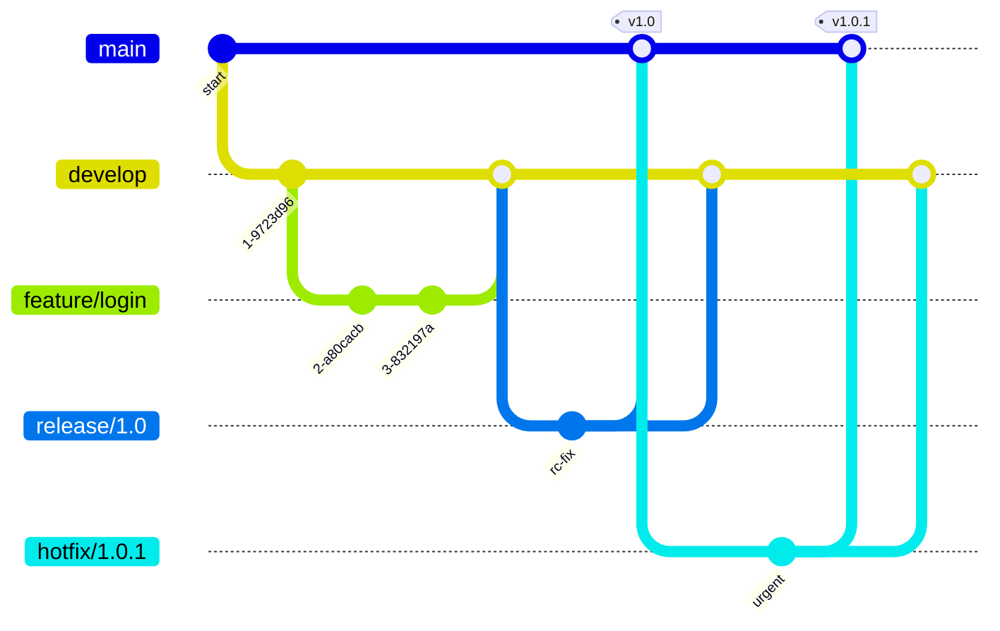
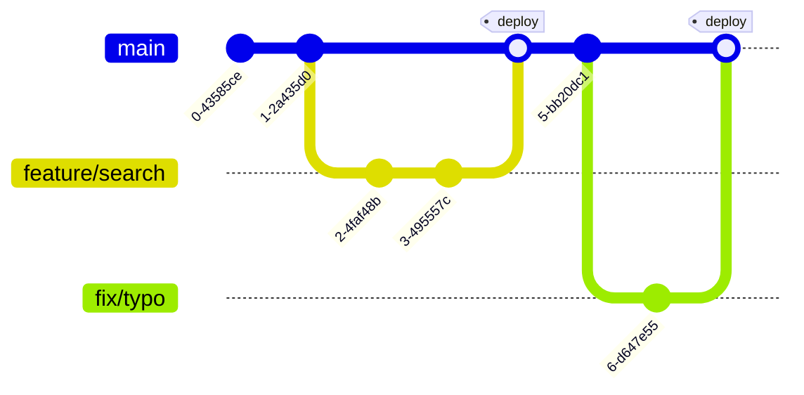
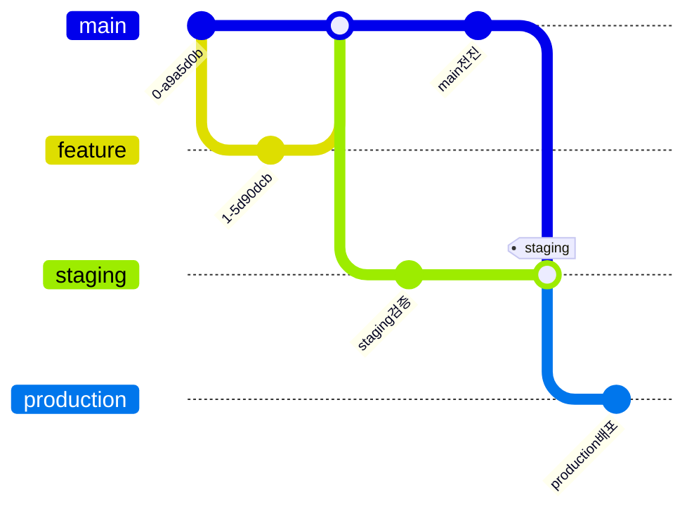
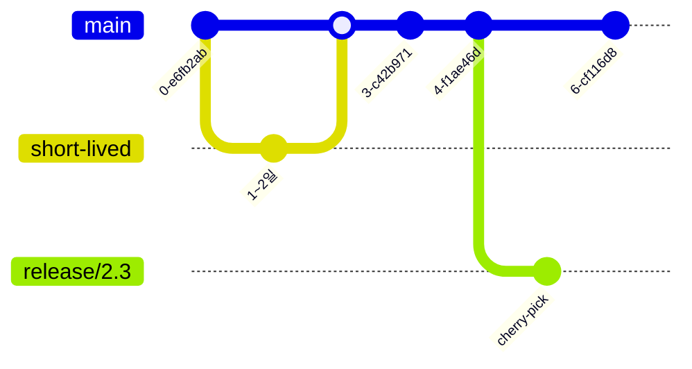
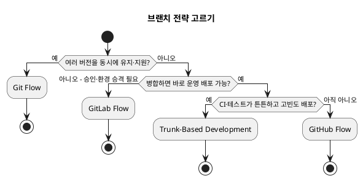

<!-- truncate -->

팀마다 "코드를 `main`에 언제·어떻게 합치느냐"가 다릅니다. 어떤 팀은 `develop`·`release`·`hotfix`까지 여러 브랜치를 두고, 어떤 팀은 `main` 하나에 계속 합칩니다. <mark>정답이 하나가 아니라 **배포 주기·릴리스 방식·팀 규모·CI 성숙도**에 따라 달라집니다.</mark> 대표적인 **4가지** — Git Flow · GitHub Flow · GitLab Flow · Trunk-Based Development — 를 구조·장단점·적합 상황으로 비교합니다.

## 먼저: 두 가지 기준으로 보기

브랜치 전략은 결국 두 가지 질문에 대한 답입니다.

- **브랜치를 얼마나 오래 유지하나?** — 오래 유지하는 브랜치가 많을수록 병합할 때 충돌이 누적됩니다. 수명이 짧을수록 통합이 자주 일어나 충돌이 적습니다.
- **배포를 어떻게 하나?** — **버전을 매겨 릴리스**하는가(예: v1.0, v1.1), 아니면 **`main`에 합치는 즉시 배포**하는가.

<mark>브랜치가 많고 오래 유지할수록 **정식 버전을 단계적으로 관리**하기에 유리하고, 브랜치가 적고 수명이 짧을수록 **자주·빠르게 배포**하기에 유리합니다.</mark> 아래 4가지 전략은 이 두 기준을 **서로 다르게 조합**한 것입니다 — 예를 들어 Git Flow는 "브랜치 많음 + 버전 릴리스", Trunk-Based는 "브랜치 최소 + 즉시 배포" 쪽입니다.

## 1. Git Flow — 버전 릴리스에 맞춘 정석

2010년 Vincent Driessen이 정리한 모델([원문](https://nvie.com/posts/a-successful-git-branching-model/))로, 브랜치 역할을 가장 엄격하게 나눕니다.

- **`main`** — 운영에 배포된 코드. 여기의 모든 커밋은 곧 하나의 릴리스입니다.
- **`develop`** — 다음 릴리스를 위한 통합 브랜치. 기능들이 여기로 모입니다.
- **`feature/*`** — `develop`에서 분기해 기능을 개발하고 다시 `develop`으로 병합.
- **`release/*`** — `develop`에서 분기해 릴리스를 준비(막판 버그 수정·버전 번호). `main`과 `develop` **양쪽**으로 병합.
- **`hotfix/*`** — 운영 긴급 수정용. `main`에서 분기해 `main`과 `develop` 양쪽으로 병합.

- **장점**: 역할이 명확하고, **QA·릴리스 준비 단계**가 브랜치로 분리돼 있어 버전 관리가 체계적입니다.
- **단점**: 브랜치가 많고 병합 경로가 복잡합니다. 하루에도 여러 번 배포하는 팀엔 과합니다.
- **언제**: **명시적으로 버전을 매기는 소프트웨어**(모바일 앱, 라이브러리, 온프레미스 설치형 제품)나 **여러 버전을 동시에 지원**해야 할 때.

<mark>Driessen은 2020년 원문 상단에 성찰 노트를 덧붙였습니다 — "지속 배포(continuous delivery)를 한다면 git-flow를 억지로 끼우지 말고 **GitHub flow 같은 더 단순한 방식**을 권한다. 다만 **명시적으로 버전을 매기거나 여러 버전을 유지**해야 한다면 git-flow가 여전히 잘 맞을 수 있다."</mark>

## 2. GitHub Flow — `main` 하나, PR로 배포

GitHub이 제안한 단순한 모델([문서](https://docs.github.com/en/get-started/using-github/github-flow))입니다. <mark>오래 유지되는 브랜치는 **`main` 하나**뿐이고, `main`은 **항상 배포 가능한 상태**를 유지합니다.</mark>

1. `main`에서 짧은 **작업 브랜치**를 만든다.
2. 커밋하고 **Pull Request**를 연다 → 리뷰·CI 통과.
3. `main`에 병합하고 **바로 배포**한다.

- **장점**: 배우기 쉽고, **PR 리뷰 중심**이며, 지속 배포에 자연스럽습니다.
- **단점**: **환경·버전 구분 개념이 없습니다**(병합 = 배포). 스테이징 승격이나 여러 버전 유지가 필요하면 부족합니다.
- **언제**: **웹앱·SaaS**처럼 항상 최신 하나만 배포하고, 작은~중간 규모 팀이 지속 배포할 때.

## 3. GitLab Flow — GitHub Flow + 환경/릴리스 브랜치

GitHub Flow는 "병합하면 곧 운영 배포"인데, 현실에선 **배포를 바로 못 하는** 경우가 많습니다(배포 윈도우, 승인 절차, 스테이징 검증). <mark>GitLab Flow는 여기에 **환경 브랜치**(main → staging → production, 한 방향 승격) 또는 **릴리스 브랜치**를 더해 배포 시점을 제어합니다.</mark>

- **환경 브랜치 방식**: `main`(개발) → `staging` → `production` 순으로 코드가 **한 방향으로만 이동합니다**. 각 환경 브랜치로 병합하는 순간이 곧 그 환경으로의 배포입니다.
- **릴리스 브랜치 방식**: 버전이 필요하면 `main`에서 `release/*`를 분기해 관리(Git Flow보다는 가볍게).

위 그림에서 `staging`·`production` 브랜치의 커밋은 각 환경으로 **승격(배포)** 되는 지점입니다 — 코드는 새로 만들지 않고 항상 `main`에서 아래로 내려갑니다.

- **장점**: **배포 시점을 제어**할 수 있고, 환경별 승격이 브랜치로 드러납니다. 버전 릴리스도 커버합니다.
- **단점**: 환경 브랜치를 사람이 관리해야 하고, 하류로 병합하는 흐름을 지켜야 합니다.
- **언제**: 병합 즉시 운영 배포가 **불가능**하고, **환경 승격 단계**나 가벼운 버전 릴리스가 필요한 팀. (배포를 Git 저장소 상태와 일치시키는 접근은 [쿠버네티스와 GitOps](./kubernetes-basics-to-gitops)와 함께 보면 좋습니다.)

## 4. Trunk-Based Development — trunk 하나에 자주 통합

모두가 **하나의 브랜치(trunk = `main`)** 에 **하루 한 번 이상** 통합하는 방식입니다([trunkbaseddevelopment.com](https://trunkbaseddevelopment.com/)). 긴 수명 브랜치를 만들지 않는 것이 핵심입니다.

- **작은 팀**: 리뷰 후 **trunk에 직접 커밋**.
- **규모가 커지면(scaled)**: **1~2일 안에 사라지는 짧은 브랜치**로 코드 리뷰·CI만 거치고 곧바로 trunk로 병합.
- **미완성 기능**은 브랜치로 숨기지 않고 **기능 플래그(feature flag)** 로 꺼 둔 채 trunk에 합칩니다.
- **릴리스**는 필요할 때 trunk에서 **`release/*`를 잘라내(cut)** 안정화하거나, 아예 **trunk에서 바로 배포**하고 문제는 앞으로 고칩니다(fix forward).

- **장점**: 브랜치가 짧아 **병합 충돌이 누적되지 않고**, 작은 배치로 자주 통합하니 **CI/CD를 극대화**합니다.
- **단점**: **규율**이 필요합니다 — 빠른 리뷰, 신뢰할 수 있는 CI·테스트, 기능 플래그 설계. 긴 기능은 플래그로 나누는 노력이 듭니다.
- **언제**: **CI가 성숙**하고 **고빈도 배포**를 지향하는 팀.

<mark>Trunk-Based Development는 **지속 통합(CI)의 핵심 전제**입니다 — "모든 팀원이 최소 24시간에 한 번 trunk에 통합"해야 CI가 성립합니다.</mark> DORA 연구는 **활성 브랜치를 3개 이하로 유지하고 매일 trunk에 병합**하며 코드 프리즈를 피하는 팀이 **배포·운영 성과(속도·안정성·가용성)** 가 높다고 보고합니다([DORA — Trunk-based development](https://dora.dev/capabilities/trunk-based-development/)).

> **DORA란?**
>
> DevOps Research and Assessment의 약자로, 『Accelerate』(2018)의 저자 Nicole Forsgren·Jez Humble·Gene Kim이 이끈 데브옵스 연구입니다(현재 Google 산하). 수천 개 팀의 데이터로 **어떤 개발 관행이 배포 성과와 상관있는지**를 분석하며, 성과를 재는 **4대 지표** — 배포 빈도, 변경 리드타임, 변경 실패율, 복구 시간(MTTR) — 으로 잘 알려져 있습니다.

## 한눈에 비교

| 전략 | 오래 유지되는 브랜치 | 배포 방식 | 병합 부담 | 적합 상황 |
|---|---|---|---|---|
| **Git Flow** | `main`·`develop` (+ release·hotfix) | 버전 릴리스 | 큼 | 버전 여러 개 유지, 설치형·앱·라이브러리 |
| **GitHub Flow** | `main` 하나 | 병합 = 배포 | 작음 | 웹앱·SaaS, 지속 배포, 소~중 팀 |
| **GitLab Flow** | `main` + 환경/릴리스 | 환경 승격 | 중간 | 배포 시점 제어·환경 승격 필요 |
| **Trunk-Based** | 사실상 없음(짧은 브랜치) | trunk 배포 / release cut | 아주 작음 | 고빈도 배포, CI 성숙 |

## 어떻게 고를까

전략을 일일이 따지기보다, 아래 질문에 **순서대로** 답하면 빠르게 정해집니다.

PlantUML 코드

- **버전을 여러 개** 유지·지원한다(모바일 앱, 라이브러리, 온프레미스) → **Git Flow**.
- 병합 즉시 배포가 **어렵고** 환경 승격·승인 단계가 있다 → **GitLab Flow**.
- 지속 배포를 하는데 **CI가 아직 성숙하지 않았다** → **GitHub Flow**로 시작.
- **CI가 튼튼하고** 하루에도 여러 번 배포한다 → **Trunk-Based Development**.

## 정리

- 브랜치 전략은 **브랜치 수명**과 **배포 방식** 두 기준으로 이해하면 명확해집니다.
- **Git Flow**(버전 릴리스)·**GitHub Flow**(단순 지속 배포)·**GitLab Flow**(환경 승격)·**Trunk-Based**(고빈도·CI 중심).
- <mark>정답은 팀 상황에 있습니다 — 배포를 자주 할수록 브랜치를 짧고 적게, 버전을 여럿 유지할수록 브랜치를 명확히 나눕니다.</mark>
- 원문/자료를 만든 사람들도 강조하듯, 만능은 없습니다. 지금 팀의 배포 주기·CI 성숙도·릴리스 요구에 맞춰 고르고, 바뀌면 전략도 바꾸면 됩니다.
