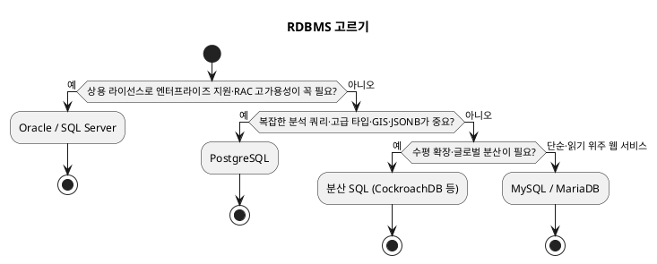

<!-- truncate -->

관계형 DB(RDBMS)는 다 비슷해 보여도, 라이선스·기능·운영 성격이 꽤 다릅니다. <mark>"무엇이 제일 좋냐"에는 정답이 없고, **워크로드·비용·팀 경험·필요한 기능**에 따라 답이 달라집니다.</mark> 가장 많이 쓰이는 **MySQL · PostgreSQL · Oracle**을 기준별로 비교하고, 고르는 순서를 정리합니다.

## 무엇을 기준으로 비교하나

세 DB를 비교하는 기준은 대략 이렇습니다.

- **라이선스·비용** — 오픈소스인가, 상용(유료 라이선스)인가.
- **기능·SQL 표준** — 고급 타입·분석 쿼리·확장 기능을 얼마나 지원하나.
- **워크로드 성격** — 단순 읽기 위주 웹 트래픽인가, 복잡한 분석·트랜잭션인가.
- **확장·복제·운영** — 복제·고가용성 구성과 운영 노하우·매니지드 서비스.
- **팀 경험** — 이미 잘 다루는 DB가 있으면 그 자체가 큰 이점입니다.

## MySQL — 웹 서비스의 대중적 선택

**오픈소스**(GPLv2, 현재 Oracle이 소유)이고, 기본 스토리지 엔진인 **InnoDB**가 트랜잭션·행 단위 잠금·MVCC를 제공합니다.

- **강점**: 구조가 단순하고 가벼워 **읽기 위주 웹 트래픽**에 잘 맞습니다. 복제·운영 노하우와 자료가 풍부하고, 매니지드 서비스(AWS RDS·Aurora 등) 지원이 넓습니다.
- **최근 보강**: 8.0에서 CTE(공통 테이블 식), 윈도우 함수, JSON 타입, 해시 조인 등이 들어와 과거의 "표준 기능 부족" 약점이 많이 줄었습니다.
- **기본 격리 수준**: `REPEATABLE READ`.
- **고려할 점**: 아주 복잡한 분석 쿼리나 고급 데이터 타입은 PostgreSQL이 더 강합니다.

<mark>단순한 스키마로 대량의 읽기·쓰기를 빠르게 처리하는 웹 서비스라면 MySQL이 무난한 출발점입니다.</mark> (인덱스 동작은 [MySQL 인덱스와 B+트리](./mysql-index-btree-explain) 참고.)

## PostgreSQL — 표준 준수와 기능 풍부함

**오픈소스**(PostgreSQL License, 관대한 라이선스)이며 **특정 회사 소유가 아닌 커뮤니티**가 개발합니다.

- **강점**: SQL 표준을 충실히 따르고 **기능이 풍부**합니다 — `JSONB`(색인 가능한 JSON), 배열·범위 타입, 지리정보(PostGIS), 전문 검색, 윈도우 함수, 그리고 **확장(extension)** 으로 기능을 덧붙일 수 있습니다.
- **워크로드**: 복잡한 조인·분석 쿼리, 지리정보, 반정형 데이터에 강합니다.
- **기본 격리 수준**: `READ COMMITTED`. 직렬화는 SSI(Serializable Snapshot Isolation)로 구현됩니다.
- **고려할 점**: 오래된 행을 정리하는 `VACUUM` 등 MVCC 운영 특성을 이해해야 하고, 아주 단순한 읽기 전용 용도엔 MySQL이 더 가벼울 수 있습니다.

<mark>고급 타입·복잡 쿼리·확장성이 중요하면 PostgreSQL이 유리합니다 — 예: 지리정보 검색이나 JSON 문서를 색인해 질의하는 서비스.</mark>

## Oracle — 엔터프라이즈 고가용성

**상용 소프트웨어**로, 코어 수 기준의 **유료 라이선스**가 붙습니다.

- **강점**: 대규모·고가용성 구성(RAC로 여러 노드가 하나의 DB 공유), 강력한 절차 언어(PL/SQL), 정교한 튜닝·파티셔닝·진단 도구, 그리고 벤더의 엔터프라이즈 지원. 금융·대기업 **기간계**(계정·원장·거래처리처럼 사업의 근간이 되는 핵심 업무 시스템 — 장애가 나면 사업이 멈춤)에서 오래 검증됐습니다.
- **기본 격리 수준**: `READ COMMITTED`(+ 스냅샷 기반 `SERIALIZABLE`, `READ ONLY` 모드).
- **고려할 점**: **비용과 라이선스 종속성**이 큽니다(라이선스 감사·클라우드 전환 비용). 필요한 고가용성·지원 수준이 그 비용을 정당화하는지 따져야 합니다.

<mark>극단적 안정성·고가용성과 벤더 지원이 비용보다 중요한 대규모 기간계라면 Oracle이 선택지에 오릅니다.</mark>

## 그 외 선택지

- **MariaDB** — MySQL에서 갈라져 나온 완전 오픈소스 포크. MySQL과 호환성이 높습니다.
- **SQL Server** — Microsoft의 상용 DB. .NET·Windows 생태계와 잘 맞습니다.
- **SQLite** — 서버가 없는 파일 기반 임베디드 DB. 앱 내장·소규모·테스트용.
- **분산 SQL**(CockroachDB·YugabyteDB·Google Spanner·TiDB 등, 'NewSQL'이라고도 함):
  - **무엇** — 데이터를 **여러 노드에 자동으로 나눠(샤딩)** 저장하면서도, 개발자에게는 **하나의 SQL DB처럼 보이고 트랜잭션(ACID)도 유지**됩니다.
  - **왜 쓰나** — 전통 RDBMS는 서버 한 대의 사양을 키우다(수직 확장) 한계에 부딪히지만, 분산 SQL은 **노드를 추가해 용량·처리량을 늘리고(수평 확장)** 여러 지역(region)에 걸쳐 배치할 수 있습니다.
  - **대가** — 노드 간 합의(예: Raft) 때문에 지연·운영 복잡도가 커집니다. 정말 대규모·글로벌 서비스가 아니면 과합니다.

## 한눈에 비교

| DB | 라이선스 | 기본 격리 | 강점 | 대표 워크로드 |
|---|---|---|---|---|
| **MySQL** | 오픈소스(GPL, Oracle 소유) | REPEATABLE READ | 단순·가벼움, 복제·매니지드 풍부 | 읽기 위주 웹 서비스 |
| **PostgreSQL** | 오픈소스(커뮤니티) | READ COMMITTED | 표준 준수, 고급 타입·분석·확장 | 복잡 쿼리·지리정보·JSON |
| **Oracle** | 상용(유료) | READ COMMITTED | 고가용성(RAC)·PL/SQL·엔터프라이즈 지원 | 대규모 기간계·금융 |

## 어떻게 고를까

한 번에 정하기보다 아래 질문에 **순서대로** 답하면 빠르게 정해집니다.

PlantUML 코드

- 유료라도 **최고 수준 고가용성·벤더 지원**이 필요하다 → **Oracle**(또는 SQL Server).
- **복잡한 분석·고급 타입·지리정보·JSON**이 중요하다 → **PostgreSQL**.
- **수평 확장·글로벌 분산**이 필요하다 → **분산 SQL**.
- **단순하고 읽기 위주인 웹 서비스**다 → **MySQL**(또는 MariaDB).
- 그리고 **팀이 이미 잘 다루는 DB**가 있으면, 그 이점을 크게 보고 판단합니다.

## 매니지드로 운영 부담 줄이기

어떤 DB를 고르든, 복제·백업·장애 복구를 직접 하는 건 부담입니다. 클라우드 **매니지드 서비스**가 이 운영을 대신 맡아 줍니다 — AWS **RDS·Aurora**(MySQL·PostgreSQL 호환), GCP **Cloud SQL**, Azure Database 등. <mark>DB 종류만큼이나 "직접 운영 vs 매니지드"도 중요한 선택이며, 대부분의 서비스는 매니지드로 시작하는 편이 안전합니다.</mark>

## 정리

- RDBMS 선택은 **라이선스·기능·워크로드·운영·팀 경험**을 함께 놓고 판단합니다.
- **MySQL**(단순·웹)·**PostgreSQL**(표준·기능 풍부)·**Oracle**(엔터프라이즈·고가용성)이 대표 후보입니다.
- <mark>정답은 상황에 있습니다 — 단순 웹이면 MySQL, 복잡 쿼리·고급 기능이면 PostgreSQL, 극단적 안정성·지원이 필요하면 Oracle을 먼저 후보로 검토합니다.</mark>
- 세 DB는 **트랜잭션 격리 수준의 기본값과 구현**도 다릅니다 — 이 주제는 별도 글에서 코드와 함께 다룹니다.
