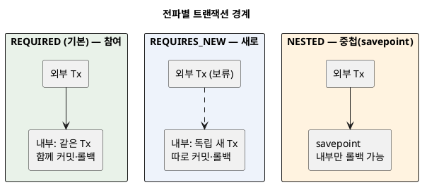
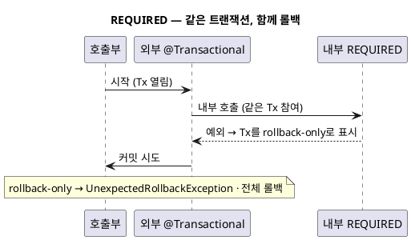
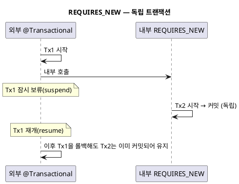

<!-- truncate -->

트랜잭션이 걸린 서비스 메서드가 **또 다른 트랜잭션 메서드를 호출**하면 트랜잭션이 어떻게 이어질까요? 새로 하나 더 열릴까요, 기존 것에 합쳐질까요? <mark>이 규칙이 **전파(propagation)** 이고, `@Transactional(propagation = ...)` 으로 정합니다.</mark> 잘못 고르면 "내부에서 롤백했는데 전체가 같이 롤백"되거나 "따로 남겨야 할 로그가 본작업과 함께 사라지는" 문제가 생깁니다. 케이스별로 정리합니다.

## 핵심 질문: 참여할까, 새로 열까

전파는 결국 두 상황에서 어떻게 행동할지를 정합니다.

- **이미 진행 중인 트랜잭션이 있을 때** — 거기에 **참여**할까, **새로** 열까, **중첩**할까, 아니면 **예외**를 낼까.
- **진행 중인 트랜잭션이 없을 때** — **새로** 열까, **트랜잭션 없이** 실행할까, **예외**를 낼까.

<details>
<summary>PlantUML 코드</summary>



</details>


## 7가지 전파 옵션 한눈에

| 전파 | 기존 트랜잭션이 있을 때 | 없을 때 |
|---|---|---|
| **REQUIRED**(기본) | 참여 | 새로 시작 |
| **REQUIRES_NEW** | 기존을 보류하고 **새 트랜잭션** | 새로 시작 |
| **NESTED** | **savepoint**로 중첩 | 새로 시작 |
| **SUPPORTS** | 참여 | 트랜잭션 없이 실행 |
| **NOT_SUPPORTED** | 기존을 보류, 트랜잭션 없이 실행 | 트랜잭션 없이 실행 |
| **MANDATORY** | 참여 | **예외** |
| **NEVER** | **예외** | 트랜잭션 없이 실행 |

아래에서는 실무에서 자주 쓰는 **REQUIRED · REQUIRES_NEW · NESTED** 세 가지를 케이스로 봅니다.

## ① REQUIRED (기본) — 하나의 트랜잭션으로 합친다

지정하지 않으면 이것입니다. 진행 중인 트랜잭션이 있으면 **그대로 참여**하고, 없으면 새로 시작합니다. 외부·내부가 **하나의 트랜잭션**으로 묶여 함께 커밋되고 함께 롤백됩니다.

```java
@Service
@RequiredArgsConstructor
public class OrderService {
    private final PaymentService paymentService;

    @Transactional  // = REQUIRED
    public void placeOrder(Order order) {
        orderRepository.save(order);
        paymentService.pay(order);   // 아래 pay()도 REQUIRED → 같은 트랜잭션에 참여
    }
}

@Service
public class PaymentService {
    @Transactional  // = REQUIRED, 호출되면 placeOrder의 트랜잭션에 참여
    public void pay(Order order) { ... }
}
```

<mark>같은 트랜잭션이므로 **내부에서 예외로 롤백되면 외부까지 전부 롤백**됩니다.</mark> 특히 참여 중인 내부가 예외로 트랜잭션을 "rollback-only"로 표시하면, 외부가 정상 종료해 커밋하려는 순간 `UnexpectedRollbackException`이 납니다.

<details>
<summary>PlantUML 코드</summary>



</details>


이 "부분 실패가 전체 롤백으로 이어지는" 문제와 대응은 [트랜잭션 rollback-only 이야기](./spring-transaction-rollback-only)에서 자세히 다뤘습니다.

## ② REQUIRES_NEW — 항상 새 트랜잭션(독립)

내부 메서드가 **자기만의 트랜잭션**을 엽니다. 기존 트랜잭션이 있으면 **잠시 보류(suspend)** 했다가, 내부가 끝나면 **재개(resume)** 합니다. 두 트랜잭션은 서로 독립이라 커밋·롤백이 따로 놉니다.

```java
@Service
public class OrderService {
    @Transactional  // 본작업 트랜잭션
    public void placeOrder(Order order) {
        orderRepository.save(order);
        auditService.record("주문 시도: " + order.getId());  // 아래는 REQUIRES_NEW
        paymentService.pay(order);   // 여기서 실패해 placeOrder가 롤백돼도…
    }
}

@Service
public class AuditService {
    @Transactional(propagation = Propagation.REQUIRES_NEW)
    public void record(String message) {
        auditRepository.save(new Audit(message));  // …이 이력은 이미 커밋되어 남는다
    }
}
```

<mark>내부(REQUIRES_NEW)는 독립이라, **외부가 롤백해도 이미 커밋한 내부는 남고**, 내부가 롤백해도 외부에는 영향이 없습니다.</mark> 그래서 "본작업이 실패해도 반드시 남겨야 하는" **감사 로그·이력·알림 기록**에 적합합니다. 다만 외부를 보류한 채 새 트랜잭션을 열므로 **DB 커넥션을 잠시 2개** 점유한다는 점은 유의합니다.

<details>
<summary>PlantUML 코드</summary>



</details>


## ③ NESTED — savepoint로 부분 롤백

기존 트랜잭션 **안에서 savepoint**를 찍고 중첩 실행합니다. 내부에서 문제가 생기면 **savepoint까지만 롤백**하고 외부는 이어갈 수 있습니다.

```java
@Transactional  // 외부
public void importAll(List<Row> rows) {
    for (Row row : rows) {
        try {
            importOne(row);   // NESTED — 실패하면 이 행만 되돌리고 계속
        } catch (Exception e) {
            log.warn("행 건너뜀: {}", row.getId());
        }
    }
}

@Transactional(propagation = Propagation.NESTED)
public void importOne(Row row) { ... }
```

REQUIRES_NEW와 헷갈리기 쉬운데, 차이는 **외부와의 관계**입니다. <mark>NESTED는 외부의 일부라, **내부만 따로 롤백**할 수는 있어도 **외부가 롤백하면 내부도 함께 롤백**됩니다(REQUIRES_NEW는 완전히 독립).</mark> savepoint를 지원하는 트랜잭션 매니저·JDBC 드라이버에서만 동작합니다.

## 나머지 네 가지 (간단히)

- **SUPPORTS** — 트랜잭션이 있으면 참여, 없으면 트랜잭션 없이 실행. 조회 위주라 있으면 좋고 없어도 되는 경우.
- **NOT_SUPPORTED** — 트랜잭션 없이 실행(있으면 보류). 트랜잭션이 오히려 방해되는 오래 걸리는 작업 등.
- **MANDATORY** — 반드시 기존 트랜잭션 안에서만 호출돼야 하고, 없으면 예외. "혼자 실행되면 안 되는" 내부 로직 방어용.
- **NEVER** — 트랜잭션이 있으면 예외. 트랜잭션에서 절대 실행되면 안 되는 경우.

## 흔히 빠지는 지점 — 같은 클래스 내부 호출(self-invocation)

`@Transactional`은 스프링이 만든 **프록시**가 가로채 동작합니다. 그런데 **같은 클래스 안에서 다른 메서드를 직접 호출**하면 프록시를 거치지 않아, 그 메서드에 붙은 전파(·격리) 설정이 **무시**됩니다.

```java
@Service
public class OrderService {
    @Transactional
    public void placeOrder(Order order) {
        record("주문");   // ← this.record() 직접 호출 → 프록시 미경유
    }

    // REQUIRES_NEW로 독립 트랜잭션을 의도했지만, 위처럼 내부에서 부르면 적용 안 됨
    @Transactional(propagation = Propagation.REQUIRES_NEW)
    public void record(String msg) { ... }
}
```

<mark>내부 호출은 프록시를 건너뛰므로, 전파를 실제로 적용하려면 **다른 빈으로 분리해 주입**받아 호출해야 합니다.</mark>(위 REQUIRES_NEW 예시에서 `AuditService`를 별도 빈으로 둔 이유입니다.)

## 정리

- 전파는 "**기존 트랜잭션에 참여할지, 새로 열지, 중첩할지**"를 정하는 규칙입니다.
- **REQUIRED**(기본)는 하나로 합쳐 함께 커밋·롤백, **REQUIRES_NEW**는 독립이라 따로, **NESTED**는 savepoint로 부분 롤백.
- <mark>"본작업과 함께 롤백되면 안 되는 로그·이력"은 REQUIRES_NEW, "한 묶음으로 성공·실패해야 하는 작업"은 REQUIRED가 맞습니다.</mark>
- 같은 클래스 내부 호출은 프록시를 안 거쳐 전파가 무시되니, 독립 트랜잭션이 필요하면 **빈을 분리**한다.
- 격리 수준과 함께 보려면 [DB 트랜잭션 격리 수준](./db-isolation-levels)을 참고하세요.
