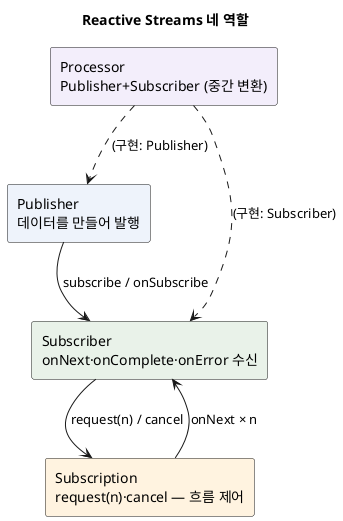
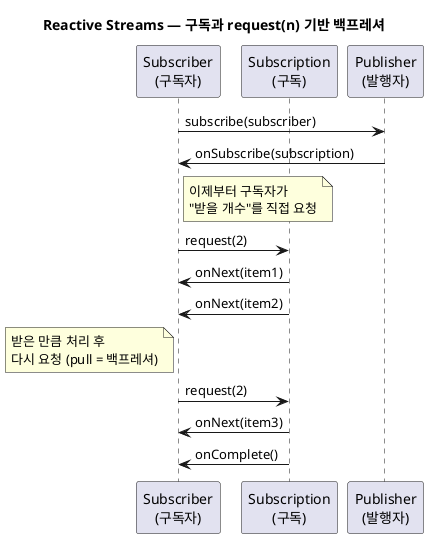
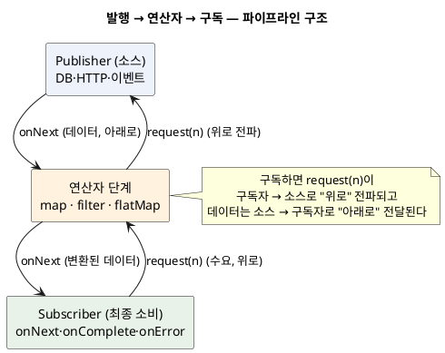
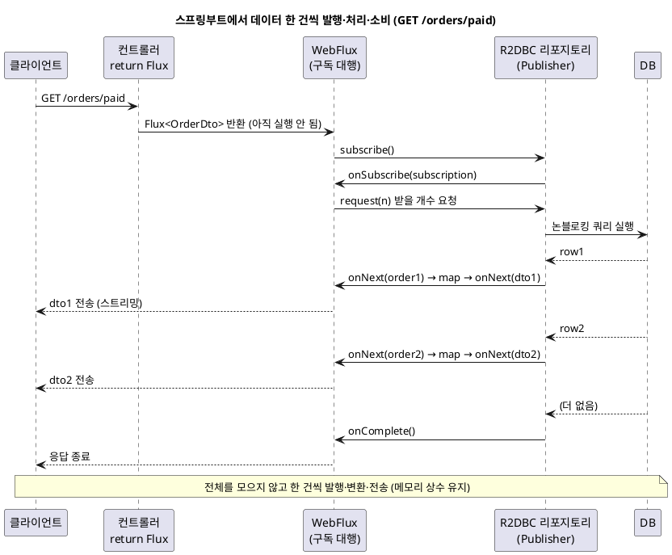

<!-- truncate -->

Reactor의 `Mono`·`Flux`, RxJava의 `Observable`, Akka Streams… 리액티브 라이브러리는 여럿인데, 이들이 **서로 연동되고 같은 개념을 공유**하는 건 밑바탕에 공통 표준이 있기 때문입니다. <mark>그 표준이 **Reactive Streams** — "비동기 스트림을 **논블로킹 백프레셔**로 주고받는" 최소 규격입니다.</mark> WebFlux를 쓰든 다른 라이브러리를 쓰든 이 토대를 알면 "왜 구독해야 실행되나", "백프레셔가 뭔가"가 명확해집니다. (WebFlux에서의 활용은 [Spring WebFlux vs MVC](./spring-webflux-vs-mvc) 참고.)

## 왜 표준이 필요했나

비동기 스트림에는 오래된 문제가 있습니다 — **생산자가 소비자보다 빠를 때**입니다.

- 생산자가 데이터를 **밀어내기(push)** 만 하면, 느린 소비자는 밀린 데이터를 쌓다가 **메모리가 넘치거나(OOM)** 데이터를 버리게 됩니다.
- 그렇다고 소비자가 **하나씩 요청해 받기(pull)** 만 하면, 매번 요청·응답을 주고받아 비동기의 이점이 사라집니다.

<mark>Reactive Streams의 해법은 **"소비자가 처리할 수 있는 개수를 미리 알려 주고, 생산자는 그만큼만 비동기로 보내는"** 방식입니다 — push와 pull의 절충인 이 흐름 제어가 곧 **백프레셔(backpressure)** 입니다.</mark>

여러 라이브러리가 이걸 제각각 구현하면 서로 연동이 안 되니, **2013~2015년 Netflix·Pivotal(현 VMware)·Lightbend 등이 모여 공통 인터페이스 4개**로 표준화한 것이 Reactive Streams입니다.

## 네 가지 역할

표준은 **인터페이스 4개**뿐입니다. 이 관계가 전부입니다.

- **Publisher**(발행자) — 데이터를 만들어 발행하는 쪽. `subscribe(Subscriber)` 하나만 가집니다.
- **Subscriber**(구독자) — 데이터를 받는 쪽. `onSubscribe`·`onNext`(값)·`onComplete`(끝)·`onError`(오류) 네 콜백을 가집니다.
- **Subscription**(구독) — Publisher와 Subscriber를 잇는 연결. 구독자가 `request(n)`으로 **받을 개수를 요청**하고 `cancel()`로 취소합니다.
- **Processor** — Publisher이자 Subscriber인 중간 변환 단계(직접 구현할 일은 드뭅니다).

<details>
<summary>PlantUML 코드</summary>



</details>


인터페이스로 보면 이렇게 단순합니다.

```java
public interface Publisher<T> {
    void subscribe(Subscriber<? super T> s);
}
public interface Subscriber<T> {
    void onSubscribe(Subscription s);
    void onNext(T item);
    void onError(Throwable t);
    void onComplete();
}
public interface Subscription {
    void request(long n);   // 받을 개수 요청 (백프레셔의 핵심)
    void cancel();
}
```

## 구독과 백프레셔 — request(n)의 흐름

핵심은 **구독자가 `request(n)`으로 "처리할 수 있는 만큼만" 요청해 받는다**는 점입니다. 생산자는 요청받은 개수까지만 `onNext`를 보냅니다.

<details>
<summary>PlantUML 코드</summary>



</details>


<mark>이 **pull 기반 요청** 덕분에 느린 소비자가 빠른 생산자에게 "천천히"라고 말할 수 있습니다 — 표준이 보장하는 건 결국 이 흐름 제어 하나입니다.</mark> (`request(Long.MAX_VALUE)`로 요청하면 사실상 제한 없는 push가 됩니다.)

> **`request(n)`의 `n`은 누가 정하나?**
>
> `n`은 **구독자(Subscriber)** 가 정합니다. 구독자가 `onSubscribe(Subscription s)`에서 받은 `Subscription`에 `s.request(n)`을 호출할 때 넘기는 숫자입니다(이때 파라미터 `s`가 곧 그 `Subscription` 객체입니다). `Subscriber` 인터페이스를 직접 구현하는 경우엔 개발자가 그 코드 안에 명시하고(아래 예시), Reactor·WebFlux처럼 프레임워크가 구독을 대행하면 그 연산자·최종 구독자가 정합니다 — 기본값은 대개 `Long.MAX_VALUE`(무제한)이고, `limitRate(n)` 같은 연산자로 상한을 둡니다. WebFlux HTTP 스트리밍에서는 응답을 내보내는 쪽이 **전송 계층(TCP 소켓)의 쓰기 여유**에 맞춰 `request`를 보내고, 소켓이 막히면 요청도 멈춥니다.

`Subscriber` 구현 클래스에서 `n`을 정하는 모습은 이렇습니다.

```java
// 직접 구현한 Subscriber 클래스 — n을 개발자가 코드에 명시한다
class MySubscriber implements Subscriber<Integer> {
    private Subscription subscription;   // onSubscribe에서 받은 s를 보관해 둔다

    @Override
    public void onSubscribe(Subscription s) {
        this.subscription = s;   // ← 이 s가 곧 Subscription 객체
        s.request(1);            // 우선 1개만 요청 (n = 1)
    }

    @Override
    public void onNext(Integer item) {
        process(item);              // 한 건 처리하고
        subscription.request(1);    // 처리한 만큼(1개) 다시 요청 → 이게 백프레셔
    }

    @Override public void onComplete() { /* 스트림 종료 */ }
    @Override public void onError(Throwable t) { /* 오류 처리 */ }
}
```

여기서는 `onSubscribe`와 `onNext`에서 `request(1)`로 **한 건씩만** 요청해 받도록 `n`을 정했습니다. `s.request(256)`처럼 크게 잡으면 한 번에 더 많이 받고, `Long.MAX_VALUE`면 사실상 백프레셔 없이 받는 대로 처리합니다.

반면 Reactor·WebFlux처럼 프레임워크가 구독을 대행하면 이 `n`을 대신 정해 줍니다.

- **기본은 무제한** — `subscribe()`나 람다형 변형처럼 가장 직접적인 구독 방식은 구독하는 순간 곧바로 `Long.MAX_VALUE`를 요청합니다.
- **상한이 필요하면 `limitRate(n)`** — [이 연산자](https://projectreactor.io/docs/core/release/api/reactor/core/publisher/Flux.html#limitRate%28int%29)가 하위 수요를 `n`개 단위 배치로 나눠 위로 전파합니다.

이 "기본은 무제한" 동작은 [Reactor 레퍼런스 가이드](https://projectreactor.io/docs/core/release/reference/reactiveProgramming.html#reactive.backpressure)가 다음과 같이 명시합니다.

> the most direct ways of subscribing all immediately trigger an unbounded request of `Long.MAX_VALUE`

즉 위 문장은 "가장 직접적인 구독 방식들은 모두 구독하는 즉시 `Long.MAX_VALUE`의 무제한 요청을 일으킨다"는 뜻으로, 앞서 말한 기본 무제한 동작을 가리킵니다.

## 발행과 구독이 이어지는 구조

실제 코드는 **소스 → 연산자 여러 단계 → 최종 구독자**로 이어진 **파이프라인**입니다. 흐름 방향이 둘인 게 핵심입니다.

- **데이터는 위→아래(소스 → 구독자)** 로 `onNext`를 타고 내려갑니다.
- **수요(`request(n)`)는 아래→위(구독자 → 소스)** 로 올라갑니다. 각 연산자는 요청을 위로 전파합니다.

<details>
<summary>PlantUML 코드</summary>



</details>


코드로 보면 이 연결 구조가 그대로 드러납니다.

```java
Flux.range(1, 100)          // ① 소스: 1~100 발행
    .filter(n -> n % 2 == 0) // ② 연산자: 짝수만 통과
    .map(n -> n * 10)        // ③ 연산자: 변환
    .subscribe(System.out::println);  // ④ 최종 구독자 — 여기서 실제 실행 시작
```

**연결·실행되는 순서**는 이렇습니다.

1. **조립(assembly)** — `.filter`·`.map`은 각 단계를 감싼 새 `Publisher`를 만들 뿐, 아직 아무것도 실행되지 않습니다(위에서 아래로 단계를 엮기만).
2. **구독(subscribe)** — 최종 `subscribe`가 호출되면, 구독이 **아래에서 위로** 올라가며 각 단계를 이어 붙입니다(`onSubscribe`).
3. **요청(request)** — 최종 구독자가 `request(n)`을 위로 올려 보내고, 각 연산자가 소스까지 전파합니다.
4. **발행(onNext)** — 소스가 요청받은 만큼 데이터를 **위에서 아래로** 내보내고, 각 연산자를 거쳐 변환된 뒤 구독자에 도착합니다. 끝나면 `onComplete`, 오류면 `onError`가 같은 경로로 내려갑니다.

<mark>즉 "선언(조립) → 구독 → 위로 요청 → 아래로 발행"의 순서라, **구독 전엔 연결 구조만 있고 실행은 없다**는 점이 절차적 코드와 가장 다릅니다.</mark>

### 스프링부트 예시 — 데이터가 한 건씩 발행·처리·소비되는 과정

앞의 추상 파이프라인을 **실제 스프링부트 코드**로 옮겨, "주문 목록 조회" 요청 하나에서 데이터가 어떻게 발행되고 소비되는지 따라가 봅니다.

```java
// 1) Publisher — R2DBC 리포지토리가 결과를 Flux로 "발행"한다 (한 건씩)
public interface OrderRepository extends ReactiveCrudRepository<Order, Long> {
    Flux<Order> findByStatus(String status);
}

// 2) 파이프라인 조립 — 컨트롤러는 "무엇을 할지" 선언만 하고 Flux를 반환한다 (아직 실행 안 됨)
@GetMapping(value = "/orders/paid", produces = MediaType.APPLICATION_NDJSON_VALUE)
public Flux<OrderDto> paidOrders() {
    return orderRepository.findByStatus("PAID")   // 소스: PAID 주문을 한 건씩 발행
                          .filter(o -> o.getAmount() > 0)   // 연산자: 걸러 내고
                          .map(OrderDto::from)              // 연산자: DTO로 변환
                          .doOnNext(dto -> log.info("보냄: {}", dto.id()));  // 각 건마다 로그
    // 3) 구독은 WebFlux가 대신 한다 — 클라이언트에 응답을 쓰기 시작할 때 subscribe()
}
```

이 요청 하나가 실행되는 과정을 시퀀스로 보면, **전체를 모으지 않고 한 건씩** 발행→변환→전송되는 게 드러납니다.

<details>
<summary>PlantUML 코드</summary>



</details>


정리하면 이렇게 이어집니다.

1. **요청 도착** → 컨트롤러가 `Flux` 파이프라인을 **조립해 반환**만 합니다(DB 쿼리는 아직 실행 전).
2. **WebFlux가 구독** → 응답 본문을 만들 데이터가 필요하므로 WebFlux가 반환된 `Flux`를 `subscribe()` 합니다. 이 구독이 곧 실행의 시작점이라, 이어서 `request(n)`이 소스(R2DBC)까지 위로 전파되고 그제야 실제 쿼리가 나갑니다.
3. **소스가 한 건 발행** → DB에서 row 하나가 오면 `onNext(order1)` → `filter` → `map`을 거쳐 `dto1`이 되고, WebFlux가 **그 건을 곧바로 응답으로 클라이언트에 내보냅니다.**
4. **반복** → 다음 row도 같은 경로로 한 건씩 처리·전송. 다 끝나면 `onComplete`로 응답을 닫습니다.

<mark>핵심은 **"한 건 발행 → 변환 → 전송"이 건마다 반복**된다는 점입니다 — 전체 결과를 메모리에 모았다가 한 번에 주는 게 아니라, 오는 대로 처리해 메모리를 상수로 유지합니다.</mark>

## 두 가지 짚어둘 개념

### 구독해야 실행된다 (lazy)

Publisher는 **설계도**일 뿐, `subscribe`가 호출돼야 실제로 데이터가 발행됩니다. 그래서 리액티브 코드는 연산자로 파이프라인을 **선언**해 두고, 마지막에 구독(프레임워크가 대신 하기도 함)해야 동작합니다.

### cold vs hot 발행자

- **cold**(차가운) — 구독하는 **그 순간에** 데이터 발행이 시작되고, 구독자마다 **처음부터 새로** 받습니다. 예: DB 조회·HTTP 요청 — 구독할 때마다 쿼리가 다시 실행됩니다.
- **hot**(뜨거운) — 구독 여부와 상관없이 **소스가 이미 값을 계속 만들어 내보내고 있어서**, 구독하면 **구독한 시점 이후의 값부터** 받습니다(그전 값은 못 봅니다). 예: 마우스 이벤트·실시간 시세 — 늦게 구독하면 이미 지나간 값은 놓칩니다.

<mark>즉 cold는 "구독마다 처음부터 다시", hot은 "구독 시점 이후만 수신"입니다 — 예를 들어 같은 시세 스트림이라도 cold면 구독자마다 과거부터 재생되고, hot이면 지금부터의 시세만 받습니다.</mark>

## JDK 9 Flow API — 표준이 표준 라이브러리로

Reactive Streams의 네 인터페이스는 **JDK 9부터 `java.util.concurrent.Flow`** 에 그대로 편입됐습니다(JEP 266).

```java
java.util.concurrent.Flow.Publisher<T>
java.util.concurrent.Flow.Subscriber<T>
java.util.concurrent.Flow.Subscription
java.util.concurrent.Flow.Processor<T, R>
```

<mark>즉 Reactive Streams와 JDK `Flow`는 **이름공간만 다른 같은 규격**입니다.</mark> 라이브러리 없이도 표준 타입을 참조할 수 있고, `org.reactivestreams`와 `java.util.concurrent.Flow` 사이는 어댑터로 변환됩니다.

## 라이브러리와의 관계

| 라이브러리 | 표준 타입 대응 | 비고 |
|---|---|---|
| **Project Reactor** | `Mono`(0·1개)·`Flux`(0개 이상) | 스프링 WebFlux의 기본 |
| **RxJava 3** | `Flowable`(백프레셔 지원)·`Observable`(미지원) 등 | 안드로이드에서 널리 |
| **Akka Streams** | `Source`·`Flow`·`Sink` | 그래프 기반 스트림 |
| **JDK Flow** | `Flow.Publisher` 등 | 표준 라이브러리 내장 |

<mark>모두 Reactive Streams를 구현하므로, 한 라이브러리의 `Publisher`를 다른 라이브러리가 구독할 수 있습니다 — 이 상호운용이 표준을 만든 목적입니다.</mark> 단, 편의 연산자(`map`·`flatMap` 등)는 표준이 아니라 각 라이브러리가 자체 제공합니다.

## 스프링에서 언제 필요한가 — 구현 예시

스프링 앱에서 이 표준(과 Reactor)이 실제로 쓸모 있는 상황과 코드입니다.

### ① 대용량을 메모리에 다 올리지 않고 스트리밍

전체를 `List`로 받으면 힙이 위험합니다. `Flux`로 **한 건씩 내보내며** 처리하면 메모리를 상수로 유지합니다. R2DBC 리포지토리는 `Flux`를 반환합니다.

```java
public interface OrderRepository extends ReactiveCrudRepository<Order, Long> {
    Flux<Order> findByStatus(String status);   // 결과를 한 번에 다 올리지 않고 스트림으로
}

// 대량 데이터를 스트리밍 응답으로 (전체를 메모리에 적재하지 않음)
@GetMapping(value = "/orders/stream", produces = MediaType.APPLICATION_NDJSON_VALUE)
public Flux<Order> stream() {
    return orderRepository.findByStatus("PAID");
}
```

### ② 실시간 푸시 — SSE

`Flux`는 서버가 값을 **생기는 대로 계속 내보내는** SSE(Server-Sent Events)에 자연스럽습니다.

```java
@GetMapping(value = "/prices", produces = MediaType.TEXT_EVENT_STREAM_VALUE)
public Flux<Price> prices() {
    return Flux.interval(Duration.ofSeconds(1))       // 1초마다
               .map(tick -> priceService.current());  // 최신 시세를 계속 내보냄
}
```

### ③ 여러 논블로킹 호출을 병렬로 합치기

독립적인 외부 호출을 `zip`으로 **동시에** 기다렸다 합칩니다(순차 대기 대신).

```java
public Mono<Dashboard> dashboard(Long userId) {
    return Mono.zip(userClient.get(userId),        // 세 호출을
                    orderClient.count(userId),      // 동시에 논블로킹으로
                    pointClient.balance(userId))    // 실행하고
               .map(t -> new Dashboard(t.getT1(), t.getT2(), t.getT3()));
}
```

### ④ 블로킹 라이브러리를 Reactor로 감싸기

R2DBC가 없거나 블로킹 SDK만 있을 때는, 그 호출을 **별도 스케줄러로 분리**해 이벤트 루프를 막지 않게 합니다(순수 리액티브의 이점은 줄지만 혼용은 가능).

```java
Mono.fromCallable(() -> legacyBlockingClient.call())  // 블로킹 호출
    .subscribeOn(Schedulers.boundedElastic());        // 이벤트 루프 밖 전용 풀에서 실행
```

### ⑤ 표준 타입으로 라이브러리 경계 넘기

메서드 시그니처를 Reactor 전용 `Flux` 대신 표준 `org.reactivestreams.Publisher`로 두면, RxJava·JDK Flow 등 **어느 구현이 와도 받을 수 있습니다**.

```java
// 표준 타입으로 받으면 Reactor Flux·RxJava Flowable 등 무엇이든 구독 가능
public void consume(org.reactivestreams.Publisher<Event> source) {
    Flux.from(source).subscribe(this::handle);   // Reactor로 감싸 처리
}
```

<mark>정리하면 스프링에서 Reactive Streams가 필요한 건 **대용량 스트리밍·실시간 푸시(SSE)·다중 논블로킹 호출 합성**처럼 흐름 제어와 논블로킹이 실익을 주는 경우입니다 — 단순 CRUD엔 과합니다(그럴 땐 MVC나 [가상 스레드](./virtual-threads-in-production)).</mark>

## 표준이 보장하는 것과 아닌 것

- **보장**: 논블로킹 백프레셔(`request(n)`), 네 인터페이스의 규약(신호 순서·취소·오류 전파), 라이브러리 간 상호운용.
- **표준이 아님**: 연산자·스케줄러·실행 모델은 각 라이브러리 몫. `map`이나 `subscribeOn`은 Reactor·RxJava가 각자 정의합니다.

## 정리

- **Reactive Streams**는 비동기 스트림을 **논블로킹 백프레셔**로 주고받는 최소 표준입니다(인터페이스 4개).
- 핵심은 **구독자가 `request(n)`으로 처리할 수 있는 만큼만 요청해 받는** 흐름 제어입니다 — push/pull의 절충.
- **Publisher는 구독해야 실행되고**(lazy), cold/hot에 따라 동작이 다릅니다.
- <mark>JDK 9 `Flow`가 이 표준을 그대로 담았고, Reactor·RxJava·Akka가 모두 이를 구현해 서로 연동됩니다.</mark> 연산자·스케줄러는 표준 밖이라 라이브러리마다 다릅니다.

## 참고

- [Reactive Streams 표준 명세](https://www.reactive-streams.org/) — 인터페이스 4개와 규약
- [Reactor 레퍼런스 — Backpressure](https://projectreactor.io/docs/core/release/reference/reactiveProgramming.html#reactive.backpressure) — 구독 시 기본 `Long.MAX_VALUE` 요청, 수요 재조정
- [`Flux.limitRate(int)` 자바독](https://projectreactor.io/docs/core/release/api/reactor/core/publisher/Flux.html#limitRate%28int%29) — 하위 수요를 배치로 나눠 상한
- [JDK 9 `java.util.concurrent.Flow`](https://docs.oracle.com/javase/9/docs/api/java/util/concurrent/Flow.html) — 표준을 담은 JDK 인터페이스
