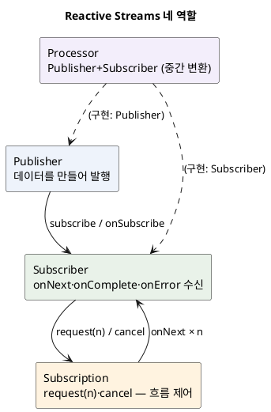
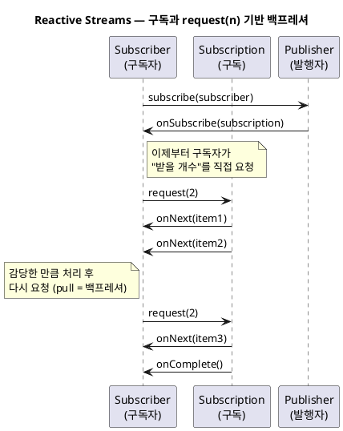

<!-- truncate -->

Reactor의 `Mono`·`Flux`, RxJava의 `Observable`, Akka Streams… 리액티브 라이브러리는 여럿인데, 이들이 **서로 연동되고 같은 개념을 공유**하는 건 밑바탕에 공통 표준이 있기 때문입니다. <mark>그 표준이 **Reactive Streams** — "비동기 스트림을 **논블로킹 백프레셔**로 주고받는" 최소 규격입니다.</mark> WebFlux를 쓰든 다른 라이브러리를 쓰든 이 토대를 알면 "왜 구독해야 실행되나", "백프레셔가 뭔가"가 명확해집니다. (WebFlux에서의 활용은 [Spring WebFlux vs MVC](./spring-webflux-vs-mvc) 참고.)

## 왜 표준이 필요했나

비동기 스트림에는 오래된 문제가 있습니다 — **생산자가 소비자보다 빠를 때**입니다.

- 생산자가 데이터를 **밀어내기(push)** 만 하면, 느린 소비자는 밀린 데이터를 쌓다가 **메모리가 넘치거나(OOM)** 데이터를 버리게 됩니다.
- 그렇다고 소비자가 **하나씩 당겨오기(pull)** 만 하면, 매번 요청·응답을 주고받아 비동기의 이점이 사라집니다.

<mark>Reactive Streams의 해법은 **"소비자가 감당할 개수를 미리 알려 주고, 생산자는 그만큼만 비동기로 보내는"** 방식입니다 — push와 pull의 절충인 이 흐름 제어가 곧 **백프레셔(backpressure)** 입니다.</mark>

여러 라이브러리가 이걸 제각각 구현하면 서로 연동이 안 되니, **2013~2015년 Netflix·Pivotal(현 VMware)·Lightbend 등이 모여 공통 인터페이스 4개**로 표준화한 것이 Reactive Streams입니다.

## 네 가지 역할

표준은 **인터페이스 4개**뿐입니다. 이 관계가 전부입니다.

- **Publisher**(발행자) — 데이터를 만들어 발행하는 쪽. `subscribe(Subscriber)` 하나만 가집니다.
- **Subscriber**(구독자) — 데이터를 받는 쪽. `onSubscribe`·`onNext`(값)·`onComplete`(끝)·`onError`(오류) 네 콜백을 가집니다.
- **Subscription**(구독) — Publisher와 Subscriber를 잇는 연결. 구독자가 `request(n)`으로 **받을 개수를 요청**하고 `cancel()`로 취소합니다.
- **Processor** — Publisher이자 Subscriber인 중간 변환 단계(직접 구현할 일은 드뭅니다).

<details>
<summary>PlantUML 코드</summary>



</details>


인터페이스로 보면 이렇게 단순합니다.

```java
public interface Publisher<T> {
    void subscribe(Subscriber<? super T> s);
}
public interface Subscriber<T> {
    void onSubscribe(Subscription s);
    void onNext(T item);
    void onError(Throwable t);
    void onComplete();
}
public interface Subscription {
    void request(long n);   // 받을 개수 요청 (백프레셔의 핵심)
    void cancel();
}
```

## 구독과 백프레셔 — request(n)의 흐름

핵심은 **구독자가 `request(n)`으로 "감당할 만큼만" 당겨 간다**는 점입니다. 생산자는 요청받은 개수까지만 `onNext`를 보냅니다.

<details>
<summary>PlantUML 코드</summary>



</details>


<mark>이 **pull 기반 요청** 덕분에 느린 소비자가 빠른 생산자에게 "천천히"라고 말할 수 있습니다 — 표준이 보장하는 건 결국 이 흐름 제어 하나입니다.</mark> (`request(Long.MAX_VALUE)`로 요청하면 사실상 제한 없는 push가 됩니다.)

## 두 가지 짚어둘 개념

### 구독해야 실행된다 (lazy)

Publisher는 **설계도**일 뿐, `subscribe`가 호출돼야 실제로 데이터가 발행됩니다. 그래서 리액티브 코드는 연산자로 파이프라인을 **선언**해 두고, 마지막에 구독(프레임워크가 대신 하기도 함)해야 동작합니다.

### cold vs hot 발행자

- **cold**(차가운) — 구독하는 **그 순간에** 데이터 발행이 시작되고, 구독자마다 **처음부터 새로** 받습니다. 예: DB 조회·HTTP 요청 — 구독할 때마다 쿼리가 다시 실행됩니다.
- **hot**(뜨거운) — 구독 여부와 상관없이 **소스가 이미 값을 계속 만들어 내보내고 있어서**, 구독하면 **구독한 시점 이후의 값부터** 받습니다(그전 값은 못 봅니다). 예: 마우스 이벤트·실시간 시세 — 늦게 구독하면 이미 지나간 값은 놓칩니다.

<mark>즉 cold는 "구독마다 처음부터 다시", hot은 "구독 시점 이후만 수신"입니다 — 예를 들어 같은 시세 스트림이라도 cold면 구독자마다 과거부터 재생되고, hot이면 지금부터의 시세만 받습니다.</mark>

## JDK 9 Flow API — 표준이 표준 라이브러리로

Reactive Streams의 네 인터페이스는 **JDK 9부터 `java.util.concurrent.Flow`** 에 그대로 편입됐습니다(JEP 266).

```java
java.util.concurrent.Flow.Publisher<T>
java.util.concurrent.Flow.Subscriber<T>
java.util.concurrent.Flow.Subscription
java.util.concurrent.Flow.Processor<T, R>
```

<mark>즉 Reactive Streams와 JDK `Flow`는 **이름공간만 다른 같은 규격**입니다.</mark> 라이브러리 없이도 표준 타입을 참조할 수 있고, `org.reactivestreams`와 `java.util.concurrent.Flow` 사이는 어댑터로 변환됩니다.

## 라이브러리와의 관계

| 라이브러리 | 표준 타입 대응 | 비고 |
|---|---|---|
| **Project Reactor** | `Mono`(0~1)·`Flux`(0~N) | 스프링 WebFlux의 기본 |
| **RxJava 3** | `Flowable`(백프레셔 지원)·`Observable`(미지원) 등 | 안드로이드에서 널리 |
| **Akka Streams** | `Source`·`Flow`·`Sink` | 그래프 기반 스트림 |
| **JDK Flow** | `Flow.Publisher` 등 | 표준 라이브러리 내장 |

<mark>모두 Reactive Streams를 구현하므로, 한 라이브러리의 `Publisher`를 다른 라이브러리가 구독할 수 있습니다 — 이 상호운용이 표준을 만든 목적입니다.</mark> 단, 편의 연산자(`map`·`flatMap` 등)는 표준이 아니라 각 라이브러리가 자체 제공합니다.

## 표준이 보장하는 것과 아닌 것

- **보장**: 논블로킹 백프레셔(`request(n)`), 네 인터페이스의 규약(신호 순서·취소·오류 전파), 라이브러리 간 상호운용.
- **표준이 아님**: 연산자·스케줄러·실행 모델은 각 라이브러리 몫. `map`이나 `subscribeOn`은 Reactor·RxJava가 각자 정의합니다.

## 정리

- **Reactive Streams**는 비동기 스트림을 **논블로킹 백프레셔**로 주고받는 최소 표준입니다(인터페이스 4개).
- 핵심은 **구독자가 `request(n)`으로 감당할 만큼만 당겨 오는** 흐름 제어입니다 — push/pull의 절충.
- **Publisher는 구독해야 실행되고**(lazy), cold/hot에 따라 동작이 다릅니다.
- <mark>JDK 9 `Flow`가 이 표준을 그대로 담았고, Reactor·RxJava·Akka가 모두 이를 구현해 서로 연동됩니다.</mark> 연산자·스케줄러는 표준 밖이라 라이브러리마다 다릅니다.
