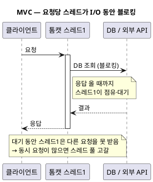
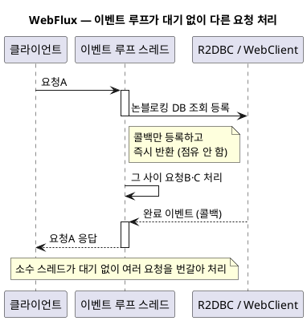
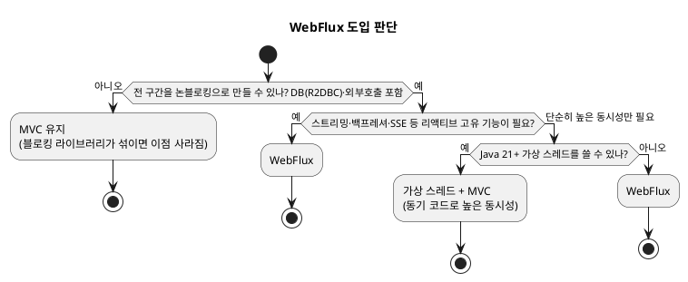

import ArchifyEmbed from '@site/src/components/ArchifyEmbed';

<!-- truncate -->

"트래픽이 늘면 WebFlux로 바꿔야 한다"는 말을 듣지만, 막상 도입하려면 개념도 낯설고 코드도 많이 바뀝니다. <mark>WebFlux는 **적은 스레드로 많은 동시 요청을 처리**하는 비동기·논블로킹 방식이지만, **전 구간을 논블로킹으로 만들어야** 이점이 나오고 아니면 오히려 복잡도만 늘어납니다.</mark> 기본 개념부터 MVC와의 차이, 도입 기준까지 바로 판단할 수 있게 정리합니다.

## 배경 — MVC(thread-per-request)의 한계

전통적인 **Spring MVC**(서블릿 기반)는 **요청 하나당 스레드 하나**를 씁니다. 그 스레드는 DB 조회·외부 API 호출 같은 I/O가 끝날 때까지 **블로킹**되어 아무 일도 못 하면서 자리만 차지합니다.

문제는 **동시 요청이 많고 각 요청이 오래 기다릴 때**입니다. 예를 들어 톰캣 기본 스레드 풀이 200개인데 요청당 외부 API가 500ms 걸린다면, 201번째 요청부터는 스레드가 없어 대기합니다. CPU는 여유가 있는데 **스레드 풀이 병목**이 되는 것입니다. (스레드 풀 튜닝은 [스레드 풀 이야기](./spring-boot-thread-pools), 이벤트 루프의 원리는 [Redis가 싱글 스레드로 빠른 이유](./redis-single-thread-fast) 참고.)

## 리액티브·비동기 기본 개념

WebFlux는 이 문제를 **논블로킹**으로 풉니다. 핵심 개념부터 짚습니다.

- **논블로킹(non-blocking)**: I/O를 요청해 놓고 **기다리지 않고** 다음 일을 합니다. 결과가 준비되면 **콜백**으로 이어서 처리합니다.
- **이벤트 루프(event loop)**: 소수의 스레드(보통 CPU 코어 수)가 "완료된 I/O"를 돌며 콜백을 실행합니다. 대기 중인 요청은 스레드를 점유하지 않습니다.
- **Reactive Streams**: 비동기 스트림의 **표준 규격**(Publisher·Subscriber·Subscription). WebFlux는 이 규격의 구현인 **Project Reactor** 위에서 동작합니다.
- **`Mono`·`Flux`**: Reactor의 두 발행자(Publisher) 타입. **`Mono<T>`** 는 결과가 **0개 또는 1개**(단건), **`Flux<T>`** 는 **0개 이상 여러 개**(스트림)를 **비동기로** 내보냅니다.
- **백프레셔(backpressure)**: 소비자가 처리할 수 있는 만큼만 데이터를 요청하는 흐름 제어. 생산자가 너무 빨라 소비자가 밀리는 상황을 규격 차원에서 막습니다.

<mark>`Mono`·`Flux`는 "값" 자체가 아니라 **"나중에 값이 전달될 통로"** 입니다 — 구독(subscribe)해야 실행되고, 결과는 콜백·연산자로 이어 붙입니다.</mark>

### Reactive Streams — 네 가지 역할

WebFlux의 바탕인 **Reactive Streams**는 네 개의 인터페이스로 이뤄집니다. 이 관계를 알면 "구독해야 실행된다"·"백프레셔"가 왜 그렇게 동작하는지 이해됩니다.

- **Publisher**(발행자) — 데이터를 만들어 내보내는 쪽. `Mono`·`Flux`가 여기에 해당합니다.
- **Subscriber**(구독자) — 데이터를 받는 쪽. `onNext`(값)·`onComplete`(끝)·`onError`(오류) 콜백을 가집니다.
- **Subscription**(구독) — 둘을 잇는 연결. 구독자가 `request(n)`으로 **받을 개수를 요청**하고, `cancel()`로 취소합니다.
- **Processor** — Publisher이자 Subscriber인 중간 단계(직접 쓸 일은 드뭅니다).

네 역할이 실제로 어떻게 맞물리는지, 저수준 코드로 한 번만 보면 감이 잡힙니다(평소엔 연산자가 이걸 대신 해 줍니다).

```java
// Publisher: 값을 발행 (Flux가 대표적 구현)
Publisher<Integer> publisher = Flux.range(1, 5);

// Subscriber: 네 콜백으로 신호를 받는다
publisher.subscribe(new Subscriber<Integer>() {
    private Subscription subscription;

    @Override
    public void onSubscribe(Subscription s) {   // ① 구독 연결이 전달됨
        this.subscription = s;
        s.request(2);                            // ② 우선 2개만 요청 (백프레셔)
    }
    @Override
    public void onNext(Integer item) {           // ③ 요청한 만큼 값이 하나씩 도착
        System.out.println("받음: " + item);
        subscription.request(1);                 // ④ 하나 처리했으니 하나 더 요청
    }
    @Override public void onError(Throwable t) { }   // 오류 신호
    @Override public void onComplete() {             // 완료 신호
        System.out.println("끝");
    }
});
```

- **Publisher** = `Flux.range(...)` — 값을 발행.
- **Subscriber** = `subscribe(...)`에 넘긴 객체 — `onSubscribe`·`onNext`·`onError`·`onComplete`를 받음.
- **Subscription** = `onSubscribe`로 전달된 `s` — 여기에 `request(n)`·`cancel()`로 **수요를 조절**.
- **Processor**(Publisher이자 Subscriber, 중간 변환)는 직접 쓸 일이 드물어 생략 — 실무에선 `map`·`filter` 같은 연산자가 그 역할을 합니다.

<mark>핵심은 **구독자가 `request(n)`으로 "처리할 수 있는 만큼만" 요청해 받는다**는 점입니다 — 이 pull 기반 요청이 곧 백프레셔입니다. 발행자가 일방적으로 밀어내지 않습니다.</mark> (표준 자체·JDK Flow·cold/hot·라이브러리 관계는 [Reactive Streams 표준](./reactive-streams-spec)에서 자세히 다룹니다.)

### 구독하기 전엔 아무 일도 안 일어난다 (lazy)

`Mono`·`Flux`는 **선언**일 뿐, 누군가 **구독(subscribe)** 해야 실제로 실행됩니다.

```java
Mono<User> mono = userRepo.findById(id);  // 여기선 DB 조회가 "아직" 실행되지 않음 (설계도만)
mono.subscribe(user -> log.info("{}", user));  // 구독하는 순간 실행
// 컨트롤러가 Mono를 반환하면, 스프링이 대신 구독해 준다 — 그래서 직접 subscribe 할 일은 드물다
```

이 **지연 실행(lazy)** 때문에, 컨트롤러에서 `Mono`를 만들어 두고 반환만 하면 프레임워크가 구독·실행을 맡습니다.

### 연산자(operator) — 흐름을 조립한다

값을 직접 다루는 대신 **연산자로 통로를 이어 붙입니다.** 자주 쓰는 것만:

- **`map`** — 값을 변환(1:1). `Mono<User> → Mono<UserDto>`.
- **`flatMap`** — 값을 **또 다른 Publisher로** 바꿔 이어 붙임(비동기 연쇄). `Mono<User> → Mono<Order>`.
- **`zip`** — 여러 Publisher를 **병렬로 기다렸다 합침**(독립된 두 호출을 동시에).
- **`onErrorResume`·`retry`·`timeout`** — 오류 대체·재시도·시간 제한.

```java
Mono<Dashboard> dashboard =
    Mono.zip(userRepo.findById(id),          // 두 호출을
             orderRepo.countByUser(id))       // 동시에 논블로킹으로 실행
        .map(t -> new Dashboard(t.getT1(), t.getT2()))
        .timeout(Duration.ofSeconds(2))       // 2초 넘으면 실패
        .onErrorResume(e -> Mono.just(Dashboard.empty()));  // 실패 시 기본값
```

### 스케줄러(Scheduler)와 백프레셔 전략

- **스케줄러**: "어느 스레드에서 실행할지" 지정. `subscribeOn`(구독 시작 스레드)·`publishOn`(이후 단계 스레드). 불가피한 블로킹 작업은 `Schedulers.boundedElastic()`로 **이벤트 루프 밖으로** 뺀다.
  ```java
  return Mono.fromCallable(() -> legacyBlockingClient.call())  // 블로킹 호출
             .subscribeOn(Schedulers.boundedElastic())         // 이벤트 루프가 아닌 전용 풀에서 실행
             .map(this::toResponse);
  // boundedElastic = 블로킹 작업용 스레드 풀(필요 시 늘고 상한 있음).
  // 이게 없으면 블로킹 호출이 이벤트 루프 스레드를 막아 전체가 멈춘다.
  ```
- **백프레셔 전략**: 소비자가 못 따라올 때 처리 방법 — `onBackpressureBuffer`(버퍼링)·`onBackpressureDrop`(버림)·`onBackpressureLatest`(최신만).

## 스레드 모델 — 무엇이 다른가

같은 동시 요청을 처리하는 방식이 근본적으로 다릅니다. 요청 하나가 처리되는 과정을 시퀀스로 비교하면 차이가 분명합니다.

<mark>MVC는 대기 중에도 스레드를 점유해 동시 요청 수만큼 스레드가 필요하지만, WebFlux는 대기를 콜백으로 넘기고 소수 스레드만으로 수만 요청을 처리합니다.</mark>

**MVC**: 요청을 받은 스레드가 I/O가 끝날 때까지 붙잡혀 있습니다.

<details>
<summary>PlantUML 코드</summary>



</details>


**WebFlux**: 스레드는 I/O를 등록만 하고 즉시 반환해, 그 사이 다른 요청을 처리합니다.

<details>
<summary>PlantUML 코드</summary>



</details>


### 논블로킹 요청 흐름 (인터랙티브)

요청이 이벤트 루프를 거쳐 R2DBC·WebClient까지 **끝까지 논블로킹**으로 처리되는 구조입니다. 각 요소의 역할은 이렇습니다.

- **클라이언트** — 요청을 보내는 사용자·앱.
- **Reactor Netty(이벤트 루프)** — 소수의 스레드가 요청을 받고, I/O는 콜백으로 등록해 두고 다른 요청을 처리하는 **논블로킹 서버 런타임**. WebFlux의 기본 서버.
- **핸들러/컨트롤러** — 비즈니스 로직. 값을 직접 반환하지 않고 나중에 결과가 전달될 **`Mono`·`Flux`를 반환**.
- **R2DBC 클라이언트** — 블로킹 없이 DB에 질의하는 **리액티브 DB 드라이버**(JDBC의 논블로킹 대체).
- **WebClient** — 블로킹 없이 외부 API를 호출하는 **논블로킹 HTTP 클라이언트**(RestTemplate의 대체).
- **데이터베이스 / 외부 API** — 실제 데이터·기능을 제공하는 외부 대상.

<ArchifyEmbed src="/diagrams/webflux-flow.html" title="WebFlux 논블로킹 요청 처리 흐름 (인터랙티브)" height="560px" />

## 코드 비교

같은 "사용자 조회 → 주문 조회" 로직을 두 방식으로 비교합니다.

**Spring MVC — 동기·블로킹**

```java
@RestController
@RequiredArgsConstructor
public class OrderController {
    private final UserService userService;
    private final OrderService orderService;

    @GetMapping("/users/{id}/orders")
    public OrderResponse getOrders(@PathVariable Long id) {
        User user = userService.findById(id);           // 여기서 블로킹(스레드 점유)
        List<Order> orders = orderService.findByUser(user);  // 또 블로킹
        return OrderResponse.of(user, orders);
    }
}
```

**Spring WebFlux — 비동기·논블로킹**

```java
@RestController
@RequiredArgsConstructor
public class OrderController {
    private final UserService userService;     // Mono/Flux 반환
    private final OrderService orderService;

    @GetMapping("/users/{id}/orders")
    public Mono<OrderResponse> getOrders(@PathVariable Long id) {
        return userService.findById(id)                    // Mono<User> (구독 전엔 실행 안 됨)
                          .flatMap(user -> orderService.findByUser(user)  // Flux<Order>
                                                       .collectList()
                                                       .map(orders -> OrderResponse.of(user, orders)));
        // 블로킹 없음 — I/O 대기 동안 이벤트 루프 스레드는 다른 요청을 처리
    }
}
```

<mark>MVC는 값을 바로 반환하지만, WebFlux는 `Mono`/`Flux`를 반환하고 `flatMap`·`map` 같은 **연산자로 흐름을 조립**합니다 — 코드의 사고방식 자체가 달라집니다.</mark>

### 주의 — 중간에 블로킹이 섞이면 이점이 사라진다

WebFlux의 이점은 **전 구간이 논블로킹**일 때만 나옵니다. 이벤트 루프 스레드에서 블로킹 코드를 호출하면 그 소수의 스레드가 블로킹돼 **전체가 멈춥니다**.

```java
@GetMapping("/bad")
public Mono<String> bad() {
    return Mono.fromCallable(() -> {
        return jdbcTemplate.queryForObject(...);  // ❌ 블로킹 JDBC — 이벤트 루프를 막는다
    });
    // DB는 R2DBC(리액티브 드라이버), 외부 호출은 WebClient로 — 끝까지 논블로킹이어야 한다
}
```

- **DB**: JPA/JDBC(블로킹) 대신 **R2DBC**(리액티브 드라이버)를 써야 합니다.
- **외부 호출**: `RestTemplate`(블로킹) 대신 **`WebClient`**(논블로킹).
- 불가피하게 블로킹 라이브러리를 써야 하면 `subscribeOn(Schedulers.boundedElastic())`로 **별도 스레드 풀에 격리**합니다(하지만 이러면 순수 리액티브의 이점이 줄어듭니다).

## 디버깅 — MVC보다 까다로운 이유와 대처

WebFlux의 실무 부담 중 하나가 **디버깅**입니다. 왜 어렵고 어떻게 대처하는지 정리합니다.

**왜 어려운가**

- **스택 트레이스가 끊긴다**: 로직이 여러 스레드(이벤트 루프)에 걸쳐 콜백으로 실행되므로, 예외가 나도 스택 트레이스에 **내 코드가 거의 안 보이고** Reactor 내부 프레임만 길게 남습니다.
- **한 요청이 한 스레드가 아니다**: 단계마다 실행 스레드가 바뀔 수 있어, 스레드 이름 기반 로그·`ThreadLocal`(MDC 등)이 그대로는 안 이어집니다.
- **중단점 디버깅이 잘 안 맞는다**: 선언(조립) 시점과 실제 실행(구독) 시점이 달라, 연산자 람다에 브레이크포인트를 걸어도 흐름을 따라가기 어렵습니다.

**대처**

- **`doOnError` / `onErrorResume`으로 지점마다 처리**: 어느 연산자 단계에서 실패했는지 남기고, 필요하면 대체값으로 이어 간다. 둘은 역할이 다르다.
  ```java
  // ① doOnError — 흐름은 그대로 두고 "로그만" 남긴다(부수 효과). 예외는 계속 전파됨
  return userRepo.findById(id)
                 .doOnError(e -> log.error("findById 실패 id={}", id, e))
                 // ② onErrorResume — 실패를 "대체 흐름"으로 바꿔 복구(예외를 삼켜 이어 감)
                 .onErrorResume(e -> Mono.just(User.guest()))
                 // ③ onErrorMap — 예외를 도메인 예외로 변환해 위로 던짐
                 .onErrorMap(DataAccessException.class, e -> new UserLookupException(id, e))
                 .flatMap(this::loadOrders);
  ```
  - **`doOnError`**: 로그·메트릭 같은 **부수 효과만**. 예외는 그대로 전파 → 어디서 났는지 기록용.
  - **`onErrorResume`**: 예외를 **대체 Publisher로 복구**(기본값·폴백). 정상 흐름으로 이어짐.
  - **`onErrorMap`**: 예외를 **다른 예외로 변환**해 다시 던짐(내부 예외 → 도메인 예외).
- **`log()` 연산자로 신호 추적**: 체인 중간에 `.log()`를 넣으면 `onSubscribe`·`request`·`onNext`·`onError` 신호가 순서대로 출력돼 흐름을 눈으로 확인할 수 있다.
  ```java
  userRepo.findById(id)
          .log()                       // 이 지점을 지나는 모든 신호를 로그로
          .flatMap(this::loadOrders);
  // 로그 예: onSubscribe → request(unbounded) → onNext(User(1)) → onComplete
  ```
- **Reactor 디버그 모드 / `checkpoint()`**: 예외가 나도 스택에 내 코드가 안 보이므로, 요소마다 표식을 남긴다.
  ```java
  // (개발) 전역 디버그 — 조립 지점을 스택에 복원, 대신 비용이 큼
  Hooks.onOperatorDebug();

  // (운영) 지점별 checkpoint — 실패 시 "결제 조회 단계"가 스택에 찍힘
  paymentClient.charge(order)
               .checkpoint("결제 조회 단계")
               .flatMap(this::save);
  // 더 가벼운 대안: reactor-tools의 ReactorDebugAgent.init() (오버헤드 없이 조립 지점 복원)
  ```
- **MDC(로그 문맥) 전파**: 스레드가 바뀌어도 요청 식별자(traceId 등)가 로그에 이어지도록 **Reactor Context**로 값을 실어 전달한다.
  ```java
  return handle(request)
      .contextWrite(ctx -> ctx.put("traceId", traceId));   // 체인 전체에서 접근 가능

  // 꺼내 쓸 때 (예: 로그 직전 MDC에 옮김)
  Mono.deferContextual(ctx -> {
      MDC.put("traceId", ctx.get("traceId"));
      log.info("주문 처리");
      return Mono.empty();
  });
  ```

<mark>디버깅 난이도는 WebFlux의 실질적 비용입니다 — `checkpoint()`·`log()`·Context 전파를 처음부터 설계에 넣지 않으면 장애 대응이 크게 느려집니다.</mark>

## MVC vs WebFlux 한눈에

| 기준 | Spring MVC | Spring WebFlux |
|---|---|---|
| 모델 | 요청당 스레드·블로킹 | 이벤트 루프·논블로킹 |
| 런타임 | 서블릿(톰캣) | Reactor Netty(기본) |
| 코드 스타일 | 순차·동기 | `Mono`/`Flux` 연산자 체인 |
| DB 드라이버 | JPA·JDBC | R2DBC |
| 외부 호출 | RestTemplate | WebClient |
| 강점 | 단순함·풍부한 생태계·쉬운 디버깅 | 적은 스레드로 높은 동시성·백프레셔·스트리밍 |
| 약점 | 동시성이 스레드 풀에 제한 | 학습 곡선·디버깅 난이도·블로킹 혼입 위험 |

## WebFlux의 이점

- **적은 스레드로 높은 동시성**: I/O 대기가 많은 서비스(게이트웨이·조합 API)에서 스레드 풀 고갈 없이 많은 요청을 감당합니다.
- **백프레셔**: 생산자-소비자 속도 차를 규격 차원에서 제어합니다 — 예: 느린 클라이언트에게 빠른 스트림을 밀어내지 않습니다.
- **스트리밍·SSE**: `Flux`로 데이터를 조금씩 내보내는 실시간 스트리밍(Server-Sent Events)에 자연스럽습니다.

<mark>WebFlux의 진짜 강점은 "빠르다"가 아니라 **"적은 자원으로 버틴다 + 흐름을 제어한다"** 입니다 — 단일 요청이 더 빨라지는 게 아닙니다.</mark>

## 언제 도입하나 — 판단 기준

가장 중요한 부분입니다. 아래 질문에 **순서대로** 답하면 좁혀집니다.

<details>
<summary>PlantUML 코드</summary>



</details>


- **도입하면 좋은 경우**: 요청당 I/O 대기가 많고, **DB·외부 호출까지 전 구간을 논블로킹**(R2DBC·WebClient)으로 만들 수 있으며, **스트리밍·백프레셔** 같은 리액티브 고유 기능이 필요할 때.
- **피하는 게 나은 경우**: 블로킹 라이브러리(JPA·RestTemplate·레거시 SDK)가 섞여 전 구간 논블로킹이 어려울 때. CPU 바운드 위주일 때. 팀이 리액티브 경험이 적고 디버깅·유지보수 비용이 부담될 때.

### 가상 스레드가 나온 뒤의 선택

Java 21의 **가상 스레드**는 "**동기 코드 그대로 높은 동시성**"을 제공해, WebFlux의 주된 도입 이유였던 "스레드 풀 고갈 해결"을 상당 부분 대체합니다.

- **높은 동시성만** 필요하다(단순 CRUD·조합 API) → **가상 스레드 + MVC**가 코드가 단순해 유리합니다.
- **백프레셔·스트리밍·연산자 조합** 같은 리액티브 고유 기능이 필요하다 → **WebFlux**.

<mark>이제 "높은 동시성 = WebFlux"가 아닙니다 — 단순 동시성은 가상 스레드로, 흐름 제어·스트리밍이 필요할 때만 WebFlux를 선택하는 편이 실용적입니다.</mark> (가상 스레드의 적용 기준은 [가상 스레드 실전 적용](./virtual-threads-in-production) 참고.)

## 정리

- WebFlux는 **이벤트 루프·논블로킹**으로 적은 스레드로 많은 동시 요청을 처리하는 방식입니다.
- 기본 개념은 **Reactive Streams·`Mono`/`Flux`·백프레셔**이며, 코드를 **연산자 체인**으로 재구성해야 합니다.
- <mark>이점은 **전 구간이 논블로킹**(R2DBC·WebClient)일 때만 나옵니다 — 블로킹이 섞이면 오히려 복잡도만 늘어납니다.</mark>
- **단순히 높은 동시성**이 목표라면 Java 21+ **가상 스레드 + MVC**가 더 간단하고, **스트리밍·백프레셔**가 필요할 때 WebFlux를 고릅니다.
