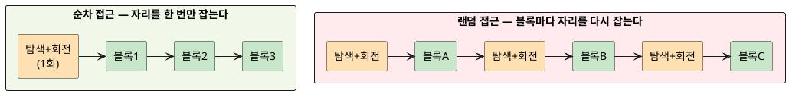
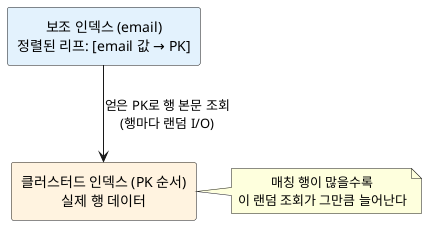

import {AnimatedLineChart} from '@site/src/components/blog/MonitorCharts';

<!-- truncate -->

"인덱스를 걸었는데 왜 안 빨라지죠?" 성능을 볼 때 자주 나오는 질문입니다. 답의 상당 부분은 **랜덤 액세스(random access)** 라는 한 개념으로 설명됩니다. 데이터를 어디에 저장하든 결국 디스크에서 읽어 와야 하는데, **어떻게 읽느냐**에 따라 속도가 수십~수백 배 차이 납니다. 이 글은 랜덤 액세스가 무엇이고 왜 느린지 HDD·SSD 구조로 설명하고, 인덱스가 이걸 줄여 주는 경우와 오히려 늘리는 경우를 정리합니다.

## 랜덤 액세스 vs 순차 액세스

- **순차 액세스(sequential access)** — 저장 장치에서 **붙어 있는 위치를 순서대로** 읽습니다. 1번 블록 다음 2번, 3번… 물리적으로 이어진 데이터를 훑습니다.
- **랜덤 액세스(random access)** — 서로 **떨어진 위치를 그때그때** 읽습니다. 100번 블록을 읽고, 다음엔 5,000번, 그다음 37번처럼 위치가 뛰어다닙니다.

<mark>같은 양을 읽어도 **순차는 한 번 자리를 잡고 쭉 읽는 반면, 랜덤은 읽을 때마다 새 위치를 찾아가야** 합니다.</mark> 이 "위치를 찾아가는 비용" 때문에 랜덤 액세스로 발생하는 디스크 입출력, 즉 **랜덤 I/O**가 느려집니다. 얼마나 느린지는 저장 장치가 무엇이냐에 달려 있습니다.

## HDD: 랜덤 I/O가 느린 근본 이유

HDD(하드디스크)는 **회전하는 원판(platter)** 위를 **헤드(head)** 가 움직이며 읽습니다. 특정 블록을 읽으려면 두 가지 물리적 대기가 생깁니다.

- **탐색 시간(seek time)** — 헤드를 목표 트랙 위로 **이동**시키는 시간(보통 수 ms).
- **회전 지연(rotational latency)** — 원판이 돌아 목표 섹터가 헤드 밑에 **올 때까지** 기다리는 시간(7,200rpm이면 한 바퀴 약 8.3ms, 평균 그 절반).

순차 읽기는 이 대기를 **처음 한 번만** 치르고 이어진 블록을 그대로 읽습니다. 반면 랜덤 읽기는 **블록을 읽을 때마다** 탐색+회전을 다시 치릅니다.

PlantUML 코드

<mark>그림의 주황색(탐색+회전)이 랜덤에서는 블록마다 반복됩니다 — 실제 데이터를 읽는 시간보다 **자리를 찾는 시간이 더 큰** 상황이 벌어집니다.</mark> HDD가 순차로는 초당 수백 MB를 읽으면서도 랜덤 4KB 읽기는 초당 수백 건(IOPS)에 그치는 이유입니다.

## SSD에서는 나아졌지만 사라지진 않았다

SSD는 움직이는 부품이 없습니다. 탐색·회전 대기가 없으니 랜덤과 순차의 격차가 크게 줄었습니다. 그렇다고 **차이가 0이 되는 건 아닙니다.**

- SSD는 데이터를 **페이지 단위**로 읽고, 내부적으로 여러 칩을 **병렬**로 활용해 순차 읽기에서 더 높은 처리량을 냅니다.
- 작은 랜덤 읽기는 이 병렬성·미리 읽기(prefetch)의 이점을 덜 받아, **순차보다 처리량이 낮습니다.**
- 쓰기는 더합니다. 지우기(erase)가 **블록 단위**라 랜덤 쓰기는 쓰기 증폭(write amplification)과 가비지 컬렉션 부담을 키웁니다.

| 구분 | HDD | SSD |
|---|---|---|
| 랜덤이 느린 원인 | 탐색+회전(물리 이동) | 페이지·병렬성·쓰기 증폭 |
| 순차 대비 랜덤 격차 | 수십~수백 배 | 수 배 이내(작지만 존재) |
| 랜덤 읽기 성능(대략) | 수백 IOPS | 수만~수십만 IOPS |

<mark>SSD로 바꾸면 랜덤 I/O의 고통이 줄지만, **순차가 여전히 유리하다**는 원칙은 그대로입니다.</mark> 그래서 "가능하면 순차로 읽게 설계한다"는 방향은 저장 장치가 바뀌어도 유효합니다.

## 왜 랜덤 I/O를 줄여야 하나

정리하면 이렇습니다.

- **자리 찾는 비용이 반복된다** — HDD는 탐색+회전, SSD는 병렬성 손해로, 랜덤은 건마다 추가 비용을 냅니다.
- **처리량이 낮다** — 같은 시간에 읽을 수 있는 양이 순차보다 적습니다.
- **캐시·미리 읽기가 안 먹힌다** — OS와 저장 장치는 "다음에 이어질 블록"을 미리 읽어 두는데, 위치가 뛰면 이 예측이 빗나갑니다.

데이터베이스 성능 튜닝의 큰 줄기가 **"랜덤 I/O를 줄이거나, 순차 I/O로 바꾸는 것"** 인 이유입니다. 그 도구의 대표가 인덱스입니다 — 그런데 인덱스는 랜덤 I/O를 **줄이기도, 만들기도** 합니다.

## 인덱스: 랜덤 액세스를 줄이는 도구

인덱스가 없으면 조건에 맞는 행을 찾으려고 **테이블 전체를 처음부터 끝까지** 읽습니다(풀 테이블 스캔). 1,000만 행에서 10건을 찾으려 해도 1,000만 행을 다 훑습니다.

인덱스(대개 B-tree)는 값이 **정렬돼** 있어, 조건에 맞는 위치로 **곧장** 내려갑니다. 1,000만 행을 훑는 대신 트리를 몇 단계 타고 내려가 필요한 몇 건만 찾아냅니다.

<mark>선택도가 높을 때(=조건에 맞는 행이 소수일 때) 인덱스는 "읽어야 할 양 자체"를 극적으로 줄여, 랜덤이든 순차든 총 I/O를 확 낮춥니다.</mark>

## 그런데 인덱스가 오히려 랜덤 I/O를 만든다

여기서 반전이 있습니다. 대부분의 인덱스는 **보조 인덱스(secondary index)** 입니다. MySQL InnoDB를 예로 들면, 보조 인덱스의 리프에는 **인덱스 컬럼 값과 기본키(PK)** 만 들어 있고, **실제 행 데이터는 기본키로 정렬된 클러스터드 인덱스**에 있습니다.

그래서 `WHERE email = ?` 를 보조 인덱스로 찾으면, 인덱스에서 PK를 얻은 뒤 **그 PK로 클러스터드 인덱스를 다시 조회**해 행 본문을 가져와야 합니다. 이 두 번째 조회가 **행마다 흩어진 위치를 찾아가는 랜덤 I/O**입니다.

PlantUML 코드

<mark>매칭 행이 몇 건이면 이 랜덤 조회 몇 번은 저렴합니다. 하지만 매칭 행이 많아지면, **랜덤 조회 횟수도 그만큼 늘어** 순식간에 비싸집니다.</mark>

## 인덱스가 손해일 때: 옵티마이저가 풀스캔을 고르는 이유

조건에 맞는 행이 테이블의 상당 비율을 차지하면(선택도가 낮으면), 보조 인덱스로 행마다 랜덤 조회를 하는 것보다 **테이블을 순차로 쭉 읽는 풀스캔이 오히려 빠릅니다.** 랜덤 한 건의 비용이 순차 한 건보다 훨씬 크기 때문에, 어느 지점을 넘어서면 역전됩니다.

<AnimatedLineChart
  title="선택도에 따른 예상 비용 — 인덱스 조회 vs 풀스캔"
  data={[3, 10, 22, 40, 66, 100, 140, 185]}
  data2={[85, 85, 85, 85, 85, 85, 85, 85]}
  yMax={200}
  tone="bad"
  tone2="good"
  xLabel="조건에 맞는 행 비율(선택도 낮아짐) →"
  unit="예상 비용(상대)"
  legend={["인덱스 조회(랜덤)", "풀스캔(순차)"]}
/>

<mark>인덱스 비용은 매칭 행 수에 따라 **비례해 오르지만**, 풀스캔 비용은 테이블 크기에 따라 **거의 일정**합니다 — 두 선이 만나는 지점을 넘으면 풀스캔이 이깁니다.</mark> 옵티마이저는 이 비용을 추정해 더 싼 쪽을 고릅니다. 그래서 "인덱스가 있는데 풀스캔을 타는" 실행 계획은 버그가 아니라, 대개 **옵티마이저가 그게 더 싸다고 판단한** 결과입니다.

이 판단의 밑바탕에는 **"랜덤이 순차보다 비싸다"** 는 비용 모델이 있습니다. PostgreSQL은 이를 기본 상수로 둡니다.

> `seq_page_cost`(순차 페이지 읽기) 기본값 **1.0**, `random_page_cost`(랜덤 페이지 읽기) 기본값 **4.0**

랜덤 페이지 읽기를 순차의 **4배**로 잡아 둔 것입니다. PostgreSQL 문서는 그 근거를 이렇게 설명합니다.

> Random access to durable storage is normally much more expensive than four times sequential access. However, a lower default is used (4.0) because the majority of random accesses to storage, such as indexed reads, are assumed to be in cache.

즉 위 문장은 "내구성 있는 저장소의 랜덤 접근은 보통 순차의 4배보다도 훨씬 비싸지만, 인덱스 읽기 같은 랜덤 접근 대부분이 캐시에 있다고 가정해 4.0으로 낮춰 잡았다"는 뜻입니다. **데이터가 SSD에 있거나 대부분 캐시에 올라와 있으면 `random_page_cost`를 낮춰** 옵티마이저가 인덱스를 더 적극적으로 쓰게 조정할 수 있습니다.

## 손해를 줄이는 방법

인덱스를 쓰되 랜덤 조회를 억제하는 방법이 있습니다.

- **커버링 인덱스(covering index)** — 조회에 필요한 컬럼을 **인덱스 안에 모두** 넣으면, 클러스터드 인덱스를 다시 조회할 필요가 없어집니다. 두 번째 랜덤 I/O가 통째로 사라집니다.
- **클러스터드 인덱스(PK) 기준 범위 조회** — PK로 정렬돼 있으니 범위 스캔이 **순차 I/O**가 됩니다. 시간·순번처럼 범위로 자주 읽는 값을 PK나 정렬 기준으로 두면 유리합니다.
- **선택도를 먼저 확인** — 넓은 범위를 읽는 쿼리는 인덱스를 강제하기보다, 애초에 읽는 범위를 좁히거나 풀스캔을 받아들이는 편이 나을 수 있습니다.

<mark>핵심 판단은 "이 조건이 소수 행만 고르나, 다수 행을 고르나"입니다 — 소수면 인덱스로 랜덤 조회 몇 번, 다수면 순차 풀스캔.</mark>

## 정리

- **랜덤 액세스**는 떨어진 위치를 그때그때 읽는 방식이고, 그로 인한 **랜덤 I/O**는 "자리 찾는 비용"이 반복돼 느립니다.
- **HDD**는 탐색+회전 때문에 랜덤이 순차보다 수십~수백 배 느리고, **SSD**는 격차가 줄었지만 순차가 여전히 유리합니다.
- **인덱스**는 읽을 행을 좁혀 랜덤 액세스를 줄이지만, **보조 인덱스의 행 조회 자체가 랜덤 I/O**라 매칭 행이 많으면 비싸집니다.
- 선택도가 낮으면 **옵티마이저가 순차 풀스캔**을 고릅니다 — 랜덤이 순차보다 비싸다는 비용 모델(PostgreSQL 기본 `random_page_cost` 4.0) 때문입니다.
- **커버링 인덱스·PK 범위 조회**로 랜덤 조회를 순차로 바꾸는 것이 튜닝의 핵심 방향입니다.

## 참고

- [PostgreSQL — Planner Cost Constants (`seq_page_cost`·`random_page_cost`)](https://www.postgresql.org/docs/current/runtime-config-query.html)
- [MySQL — Clustered and Secondary Indexes](https://dev.mysql.com/doc/refman/8.0/en/innodb-index-types.html)
- [MySQL — Covering Index (using indexes to avoid row lookups)](https://dev.mysql.com/doc/refman/8.0/en/glossary.html#glos_covering_index)
