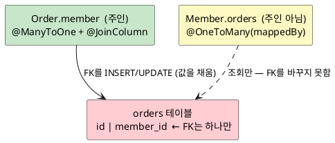
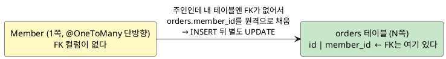
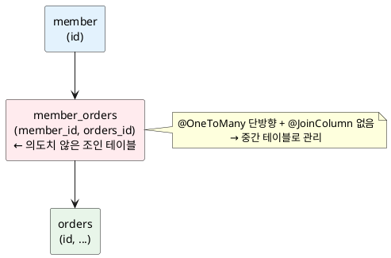
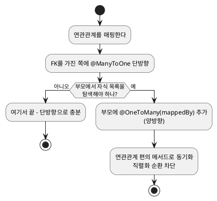

<!-- truncate -->

JPA에서 연관관계를 어느 방향으로 매핑하느냐는 단순한 취향 문제가 아닙니다. 특히 **`@OneToMany` 단방향**은 멀쩡해 보여도 숨은 쿼리를 만들어, 저장할 때마다 불필요한 `UPDATE`가 나가거나 의도치 않은 조인 테이블이 생깁니다. 단방향 매핑의 문제를 짚고, 실무에서 사용하는 해결 방향을 정리합니다.

<mark>핵심은 **"연관관계의 주인은 외래 키(FK)를 가진 쪽"** 이라는 규칙입니다 — FK가 없는 `@OneToMany` 쪽이 컬렉션을 주인처럼 다루면, DB가 FK를 채우려고 추가 쿼리를 발생시킵니다.</mark>

> **"FK가 없는 `@OneToMany` 쪽"이란?**
>
> FK 컬럼(`member_id`)은 **N쪽인 `orders` 테이블에만** 있고, `@OneToMany`를 거는 **1쪽 `Member` 테이블에는 FK가 없습니다**(`member`에는 `id`만, `orders`에는 `id`·`member_id`). 그 FK 없는 `Member`가 컬렉션을 주인처럼 다루면, 자기 것이 아닌 `orders.member_id`를 원격으로 채우느라 추가 쿼리가 생깁니다 — 자세한 구조는 아래 "문제"에서 그림으로 봅니다.

## 연관관계 — "DB의 FK 하나를 누가 채우나"

먼저 **방향**은 객체(JPA) 쪽 개념입니다. 한쪽에서만 참조하면 **단방향**, 양쪽이 서로 참조하면 **양방향**입니다.

여기서 헷갈리기 쉬운 "연관관계의 주인"은 사실 단순합니다. **DB에는 두 테이블을 잇는 외래 키(FK) 컬럼이 딱 하나** — `orders.member_id` — 뿐입니다. 객체에서는 `Member`와 `Order`가 서로를 참조할 수 있지만, 저장할 때 **이 유일한 FK 값을 실제로 채우는(INSERT/UPDATE) 쪽은 한 곳으로 정해야** 합니다. 그 한 곳이 **주인**입니다.

- FK 컬럼(`member_id`)은 **`orders` 테이블**에 있습니다 → 그 값은 **`Order`를 저장할 때** 채워집니다 → 그래서 **주인은 `Order.member`**.
- 반대쪽 `Member.orders`는 **읽기 전용**입니다. `mappedBy = "member"`로 "FK 관리는 `Order.member`가 하고, 이쪽은 조회만 한다"를 선언합니다.

<mark>규칙은 하나입니다 — **FK 컬럼을 가진 테이블의 엔티티가 주인**이고, 주인만 FK를 채웁니다. 주인이 아닌 쪽(`mappedBy`)에서 컬렉션을 수정해도 DB의 FK는 변하지 않습니다.</mark>

<details>
<summary>PlantUML 코드</summary>



</details>


예시는 **회원(`Member`) 1 : N 주문(`Order`)** 입니다 — FK `member_id`는 `orders` 테이블에 있습니다.

## @ManyToOne 단방향 — 기본이자 깔끔한 선택

FK를 가진 `Order`가 `Member`를 참조하는 다대일 단방향은 문제가 없습니다. 자식이 자기 FK를 직접 알고 있어, 저장이 **INSERT 한 번**으로 끝납니다.

```java
@Entity
class Order {
    @Id @GeneratedValue
    Long id;

    @ManyToOne(fetch = FetchType.LAZY)   // 지연 로딩 기본 권장
    @JoinColumn(name = "member_id")      // orders.member_id (FK) = 연관관계 주인
    Member member;
}
```

```sql
-- order를 저장하면 FK까지 한 번에
INSERT INTO orders (id, member_id) VALUES (?, ?);
```

<mark>다대일 단방향은 FK를 가진 쪽이 주인이라 자연스럽고, 대부분의 매핑은 이걸로 시작하면 됩니다.</mark> 한계는 한 가지입니다 — **부모(`Member`)에서 주문 목록으로 바로 탐색할 수 없다**는 점입니다.

## @OneToMany 단방향의 문제

반대로 부모 `Member`가 컬렉션으로 `Order`를 단방향 참조하면, **FK는 `orders`에 있는데 그 FK를 `Member` 쪽에서 관리**하게 됩니다. 여기서 두 가지 문제가 생깁니다.

`@OneToMany` 단방향의 문제는 **주인과 FK가 서로 다른 테이블에 있다**는 점입니다. 효율적이려면 FK를 직접 가진 쪽이 주인이어야 하는데, `@OneToMany` 단방향은 **FK가 없는 `Member`를 주인으로** 삼습니다. 정작 FK(`member_id`)는 `orders` 테이블에 있으니, `Member`가 **자기 것이 아닌 `orders`의 FK를 원격으로 채워야** 해서 추가 쿼리가 생깁니다.

<details>
<summary>PlantUML 코드</summary>



</details>


### 문제 1 — `@JoinColumn`이 없으면 조인 테이블이 생긴다

```java
@Entity
class Member {
    @Id @GeneratedValue
    Long id;

    @OneToMany                 // @JoinColumn 없음
    List<Order> orders = new ArrayList<>();
}
```

이렇게 하면 Hibernate는 FK를 어디에 둘지 몰라, **중간 조인 테이블(`member_orders`)** 을 만들어 다대다처럼 관리합니다. 테이블이 하나 더 생기고, 조회·저장 때마다 그 테이블을 거쳐 쿼리가 복잡해집니다.

<details>
<summary>PlantUML 코드</summary>



</details>


### 문제 2 — `@JoinColumn`을 사용해도 추가 UPDATE가 발생한다

조인 테이블이 싫어 `@JoinColumn`으로 `orders.member_id`에 직접 매핑해도 문제가 남습니다.

```java
@Entity
class Member {
    @Id @GeneratedValue
    Long id;

    @OneToMany
    @JoinColumn(name = "member_id")   // orders.member_id에 매핑
    List<Order> orders = new ArrayList<>();
}
```

`member.getOrders().add(order)`로 주문을 추가해 저장하면, **`Order` 엔티티는 자기 `member_id`를 모릅니다**(단방향이라 `Order`에 `Member` 참조가 없음). 그래서 Hibernate는 일단 FK를 비운 채 INSERT한 뒤, 컬렉션을 보고 **별도 UPDATE로 FK를 채웁니다.**

```sql
INSERT INTO member (id) VALUES (?);
INSERT INTO orders (id, member_id) VALUES (?, NULL);   -- 자식이 부모를 모름
UPDATE orders SET member_id = ? WHERE id = ?;          -- 추가 UPDATE
```

<mark>주문 한 건마다 INSERT + UPDATE가 나가므로, 벌크로 쌓을수록 쿼리가 두 배로 늘고 원인도 눈에 잘 띄지 않습니다.</mark> 이게 `@OneToMany` 단방향을 피하는 가장 큰 이유입니다.

### 문제 3 — 한 방향으로만 탐색되고, 방향이 헷갈린다

단방향은 말 그대로 **한쪽에서만 상대를 참조**합니다. 그래서 반대 방향 탐색이 막힙니다.

- `@ManyToOne` 단방향(`Order` → `Member`): `order.getMember()`는 되지만 **`member.getOrders()`는 없습니다**(부모에서 자식 목록을 볼 수 없음).
- `@OneToMany` 단방향(`Member` → `Order`): `member.getOrders()`는 되지만 **`order.getMember()`는 없습니다**(자식에서 부모를 볼 수 없음).

어느 쪽을 택하든 필요한 탐색이 막힐 수 있습니다. 특히 `@OneToMany` 단방향이 헷갈리는 이유는 이렇습니다 — 채워야 할 FK는 **`orders` 테이블의 `member_id` 컬럼**입니다. 상식적으로는 "그 컬럼이 `orders`에 있으니 `Order`를 저장할 때 `Order` 쪽이 채운다"고 보게 됩니다. 그런데 `@OneToMany` 단방향에서는 그 `member_id`를 **`Order`가 아니라 `Member`의 컬렉션(`@OneToMany`)이 관리**합니다. **컬럼이 있는 곳(`orders`)과 그 값을 채우는 코드(`Member`)가 서로 달라서**, 코드만 봐서는 누가 FK를 채우는지 헷갈립니다.

## 해결 방향

### 1) 다대일 단방향(`@ManyToOne`)을 기본으로

가장 단순한 해결은 **연관관계를 FK 가진 쪽(`Order`)에서 `@ManyToOne` 단방향으로** 거는 것입니다. 추가 UPDATE도, 조인 테이블도 없습니다. 부모에서 자식으로 탐색할 일이 없다면 여기서 끝내면 됩니다.

### 2) 역방향 탐색이 필요하면 — 양방향으로 보완

`member.getOrders()`처럼 부모에서 자식을 탐색해야 한다면, **`@ManyToOne`(주인)은 그대로 유지하고 부모에 `@OneToMany(mappedBy)`를 추가**합니다. `mappedBy`는 "FK 관리는 `Order.member`가 한다"는 선언이라, **테이블 구조도 쿼리도 1)과 똑같고** 객체 탐색만 양쪽으로 열립니다.

```java
@Entity
class Member {
    @Id @GeneratedValue
    Long id;

    @OneToMany(mappedBy = "member")   // 주인 아님(읽기 전용) — 추가 쿼리 없음
    List<Order> orders = new ArrayList<>();
}

@Entity
class Order {
    @Id @GeneratedValue
    Long id;

    @ManyToOne(fetch = FetchType.LAZY)
    @JoinColumn(name = "member_id")   // 주인(FK)
    Member member;
}
```

### 3) 양방향을 쓸 때의 주의점

양방향은 편리하지만 두 가지를 챙겨야 합니다.

- **연관관계 편의 메서드로 양쪽을 함께 세팅** — 주인(`Order.member`)만 세팅하면 DB는 맞지만, 영속성 컨텍스트 안의 부모 컬렉션은 갱신되지 않아 조회 값이 맞지 않을 수 있습니다. 한 메서드에서 양쪽을 동기화합니다.

  ```java
  // Member
  void addOrder(Order order) {
      orders.add(order);
      order.setMember(this);   // 주인 쪽도 함께 세팅
  }
  ```

- **무한 재귀 차단** — `Member`↔`Order`가 서로 참조하므로, 롬복 `@ToString`이나 JSON 직렬화가 순환 참조를 따라 무한히 반복돼 `StackOverflowError`에 이릅니다. `@ToString`에서 연관 필드를 빼고(`exclude`), API 응답은 엔티티 대신 **DTO로 변환**하거나 `@JsonIgnore`로 끊습니다.

  ```java
  @Entity
  class Member {
      @OneToMany(mappedBy = "member")
      @ToString.Exclude   // 롬복 toString이 orders를 타고 순환하지 않도록 제외
      @JsonIgnore         // JSON 직렬화가 orders↔member 순환하지 않도록 차단
      List<Order> orders = new ArrayList<>();
  }
  // 가장 깔끔한 방법은 엔티티를 그대로 응답하지 않고 필요한 필드만 DTO로 변환해 반환하는 것입니다.
  ```

## 언제 단방향으로 충분한가 — 판단 기준

<details>
<summary>PlantUML 코드</summary>



</details>


- **`@ManyToOne` 단방향** — FK 가진 쪽에서만 참조하면 되는 대부분의 경우. 기본값으로 삼습니다.
- **양방향** — 부모에서 자식 컬렉션 탐색이 실제로 필요할 때만. `@OneToMany`는 항상 `mappedBy`로 읽기 전용이어야 합니다.
- **`@OneToMany` 단방향(주인)** — `mappedBy` 없이 부모가 컬렉션을 주인으로 다루는 형태. 조인 테이블·추가 UPDATE 때문에 **특별한 이유가 없으면 사용하지 않습니다.**

## 정리

- 연관관계의 주인은 **FK를 가진 쪽**입니다 — 이 원칙을 어기면 DB가 FK를 채우려고 추가 쿼리를 발생시킵니다.
- **`@OneToMany` 단방향**은 `@JoinColumn`이 없으면 **조인 테이블**, 있어도 **INSERT 후 추가 UPDATE**가 발생합니다.
- 기본은 **`@ManyToOne` 단방향**, 부모→자식 탐색이 필요할 때만 **`@OneToMany(mappedBy)`로 양방향** 보완(테이블·쿼리 영향 없음).
- 양방향은 **연관관계 편의 메서드**로 양쪽을 동기화하고, **직렬화 순환**(`@ToString`·JSON)을 끊습니다.

## 참고

- [Hibernate ORM — Unidirectional `@OneToMany`](https://docs.jboss.org/hibernate/orm/current/userguide/html_single/Hibernate_User_Guide.html#associations-one-to-many-unidirectional)
- [Jakarta Persistence — `@OneToMany` / `@ManyToOne`](https://jakarta.ee/specifications/persistence/3.1/apidocs/jakarta.persistence/jakarta/persistence/onetomany)
