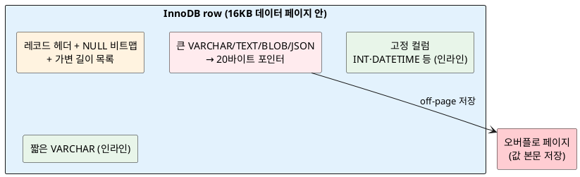
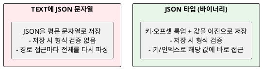

<!-- truncate -->

컬럼 타입을 고르는 건 "값의 범위"만의 문제가 아닙니다. 타입에 따라 **한 행이 차지하는 크기, 디스크에 저장되는 위치, 인덱스 가능 여부**가 달라집니다. InnoDB가 각 타입을 내부에서 어떻게 저장하는지 숫자·문자·날짜·JSON 순으로 정리합니다. (타입 불일치가 조인 성능에 미치는 영향은 [MySQL 인덱스 글](./mysql-index-btree-explain)에서 다뤘습니다.)

<mark>핵심은 **"고정 크기 타입은 행 안에 그대로, 큰 가변 타입은 행 밖(오버플로 페이지)에 포인터로"** 저장된다는 구조입니다 — 이걸 알면 타입 선택이 공간·I/O로 어떻게 이어지는지 보입니다.</mark>

## InnoDB row의 기본 구조

InnoDB는 데이터를 **16KB 페이지** 단위로 저장하고, 한 페이지 안에 여러 row가 들어갑니다. 한 row는 대략 이렇게 구성됩니다.

- **레코드 헤더 + NULL 비트맵** — 어떤 컬럼이 `NULL`인지 비트로 표시(그래서 `NULL`은 값 저장 공간을 거의 쓰지 않습니다).
- **고정 크기 컬럼** — `INT`·`DATETIME` 등은 정해진 바이트로 **행 안에 그대로** 들어갑니다.
- **가변 길이 컬럼** — `VARCHAR`·`TEXT`·`BLOB`·`JSON`은 길이 정보와 함께 저장되고, 값이 크면 **행 밖(오버플로 페이지)에 저장하고 포인터만** 남깁니다.

<details>
<summary>PlantUML 코드</summary>



</details>


한 row의 최대 크기는 **65,535바이트**로 제한되며, 모든 컬럼이 이 한도를 나눠 사용합니다(단, `TEXT`·`BLOB`·`JSON`은 본문이 행 밖에 있어 9~12바이트만 차지). 이 구조를 전제로 타입별로 봅니다.

## 숫자형 — 고정 크기, 그리고 정확도

정수형은 **값에 상관없이 고정 크기**입니다. `signed`·`unsigned`는 크기가 같고 표현 범위만 이동합니다.

| 타입 | 크기 | 비고 |
|---|---|---|
| `TINYINT` | 1바이트 | `-128~127` (unsigned `0~255`) |
| `SMALLINT` | 2바이트 | |
| `MEDIUMINT` | 3바이트 | |
| `INT` | 4바이트 | 약 ±21억 |
| `BIGINT` | 8바이트 | |

실수형은 두 가지입니다.

- **`FLOAT`(4바이트)·`DOUBLE`(8바이트)** — 부동소수점이라 **오차**가 있습니다. 금액·수량처럼 정확해야 하는 값에는 쓰지 않습니다.
- **`DECIMAL(p, s)`** — 정확한 고정소수점입니다. 내부적으로 **9자리를 4바이트에 담는 패킹 형식**으로 저장합니다. 예: `DECIMAL(19,2)`는 9바이트. 돈은 `DECIMAL`이 정답입니다.

<mark>부동소수(`FLOAT`/`DOUBLE`)는 빠르지만 오차가 있고, `DECIMAL`은 정확하지만 패킹·계산 비용이 있습니다 — 금액은 무조건 `DECIMAL`입니다.</mark>

## 문자열 — CHAR(고정) vs VARCHAR(가변)

- **`CHAR(M)`** — **고정 길이**입니다. 값이 짧아도 `M` 길이만큼 공간을 차지하고(공백 패딩), 문자셋 1자당 바이트 수 `w`를 곱한 `M × w` 바이트를 차지합니다. 길이가 거의 일정한 값(국가 코드, 고정 포맷 키)에 적합합니다.
- **`VARCHAR(M)`** — **가변 길이**입니다. 실제 값 길이 `L`에 **길이 프리픽스**가 붙습니다 — 값이 **255바이트 이하면 1바이트**, 넘으면 **2바이트**. 대부분의 문자열은 `VARCHAR`가 공간 효율이 좋습니다.

문자셋도 크기에 직접 영향을 줍니다. `utf8mb4`는 **1문자당 최대 4바이트**라, `VARCHAR(255)`는 최악의 경우 약 1,020바이트를 쓸 수 있습니다. 그래서 행 최대 크기(65,535바이트)나 인덱스 길이 제한을 계산할 때 **문자 수가 아니라 바이트 수**로 따져야 합니다.

```sql
-- 같은 '255'라도 문자셋에 따라 최대 바이트가 다르다
VARCHAR(255)  CHARACTER SET latin1    -- 최대 255바이트
VARCHAR(255)  CHARACTER SET utf8mb4   -- 최대 약 1,020바이트
```

## 대용량 — TEXT/BLOB은 행 밖에 저장된다

`TEXT`·`BLOB` 계열은 값 본문을 **행이 아니라 별도 영역(오버플로 페이지)** 에 저장하고, 행에는 **그 위치를 가리키는 포인터(약 9~12바이트)만** 남깁니다. InnoDB의 `DYNAMIC` 행 포맷에서는 큰 가변 값 전체를 off-page에 저장하고 **20바이트 포인터**로 참조합니다.

| 타입 | 최대 크기 | 길이 프리픽스 |
|---|---|---|
| `TINYTEXT`/`TINYBLOB` | 255바이트 | 1바이트 |
| `TEXT`/`BLOB` | 약 64KB | 2바이트 |
| `MEDIUMTEXT`/`MEDIUMBLOB` | 약 16MB | 3바이트 |
| `LONGTEXT`/`LONGBLOB` | 약 4GB | 4바이트 |

여기서 두 가지가 따라옵니다.

- **조회 비용** — 본문이 행 밖에 있으니, 그 컬럼을 `SELECT`하면 오버플로 페이지를 추가로 읽습니다. 목록 조회에서 큰 `TEXT`를 매번 가져오면 I/O가 늘어납니다(필요할 때만 선택).
- **인덱스 제한** — 전체 값에는 인덱스를 걸 수 없고 **접두사 인덱스(prefix index)** 만 가능합니다(예: `INDEX(body(100))`).

## 날짜·시간 — DATETIME vs TIMESTAMP

둘 다 날짜+시간을 저장하지만 **크기와 의미**가 다릅니다.

| 타입 | 크기 | 범위·특성 |
|---|---|---|
| `DATE` | 3바이트 | 날짜만 |
| `DATETIME` | 5바이트(+소수초) | 입력값 그대로 저장, 타임존 변환 없음 |
| `TIMESTAMP` | 4바이트(+소수초) | **UTC로 저장**, 조회 시 세션 타임존으로 변환. 1970~2038 |

<mark>`TIMESTAMP`는 4바이트로 작고 타임존을 자동 변환하지만 **2038년 한계**가 있고, `DATETIME`은 범위가 넓고 입력값을 그대로 저장합니다 — 전역 서비스의 시각 기록은 대개 `DATETIME`(UTC로 직접 관리)이나 넉넉한 쪽을 택합니다.</mark> 소수초(`DATETIME(3)` 등)는 정밀도에 따라 1~3바이트가 더 붙습니다.

## ENUM·SET — 문자열처럼 보이지만 정수로 저장

`ENUM`은 선언한 문자열 목록을 **내부적으로 정수 인덱스로** 저장합니다 — 값이 255개 이하면 1바이트, 그 이상이면 2바이트. 보기엔 문자열이지만 저장은 작고 비교도 빠릅니다. 다만 값 목록을 바꾸려면 `ALTER`가 필요해 유연성은 떨어집니다. `SET`은 여러 값을 비트로 묶어 저장합니다.

## JSON — 텍스트가 아니라 바이너리로 저장된다

MySQL 5.7+의 `JSON` 타입은 입력을 **문자열 그대로가 아니라 최적화된 바이너리 형식**으로 저장합니다. 이게 `TEXT`에 JSON 문자열을 넣는 것과의 핵심 차이입니다.

<details>
<summary>PlantUML 코드</summary>



</details>


- **형식 검증** — `JSON` 컬럼은 저장 시 유효한 JSON인지 검사합니다. `TEXT`는 아무 문자열이나 들어갑니다.
- **부분 접근** — 바이너리 안에 **키와 값의 오프셋 테이블**이 있어, `JSON_EXTRACT`(`->`, `->>`)로 특정 경로를 읽을 때 전체를 파싱하지 않고 **그 값으로 바로** 접근합니다.
- **부분 수정** — 8.0.17부터 `JSON_SET` 등으로 일부만 바꿀 때 조건이 맞으면 **전체를 다시 쓰지 않고 제자리(in-place) 수정**이 가능합니다.
- **크기** — `LONGBLOB` 수준(최대 약 4GB, 실제로는 `max_allowed_packet`에 제한)이고, 본문은 역시 행 밖에 저장됩니다.

### JSON은 직접 인덱스가 되지 않는다 — 생성 컬럼으로 건다

`JSON` 컬럼 자체에는 인덱스를 걸 수 없습니다. 자주 조회하는 경로를 **생성 컬럼(generated column)으로 꺼내 인덱스**를 겁니다.

```sql
CREATE TABLE product (
    id   BIGINT PRIMARY KEY,
    attr JSON,
    -- JSON 경로를 가상 컬럼으로 추출
    brand VARCHAR(50) AS (attr->>'$.brand') STORED,
    INDEX idx_brand (brand)
);

-- 이제 brand 조건이 인덱스를 사용한다
SELECT * FROM product WHERE brand = 'ACME';
```

배열 요소를 조건으로 자주 찾는다면 **다중 값 인덱스(multi-valued index, 8.0.17+)** 도 선택지입니다.

<mark>JSON은 "스키마가 유동적인 속성"에 유용하지만, 자주 조회·정렬하는 값이라면 생성 컬럼+인덱스로 꺼내거나 애초에 **정규 컬럼으로 선언하는 편**이 빠릅니다 — JSON은 만능 저장소가 아닙니다.</mark>

## 예시 — 한 행이 실제로 몇 바이트인가

지금까지의 규칙을 실제 테이블 한 행에 대입해 봅니다. 아래 테이블(utf8mb4, 소수초 없음)에 `nickname = '홍길동'`(한글 3자)인 행을 저장한다고 하면:

```sql
CREATE TABLE member (
    id        BIGINT,          -- 고정 8
    age       TINYINT,         -- 고정 1
    grade     CHAR(2),         -- 고정 2 × 4 = 8  (utf8mb4 1자 최대 4바이트)
    nickname  VARCHAR(20),     -- 가변: 값 바이트 + 길이 프리픽스
    balance   DECIMAL(13, 2),  -- 패킹 6
    joined_at DATETIME,        -- 고정 5
    bio       TEXT             -- 본문은 off-page, 행엔 포인터만
);
```

| 컬럼 | 타입 | 이 행에서의 크기 | 계산 |
|---|---|---|---|
| `id` | `BIGINT` | 8 | 고정 |
| `age` | `TINYINT` | 1 | 고정 |
| `grade` | `CHAR(2)` | 8 | 2자 × 4바이트(utf8mb4) |
| `nickname` | `VARCHAR(20)` | 10 | `'홍길동'` 9바이트 + 길이 프리픽스 1바이트 |
| `balance` | `DECIMAL(13,2)` | 6 | 정수 11자리(5) + 소수 2자리(1) |
| `joined_at` | `DATETIME` | 5 | 고정 |
| `bio` | `TEXT` | 약 12 | 본문은 off-page, 행엔 포인터만 |

행 안에 들어가는 건 **레코드 헤더·NULL 비트맵 + 위 합계(약 50바이트)** 정도이고, `bio`의 긴 본문은 **행 밖 오버플로 페이지**에 따로 저장됩니다.

<mark>같은 7개 컬럼이라도 `grade`를 `CHAR(2)`→`VARCHAR`로, `balance`를 `DECIMAL`→`BIGINT`(원 단위)로, `bio`를 꼭 필요할 때만 조회하도록 하면 행 크기가 크게 줄어듭니다 — 타입 선택이 행 크기를 정하고, 행 크기가 페이지당 행 수·캐시 효율을 좌우합니다.</mark>

## 타입 선택 기준 — 정리

- **정수는 범위에 맞는 가장 작은 타입** — 작을수록 행·인덱스가 가벼워집니다. FK는 부모 PK와 **타입·크기·부호를 일치**시킵니다.
- **금액은 `DECIMAL`**, 부동소수(`FLOAT`/`DOUBLE`)는 오차 때문에 금액에 사용하지 않습니다.
- **문자열은 대개 `VARCHAR`**, 길이가 일정하면 `CHAR`. 길이·인덱스는 **바이트 기준**(utf8mb4는 1자 4바이트)으로 계산합니다.
- **큰 본문은 `TEXT`/`BLOB`** — 행 밖에 저장되고 접두사 인덱스만 가능하니, 목록 조회에서 불필요하게 선택하지 않습니다.
- **시각은 `DATETIME`/`TIMESTAMP`** — 2038 한계·타임존 변환 여부로 선택합니다.
- **`JSON`은 유동 속성에**, 자주 조회하는 경로는 **생성 컬럼+인덱스**로. 핵심 조회 조건은 정규 컬럼이 낫습니다.

## 참고

- [MySQL — Data Type Storage Requirements](https://dev.mysql.com/doc/refman/8.0/en/storage-requirements.html)
- [MySQL — The JSON Data Type](https://dev.mysql.com/doc/refman/8.0/en/json.html)
- [MySQL — InnoDB Row Formats](https://dev.mysql.com/doc/refman/8.0/en/innodb-row-format.html)
