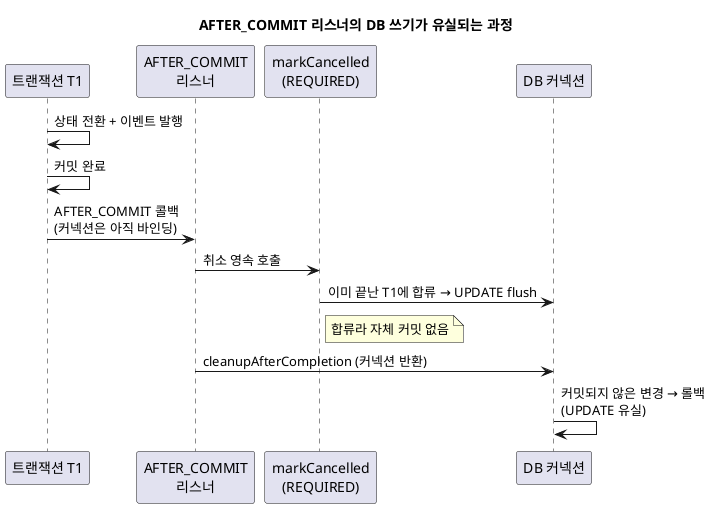
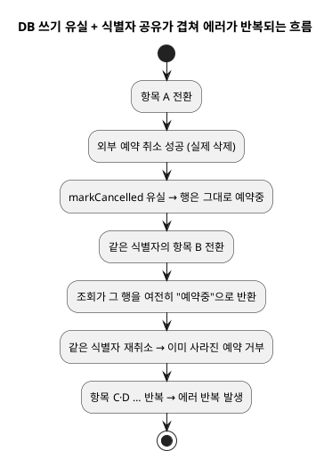

<!-- truncate -->

상태가 바뀔 때 외부 알림 서비스의 예약 메시지를 취소하고 그 결과를 DB에 "취소됨"으로 기록하는 기능이 있었습니다. 그런데 **외부 취소는 실제로 나가는데 DB의 취소 표시만 매번 사라졌습니다.** 예외도 없이 조용히요. 원인은 외부 연동이 아니라 **`@TransactionalEventListener(AFTER_COMMIT)` 안에서의 DB 쓰기가 기본 전파로는 커밋되지 않는다**는, 트랜잭션 전파와 커밋 타이밍의 문제였습니다.

<mark>핵심은 **"AFTER_COMMIT 시점엔 원 트랜잭션이 이미 커밋돼 있는데, 기본 전파(`REQUIRED`)로 DB를 갱신하면 그 끝난 트랜잭션에 합류만 할 뿐 자체 커밋이 없어 정리 단계에서 롤백된다"** 는 점입니다.</mark>

## 상황 — 커밋 뒤에 외부 호출 + DB 갱신

상태 전환은 트랜잭션 안에서 일어나고, 전환이 **실제로 커밋된 뒤에만** 후속 처리(예약 취소)가 동작해야 합니다. 커밋 전에 외부로 취소를 보냈다가 트랜잭션이 롤백되면, 멀쩡한 예약을 지워 버리기 때문입니다. 그래서 후속 처리를 `AFTER_COMMIT` 리스너에 배치하는 건 자연스러운 선택입니다.

```java
@TransactionalEventListener(phase = TransactionPhase.AFTER_COMMIT)
public void cancelOnTransition(ItemTransitionedEvent event) {
    List<Reserved> reserved = port.findReserved(event.itemIds());   // 발송 전(미래) 예약분
    List<Long> cancelled = new ArrayList<>();
    for (Reserved r : reserved) {
        notifier.cancelScheduled(r.scheduledId());  // ① 외부 알림 예약 취소 (HTTP)
        cancelled.add(r.historyId());
    }
    port.markCancelled(cancelled, "상태 전환으로 예약 취소");   // ② DB에 취소 표시
}
```

```java
// 어댑터 — 전파는 기본값 REQUIRED
@Transactional
public void markCancelled(List<Long> ids, String reason) {
    repository.findAllById(ids).forEach(e -> e.cancelScheduled(reason)); // dirty checking
}
```

## 증상 — 외부는 취소되는데 DB 표시는 0건

운영 DB를 조사했더니, **"상태 전환으로 예약 취소" 사유를 가진 행이 테이블 전체에 단 한 건도 없었습니다.** `send_yn=false`인 행은 전부 *발송 실패*분이지 *취소*분이 아니었고, 취소 대상 행들의 `updated_at`은 **전부 `created_at`과 같아** 생성 후 한 번도 변경되지 않았습니다.

> **"취소가 성공했다면 취소 표시 행이 남아야 하지 않나?"**
>
> 이 질문이 핵심을 정확히 가리켰습니다. 외부로는 취소가 나갔는데(알림은 실제로 사라졌는데) DB에는 취소 흔적이 전혀 없었습니다. 외부와 DB 사이의 이 비대칭이 "DB 쓰기만 유실된다"를 가리킵니다.

## 왜 AFTER_COMMIT에서 `REQUIRED` 쓰기는 커밋되지 않나

`markCancelled`가 한 번도 반영되지 않은 이유는 **실행 위치와 전파 속성**에 있었습니다.

### 타이밍 — 콜백은 커밋 직후, 자원 정리 직전

`@TransactionalEventListener(AFTER_COMMIT)` 리스너는 원 트랜잭션 **T1이 커밋된 뒤** 실행됩니다. 정확히는 Spring이 커밋 직후 자원 정리(`cleanupAfterCompletion`) **직전에** AFTER_COMMIT 콜백을 호출합니다. 그 순간:

- **물리 트랜잭션 T1은 이미 커밋 완료** — 다시 커밋할 일이 없습니다.
- 그런데 **커넥션·영속성 컨텍스트는 아직 스레드에 바인딩**돼 있습니다(정리 전이라).

### `REQUIRED`는 "이미 끝난 트랜잭션에 합류"한다

`markCancelled`는 전파가 기본값 `REQUIRED`입니다. `REQUIRED`는 "활성 트랜잭션이 있으면 **합류**, 없으면 새로 생성"입니다([전파 속성 정리](./spring-transaction-propagation)).

- AFTER_COMMIT 시점엔 자원이 아직 바인딩돼 있어 Spring이 "트랜잭션이 있다"고 판단합니다 → 새로 만들지 않고 **이미 커밋된 T1에 합류(participating)** 합니다.
- 합류한 트랜잭션은 메서드 종료 시 **물리 커밋을 하지 않습니다**(최외곽만 커밋하는데, 그 최외곽 = T1은 이미 끝남).

### UPDATE는 나가도 커밋이 없어 폐기

`markCancelled`는 dirty checking이라, 엔티티를 로드해 변경하면 Hibernate가 flush 때 `UPDATE`를 커넥션에 내보낼 수는 있어도 **뒤따르는 커밋이 없습니다.** 이어서 `cleanupAfterCompletion`이 커넥션을 풀로 반환하는데, autocommit=false 커넥션이라 **커밋되지 않은 변경은 반환 시 롤백**됩니다. → UPDATE 유실.

<details>
<summary>PlantUML 코드</summary>



</details>


<mark>예외도 안 나고 조용히 사라지기 때문에 로그에도 남지 않아 오래 드러나지 않았습니다.</mark> 반면 외부 취소 호출은 **HTTP**라 DB 트랜잭션과 무관하게 즉시 반영됩니다. 그래서 **외부 알림은 실제로 지워지는데 DB의 취소 표시만 유실**되는 비대칭이 생깁니다 — 운영 DB에서 본 "취소 사유 0건"과 정확히 맞습니다.

## 왜 테스트로도 못 잡았나

이 유실은 단위 테스트로 재현하기 어렵습니다. 리스너 핸들러를 **직접 호출**하면, `markCancelled`가 테스트 트랜잭션에 합류해 UPDATE가 그 안에서 적용된 것처럼 보이고, 애초에 **AFTER_COMMIT 정리 단계를 거치지 않습니다.** 그래서 **유실이 재현되지 않아 테스트는 초록불로 통과**합니다 — 테스트가 틀린 게 아니라, 이 경로로는 버그가 드러나지 않을 뿐입니다. 실제 **이벤트 발행 → 커밋 → 리스너(AFTER_COMMIT)** 전체 경로를 재현해야 유실이 나타납니다.

## 해결 — AFTER_COMMIT에서 쓰려면 새 트랜잭션으로

AFTER_COMMIT 시점의 "이미 끝난 트랜잭션"을 피하고, **자체적으로 커밋하는 트랜잭션**에서 DB를 갱신하면 됩니다.

- **`REQUIRES_NEW`** — `markCancelled`에 `@Transactional(propagation = Propagation.REQUIRES_NEW)`를 붙입니다. `REQUIRES_NEW`는 기존(이미 끝난) 트랜잭션을 **잠시 멈추고 새 물리 트랜잭션**을 열어 자체 커밋하므로 UPDATE가 반영됩니다.
- **`TransactionTemplate`** — 리스너 안에서 새 트랜잭션을 명시적으로 열어 그 안에서 갱신합니다.
- **AFTER_COMMIT 밖으로 분리** — 외부 호출만 리스너에 남기고, DB 갱신은 별도 경로(후속 커맨드)로 옮깁니다.

```java
// 가장 간단한 해결: 취소 영속만 새 트랜잭션으로
@Transactional(propagation = Propagation.REQUIRES_NEW)
public void markCancelled(List<Long> ids, String reason) {
    repository.findAllById(ids).forEach(e -> e.cancelScheduled(reason));
}
```

> **`BEFORE_COMMIT`은 왜 안 되나**
>
> "커밋 전"에 쓰면 원 트랜잭션에 포함돼 함께 커밋됩니다. 하지만 이 경우엔 외부 취소를 **커밋이 확정된 뒤에** 보내야 하므로(롤백 시 멀쩡한 예약을 지우면 안 됨) `AFTER_COMMIT`이 맞고, 대신 DB 갱신만 새 트랜잭션으로 분리하는 게 안전합니다.

## 또 다른 문제 — 외부 호출은 멱등하지 않을 수 있다

이 장애에는 다른 문제도 겹쳐 있었습니다. 외부 예약 식별자(`scheduledId`)가 **여러 이력 행에 공유**되는 구조라, 취소 리스너가 행 단위로 돌며 **같은 식별자를 반복 취소**했습니다. 첫 취소는 성공하지만 그다음 같은 식별자 취소는 "이미 사라진 예약"으로 거부됩니다. 여기에 위의 DB 쓰기 유실까지 겹치니, 행이 영원히 "예약중"으로 남아 **중복 취소가 끝없이 재시도**됐습니다.

<details>
<summary>PlantUML 코드</summary>



</details>


그래서 전파 수정(원인 ①)과 함께 다음을 적용했습니다.

- **식별자 단위로 중복 제거** — 같은 식별자는 **한 번만** 취소하고, 그 식별자를 공유하는 행은 **한꺼번에 취소 표시**합니다.
- **"이미 처리됨" 응답을 정상으로 흡수** — 이미 사라진 예약을 다시 취소하면 나오는 거부 응답을 에러가 아니라 "이미 취소됨"으로 처리하고, 그 행들도 취소 표시합니다.

핵심은 **외부 API가 멱등하다고(같은 요청을 여러 번 보내도 결과가 같다고) 가정하지 않는 것**입니다.

## 정리

- `@TransactionalEventListener(AFTER_COMMIT)` 리스너는 **원 트랜잭션이 이미 커밋된 뒤** 실행됩니다.
- 그 안에서 **기본 전파(`REQUIRED`)로 DB를 갱신하면** 끝난 트랜잭션에 합류만 할 뿐 자체 커밋이 없어 **정리 단계에서 롤백**됩니다 — 예외 없이 조용히 유실됩니다.
- 외부 호출(HTTP)은 반영되는데 DB 갱신만 사라져 **상태가 서로 맞지 않게 됩니다** — 외부 연동과 DB 갱신을 한 리스너에서 할 때 특히 위험합니다.
- 해결은 **`REQUIRES_NEW`**(또는 `TransactionTemplate`·AFTER_COMMIT 밖 분리)로 DB 갱신을 **자체 커밋되는 새 트랜잭션**에서 수행합니다.
- 핸들러를 직접 호출하는 테스트는 **AFTER_COMMIT 경로를 거치지 않아 이 유실을 재현하지 못한 채 통과**하니, 실제 이벤트→커밋→리스너 경로로 검증합니다.

## 참고

- [Spring — `@TransactionalEventListener` (Transaction-bound Events)](https://docs.spring.io/spring-framework/reference/data-access/transaction/event.html)
- [Spring — Transaction Propagation](https://docs.spring.io/spring-framework/reference/data-access/transaction/declarative/tx-propagation.html)
