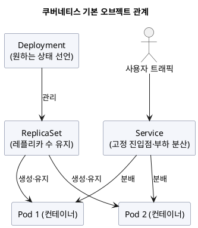
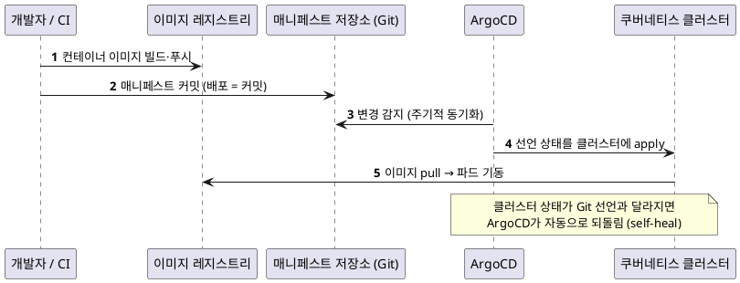
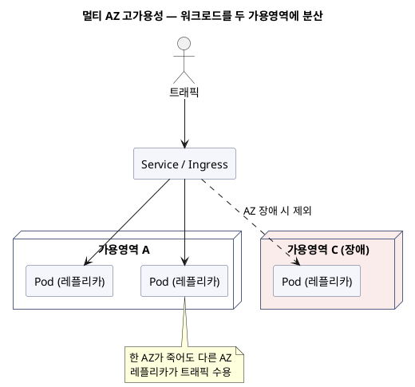

컨테이너로 서비스를 하나 띄우는 건 어렵지 않습니다. 그런데 그 컨테이너가 수십 개가 되고, 죽으면 다시 살아나야 하고, 무중단으로 새 버전을 올려야 하고, 두 데이터센터에 나눠 떠 있어야 한다면 이야기가 달라집니다. 이 "여러 컨테이너를 대신 운영해 주는 도구"가 **쿠버네티스**입니다. 이 글은 쿠버네티스의 기본 개념부터 시작해, 제가 참여한 프로젝트에서 이를 **어떻게 실제 배포·운영에 적용했는지**까지 정리합니다.

<!-- truncate -->

import {AnimatedLineChart} from '@site/src/components/blog/MonitorCharts';

<mark>쿠버네티스는 하나의 원리로 움직입니다 — 원하는 상태를 선언하면, 시스템이 알아서 그 상태로 맞추고 유지합니다. 이 원리 하나만 이해하면 나머지 개념은 훨씬 쉽게 이해됩니다.</mark>

## 왜 쿠버네티스가 필요한가

컨테이너(도커)는 "애플리케이션 + 실행 환경"을 하나로 묶어, 어디서든 똑같이 실행되게 해 줍니다. 문제는 **운영**입니다. 컨테이너 하나를 손으로 띄우는 건 쉽지만, 실서비스에서는 이런 게 필요합니다.

- 트래픽이 늘면 같은 컨테이너를 **여러 개로 복제**하고, 줄면 다시 줄인다.
- 컨테이너가 죽으면 **자동으로 다시 띄운다.**
- 새 버전을 **순단(멈춤) 없이** 교체한다.
- 여러 서버(노드)에 컨테이너를 **적절히 배치**하고, 한 서버가 죽어도 버틴다.

이걸 사람이 스크립트로 관리하면 금방 한계에 부딪힙니다. **컨테이너 오케스트레이션**이 이 일을 대신하고, 그 사실상 표준이 쿠버네티스입니다.

## 기본 개념 — Pod, Deployment, Service

쿠버네티스는 여러 종류의 **오브젝트**로 이뤄지는데, 처음엔 세 가지만 알면 됩니다.

- **Pod(파드)** — 쿠버네티스가 다루는 **가장 작은 배포 단위**. 보통 컨테이너 하나(때로 여러 개)를 감싼 껍데기입니다. 파드는 **언제든 죽고 새로 뜰 수 있는** 일회성 존재로 봅니다.
- **Deployment(디플로이먼트)** — "이 이미지를 **몇 개(레플리카)** 띄워 둬라"를 선언하는 오브젝트. 실제로는 **ReplicaSet**을 통해 파드 개수를 유지합니다. 파드가 하나 죽으면 Deployment가 곧바로 새 파드를 채워 **선언한 개수를 지킵니다.**
- **Service(서비스)** — 파드는 죽고 살아나며 IP가 계속 바뀌므로, 그 앞에 **고정된 진입점**을 두고 트래픽을 여러 파드에 **부하 분산**합니다. 바깥에서 들어오는 경로는 **Ingress**가 담당합니다.

이 관계를 실제 매니페스트(YAML)로 쓰면 이렇습니다. 값은 예시이며 이름은 일반화한 것입니다.

```yaml
# deployment.yaml — 이 이미지를 3개(레플리카) 띄워 유지하라고 선언
apiVersion: apps/v1
kind: Deployment
metadata:
  name: my-app
  namespace: my-namespace
spec:
  replicas: 3                      # 항상 3개 유지
  selector:
    matchLabels: { app: my-app }
  template:
    metadata:
      labels: { app: my-app }      # Service가 이 라벨로 파드를 찾음
    spec:
      containers:
        - name: my-app
          image: registry.example.com/my-app:1.4.2
          ports:
            - containerPort: 8080
---
# service.yaml — 파드 앞의 변하지 않는 진입점
apiVersion: v1
kind: Service
metadata:
  name: my-app
  namespace: my-namespace
spec:
  selector: { app: my-app }        # 이 라벨을 가진 파드들에 부하 분산
  ports:
    - port: 80
      targetPort: 8080
```

<details>
<summary>PlantUML 코드</summary>



</details>


이 오브젝트들은 **Namespace(네임스페이스)** 로 나눠 담아 환경(dev·stg·운영)이나 팀별로 격리합니다. 그리고 이 모든 파드는 실제 서버인 **노드(Node)** 위에서 동작하고, 노드들의 묶음이 **클러스터**입니다.

<mark>파드는 언제든 사라질 수 있는 일회성 단위이고, Deployment가 "선언한 개수"를 유지하며, Service가 그 앞에서 변하지 않는 진입점을 제공합니다.</mark>

## 쿠버네티스의 핵심 철학 — 선언형과 원하는 상태

쿠버네티스를 관통하는 사고방식이 하나 있습니다. **명령형이 아니라 선언형**이라는 점입니다.

- **명령형(예전 방식)**: "컨테이너를 켜라", "하나 더 띄워라"처럼 **단계를 직접 지시**합니다.
- **선언형(쿠버네티스)**: "이 서비스는 항상 **레플리카 3개**여야 한다"처럼 **원하는 상태(desired state)** 만 적어 둡니다. 그러면 쿠버네티스가 현재 상태와 비교해, 부족하면 채우고 남으면 줄여 **끊임없이 그 상태로 맞춥니다.** 이 반복 과정을 **reconciliation(조정) 루프**라고 합니다.

그래서 파드가 죽어도, 노드가 빠져도, 실수로 하나를 지워도 **선언한 상태로 자동 복구**됩니다. 뒤에서 볼 GitOps·self-heal이 전부 이 원리의 연장입니다.

명령 몇 개로 직접 확인할 수 있습니다.

```bash
# 선언한 상태를 적용 (여러 번 실행해도 결과가 같은 '멱등' 연산)
kubectl apply -f deployment.yaml

# 원하는 개수(3)와 실제 개수가 맞는지 확인
kubectl get deployment my-app
# NAME     READY   UP-TO-DATE   AVAILABLE
# my-app   3/3     3            3

# 파드 하나를 강제로 지워도…
kubectl delete pod my-app-7c9f-abcde
# …곧바로 새 파드가 채워져 다시 3개가 된다 (자동 복구)

# 원하는 개수를 4로 바꾸면 시스템이 알아서 1개를 더 띄운다
kubectl scale deployment my-app --replicas=4
```

<mark>"어떻게 할지"가 아니라 "무엇을 원하는지"를 적어 두면 시스템이 그 상태를 유지한다 — 이것이 쿠버네티스 운영이 손이 덜 가는 이유입니다.</mark>

## 매니지드 쿠버네티스(EKS)를 쓴 이유

쿠버네티스는 강력하지만, **직접 운영하기는 까다롭습니다.** 클러스터의 두뇌에 해당하는 **컨트롤 플레인**(API 서버·스케줄러·etcd 등)을 직접 설치·이중화·업그레이드·백업해야 하기 때문입니다. 프로젝트에서는 이 부담을 클라우드에 위임하는 **매니지드 쿠버네티스(AWS의 EKS)** 를 선택했습니다.

- 컨트롤 플레인은 클라우드가 관리하고, 우리는 **워크로드(파드)와 워커 노드**에 집중합니다.
- 노드는 관리형 노드그룹으로 두고, 워크로드는 `nodeAffinity` 같은 규칙으로 **용도에 맞는 노드풀에 배치**해 격리·용량 관리를 합니다.

노드 배치 규칙은 파드 스펙(`template.spec`)에 이렇게 넣습니다.

```yaml
spec:
  nodeSelector:
    group-type: api          # 'api' 라벨이 붙은 노드풀에만 배치
  # 더 유연하게는 nodeAffinity로 표현
  affinity:
    nodeAffinity:
      requiredDuringSchedulingIgnoredDuringExecution:
        nodeSelectorTerms:
          - matchExpressions:
              - key: group-type
                operator: In
                values: [ api ]
```

<mark>매니지드 쿠버네티스는 "쿠버네티스를 운영하는 일" 자체를 클라우드에 맡기고, 팀은 애플리케이션 배포·운영에만 집중하게 해 줍니다.</mark>

## 배포를 GitOps로 — "배포 = Git 커밋"

가장 크게 달라진 지점이 배포 방식입니다. 클러스터에 직접 `kubectl apply` 하지 않고, **모든 배포를 Git 커밋으로** 합니다. 이 방식을 **GitOps**라 하고, 도구로 **ArgoCD**를 씁니다.

흐름은 이렇습니다.

1. CI가 컨테이너 이미지를 빌드해 **이미지 레지스트리**에 올립니다.
2. 배포 파이프라인이 그 이미지를 가리키는 **쿠버네티스 매니페스트**를 만들어, **별도의 매니페스트 저장소(Git)에 커밋**합니다.
3. **ArgoCD**가 그 저장소를 지켜보다가 변경을 감지하면, 선언된 상태를 **클러스터에 자동 반영**합니다.

<details>
<summary>PlantUML 코드</summary>



</details>


이 방식의 장점은 분명합니다.

- **Git이 곧 배포 이력**입니다. 언제·누가·무엇을 바꿨는지 커밋 로그에 남고, 되돌리기는 커밋 되돌리기입니다.
- 클러스터가 선언과 달라지면(누가 수동으로 손댔거나, 리소스가 유실됐거나) ArgoCD가 **원래 상태로 되돌립니다(self-heal).**
- 배포 담당자에게 클러스터 접근 권한을 널리 줄 필요가 없습니다 — **저장소에 커밋할 권한**이면 충분합니다.

ArgoCD에는 "어떤 Git 경로를 어떤 클러스터/네임스페이스와 동기화할지"를 **Application**이라는 오브젝트로 선언합니다.

```yaml
apiVersion: argoproj.io/v1alpha1
kind: Application
metadata:
  name: my-app
spec:
  source:
    repoURL: https://git.example.com/manifests.git
    path: apps/my-app/prod          # 매니페스트 저장소 안의 경로
    targetRevision: main
  destination:
    server: https://kubernetes.default.svc
    namespace: my-namespace
  syncPolicy:
    automated:
      selfHeal: true                # 선언과 달라지면 자동으로 되돌림
      prune: true                   # 선언에서 사라진 리소스는 삭제
```

그리고 배포 파이프라인이 남기는 커밋의 실제 내용은 대개 **이미지 태그 한 줄**입니다. 이 커밋이 곧 "배포"입니다.

```yaml
# kustomization.yaml — 이 한 줄(이미지 태그)이 바뀌는 커밋 = 배포
images:
  - name: my-app
    newTag: 1.4.2
```

이미지 관리도 환경을 나눴습니다. 이미지는 **빌드용 레지스트리**에 한 번 올리고, 운영 배포 시에는 그 이미지를 **운영 레지스트리로 복제(교차 계정)** 한 뒤 배포합니다. 운영 배포에는 **승인 게이트**를 둬서, 승인 없이는 파이프라인이 멈추게 했습니다.

<mark>GitOps에서는 클러스터에 직접 명령하지 않고 "원하는 상태를 Git에 적어 두면" ArgoCD가 맞춰 줍니다 — 배포가 곧 커밋이고, 롤백이 곧 되돌리기입니다.</mark>

## 무중단 배포 — Argo Rollouts

기본 Deployment도 롤링 업데이트를 하지만, 프로젝트에서는 더 안전한 점진 배포를 위해 **Argo Rollouts**를 씁니다. 새 버전을 한 번에 바꾸지 않고 **단계적으로** 올립니다.

- **카나리(canary)**: 새 버전에 트래픽을 **조금씩(예: 5% → 25% → 50% → 100%)** 흘리며 지표를 보고, 이상이 없으면 비중을 늘립니다. 문제가 보이면 즉시 **자동/수동 롤백**합니다.
- **블루-그린(blue-green)**: 새 버전을 완전히 띄워 두고, 준비되면 트래픽을 **한 번에 전환**합니다. 문제가 생기면 예전 버전으로 바로 되돌립니다.

카나리는 Deployment 대신 **Rollout** 오브젝트로 단계(step)를 선언합니다.

```yaml
apiVersion: argoproj.io/v1alpha1
kind: Rollout
metadata:
  name: my-app
spec:
  replicas: 4
  strategy:
    canary:
      steps:
        - setWeight: 5              # 새 버전에 트래픽 5%
        - pause: { duration: 5m }   # 5분간 지표 관찰
        - setWeight: 25
        - pause: { duration: 5m }
        - setWeight: 50
        - pause: { duration: 5m }
        # 이상 없으면 100%로 승격, 문제가 보이면 abort → 자동 롤백
  template:
    # (파드 스펙은 Deployment의 template과 동일)
    metadata:
      labels: { app: my-app }
    spec:
      containers:
        - name: my-app
          image: registry.example.com/my-app:1.5.0
```

블루-그린은 `strategy.blueGreen`으로 선언합니다. 새 버전을 **preview 서비스**로 미리 띄워 두고, 승인하면 트래픽을 **active 서비스**로 한 번에 전환합니다.

```yaml
apiVersion: argoproj.io/v1alpha1
kind: Rollout
metadata:
  name: my-app
spec:
  replicas: 4
  strategy:
    blueGreen:
      activeService: my-app          # 지금 운영 트래픽을 받는 서비스
      previewService: my-app-preview  # 새 버전을 미리 받아 검증하는 서비스
      autoPromotionEnabled: false    # 자동 전환 끔 → 검증 후 수동 승인으로 전환
  template:
    metadata:
      labels: { app: my-app }
    spec:
      containers:
        - name: my-app
          image: registry.example.com/my-app:1.5.0
```

카나리가 트래픽을 조금씩 옮긴다면, 블루-그린은 새 버전을 통째로 준비해 두고 **한 번에 스위치**합니다. 아래는 카나리의 트래픽 이동을 그린 것입니다.

<AnimatedLineChart
  title="카나리 배포 — 새 버전으로 트래픽을 단계적으로 이동"
  data={[5, 5, 25, 25, 50, 50, 100, 100]}
  yMax={100}
  tone="accent"
  xLabel="배포 진행 →"
  unit="새 버전 트래픽 %"
/>

핵심은 **배포 리스크를 격리**하는 것입니다. 잘못된 버전이 나가도 전체가 아니라 일부 트래픽만 영향을 받고, 지표로 감지해 되돌릴 시간을 법니다.

<mark>Argo Rollouts는 새 버전을 한 번에 바꾸지 않고 트래픽을 조금씩 옮기며 검증해, 나쁜 배포의 영향 범위를 줄이고 되돌릴 여유를 줍니다.</mark>

## 고가용성 — 멀티 AZ와 self-heal

한 데이터센터(가용영역, AZ)가 통째로 내려가도 서비스가 살아 있어야 합니다. 그래서 워크로드를 **두 개의 가용영역에 나눠** 배치합니다. 한 AZ가 죽어도 다른 AZ의 레플리카가 트래픽을 받습니다.

<details>
<summary>PlantUML 코드</summary>



</details>


가용성은 여러 계층이 겹쳐 만듭니다.

- **AZ 이중화** — 워크로드를 두 AZ에 분산해 한 AZ 장애를 견딥니다.
- **드리프트 자동 복구** — 앞서 본 ArgoCD self-heal이 클러스터 상태를 항상 Git 선언대로 강제합니다.
- **배포 무중단** — Argo Rollouts로 새 버전 교체 중에도 순단이 없습니다.
- **오토스케일** — 부하가 늘면 **HPA**(Horizontal Pod Autoscaler)가 파드 수를 늘리고, 노드가 부족하면 노드 오토스케일러가 노드를 늘립니다.

AZ 분산은 `topologySpreadConstraints`로, 파드 수 자동 조절은 `HorizontalPodAutoscaler`로 선언합니다.

```yaml
# 1) 파드를 여러 AZ에 고르게 분산 (파드 스펙에)
topologySpreadConstraints:
  - maxSkew: 1                                  # AZ 간 파드 수 차이 최대 1
    topologyKey: topology.kubernetes.io/zone    # AZ 기준으로 분산
    whenUnsatisfiable: DoNotSchedule
    labelSelector:
      matchLabels: { app: my-app }
```

```yaml
# 2) HPA — CPU 사용률 60%를 기준으로 파드 수를 2~10개로 자동 조절
apiVersion: autoscaling/v2
kind: HorizontalPodAutoscaler
metadata:
  name: my-app
spec:
  scaleTargetRef:
    apiVersion: apps/v1
    kind: Deployment
    name: my-app
  minReplicas: 2
  maxReplicas: 10
  metrics:
    - type: Resource
      resource:
        name: cpu
        target: { type: Utilization, averageUtilization: 60 }
```

트래픽·장애 격리에는 **서비스 메시(Istio)** 를 함께 써서, 서비스 간 통신 암호화(mTLS)와 트래픽 셰이핑·카나리 라우팅을 담당하게 했습니다.

<mark>고가용성은 한 가지 장치가 아니라 AZ 이중화·self-heal·무중단 배포·오토스케일이 겹쳐서 만들어집니다 — 한 계층이 실패해도 다른 계층이 받칩니다.</mark>

## 배치는 CronJob — 중복 실행을 막는 법

주기적으로 실행되는 배치 작업은 쿠버네티스의 **CronJob**으로 실행합니다. 정해진 스케줄에 파드를 하나 띄워 작업을 수행하고 끝나면 사라집니다. 배치에서 가장 조심할 것은 **중복 실행**입니다.

- **`concurrencyPolicy: Forbid`** — 앞 실행이 아직 안 끝났으면 **새 실행을 시작하지 않습니다.** 같은 배치가 겹쳐 실행되는 사고를 막습니다.
- **`backoffLimit: 0`** — 실패해도 자동 재시도하지 않습니다(재시도가 오히려 위험한 배치에서).
- **`timeZone: "Asia/Seoul"`** — 스케줄을 UTC가 아니라 한국 시간으로 해석하게 지정합니다. 이게 없으면 새벽 배치 시간이 틀어집니다.

이 옵션들을 담은 CronJob 매니페스트는 이렇습니다.

```yaml
apiVersion: batch/v1
kind: CronJob
metadata:
  name: my-batch
  namespace: my-namespace
spec:
  schedule: "30 0 * * *"           # 매일 00:30
  timeZone: "Asia/Seoul"           # KST로 해석 (UTC 환산 안 함)
  concurrencyPolicy: Forbid        # 앞 실행이 안 끝났으면 새로 시작 안 함
  suspend: false                   # 컷오버 때는 true로 배포했다가 나중에 해제
  jobTemplate:
    spec:
      backoffLimit: 0              # 실패해도 재시도 안 함
      template:
        spec:
          restartPolicy: Never
          containers:
            - name: my-batch
              image: registry.example.com/my-batch:1.4.2
              args: [ "--job=daily-settlement" ]
```

기존 배치 시스템에서 쿠버네티스 CronJob으로 옮길 때는 **컷오버 순서**가 중요했습니다. 새 CronJob을 **정지(suspend) 상태로** 먼저 배포하고 → **수동으로 한 번** 실행해 정상 동작을 확인한 뒤 → **구 배치를 멈추고** → 새 CronJob의 정지를 해제합니다. 순서를 뒤집으면 구 배치와 새 배치가 **동시에 실행**됩니다(이중 실행).

<mark>배치의 핵심은 "겹쳐 실행되지 않게" 하는 것 — `concurrencyPolicy: Forbid`와 컷오버 순서로 이중 실행을 원천 차단합니다.</mark>

## 시크릿과 권한 — 매니페스트에 비밀을 두지 않는다

DB 비밀번호·API 키 같은 **시크릿을 매니페스트(Git)에 절대 넣지 않는** 원칙을 세웠습니다. GitOps라 매니페스트가 저장소에 그대로 남기 때문입니다.

- **애플리케이션이 클라우드 시크릿 매니저에서 직접 로드**합니다. 매니페스트에는 "어디서 읽어라"만 있고 값은 없습니다.
- 파드가 클라우드 자원(레지스트리·시크릿 매니저 등)에 접근할 때 쓰는 **권한은 Pod Identity로 부여**합니다. 각 서비스어카운트(SA)에 필요한 IAM 역할만 연결해, **파드에 최소 권한**만 줍니다. 접근 키를 컨테이너에 심지 않습니다.

무엇을 피하고 무엇을 했는지 예시로 보면 분명합니다.

```yaml
# ❌ 이렇게 하지 않는다 — 시크릿이 Git 매니페스트에 평문으로 남는다
apiVersion: v1
kind: Secret
metadata:
  name: my-app-secret
stringData:
  DB_PASSWORD: "super-secret-1234"     # GitOps 저장소에 그대로 노출
```

```yaml
# ✅ 파드에는 IAM 권한만 부여하는 ServiceAccount (Pod Identity)
apiVersion: v1
kind: ServiceAccount
metadata:
  name: my-app-sa
  namespace: my-namespace
# → 이 SA에 '시크릿 매니저 읽기'만 가능한 IAM Role을 Pod Identity로 연결
#   (Deployment의 template.spec.serviceAccountName: my-app-sa 로 지정)
```

```yaml
# ✅ 앱이 시크릿 매니저에서 직접 로드 (예: 스프링 설정). 값은 매니페스트에 없음
spring:
  config:
    import: "aws-secretsmanager:/my-app/db"   # 키 위치만 적고 값은 런타임에 로드
```

<mark>시크릿은 매니페스트에 넣지 않고 앱이 시크릿 매니저에서 직접 읽으며, 파드 권한은 Pod Identity로 최소한만 부여합니다 — Git에도 컨테이너에도 비밀이 남지 않습니다.</mark>

## 롤백 — 되돌리기도 선언형

문제가 생겼을 때 되돌리는 방법도 선언형 원리를 따릅니다.

- **서비스** — Argo Rollouts로 진행 중 배포를 중단(abort)하거나, **이전 이미지 태그로 되돌리는 커밋**을 넣어 ArgoCD가 이전 상태로 동기화하게 합니다.
- **배치** — 먼저 새 CronJob을 **정지**시키고, 구 배치를 복구합니다. 순서를 반대로 하면 겹쳐 실행됩니다.

명령으로는 이렇게 됩니다.

```bash
# 서비스(Rollout) — 진행 중 배포를 중단하거나 직전 버전으로 되돌리기
kubectl argo rollouts abort my-app      # 카나리 중단
kubectl argo rollouts undo  my-app      # 직전 버전으로 롤백

# GitOps 방식 — 이미지 태그를 되돌리는 커밋이 곧 롤백
git revert <배포-커밋>                    # 이전 태그로 되돌리는 커밋을 만든다
# → ArgoCD가 이 변경을 감지해 클러스터를 이전 상태로 동기화

# 배치(CronJob) — 먼저 멈추고(suspend) 구 스케줄러를 복구
kubectl patch cronjob my-batch -p '{"spec":{"suspend":true}}'
```

<mark>되돌리기도 "이전에 원하던 상태"를 다시 선언하는 것 — GitOps에서는 롤백이 특별한 조작이 아니라 커밋 하나입니다.</mark>

## 정리

기본 개념부터 실전 적용까지를 한 줄씩 정리하면 이렇습니다.

- **개념**: 파드는 일회성 단위, Deployment가 개수를 유지, Service가 고정 진입점. 모든 게 **선언형(원하는 상태)** 위에서 동작한다.
- **운영 위임**: 컨트롤 플레인 부담을 던 **매니지드 쿠버네티스(EKS)**.
- **배포**: **GitOps(ArgoCD)** — 배포는 커밋, 롤백은 되돌리기, 드리프트는 self-heal.
- **무중단**: **Argo Rollouts** 카나리/블루-그린으로 배포 리스크 격리.
- **가용성**: **멀티 AZ + self-heal + 무중단 배포 + 오토스케일**이 겹쳐 만든다.
- **배치**: **CronJob** — `Forbid`와 컷오버 순서로 이중 실행 방지.
- **보안**: 시크릿은 매니페스트 밖(시크릿 매니저), 권한은 **Pod Identity 최소 부여**.

쿠버네티스를 처음 볼 때는 오브젝트 종류가 많아 막막하지만, **"원하는 상태를 선언하면 시스템이 맞춘다"** 는 원리 하나만 이해하면 GitOps도, self-heal도, 롤백도 모두 같은 원리를 다르게 적용한 것입니다.

## 용어 한 줄 정리

| 용어 | 쉬운 뜻 |
|---|---|
| Pod | 컨테이너를 감싼 가장 작은 배포 단위(일회성) |
| Deployment | 원하는 레플리카 개수를 선언·유지하는 오브젝트 |
| ReplicaSet | Deployment가 파드 개수를 맞추려고 쓰는 하위 오브젝트 |
| Service / Ingress | 파드 앞의 고정 진입점·부하 분산 / 외부 트래픽 경로 |
| Namespace | 환경·팀별로 리소스를 나눠 담는 격리 단위 |
| 선언형·원하는 상태 | "무엇을 원하는지"만 적으면 시스템이 그 상태로 맞춤 |
| EKS(매니지드 k8s) | 컨트롤 플레인 운영을 클라우드에 위임한 쿠버네티스 |
| GitOps / ArgoCD | Git 커밋으로 배포하고, 선언 상태를 클러스터에 동기화 |
| self-heal | 클러스터가 Git 선언과 달라지면 자동으로 되돌림 |
| Argo Rollouts | 카나리·블루-그린으로 점진 배포하는 도구 |
| 가용영역(AZ) | 물리적으로 분리된 데이터센터 구역. 이중화의 단위 |
| HPA | 부하에 따라 파드 수를 자동 조절하는 오토스케일러 |
| CronJob | 스케줄에 맞춰 파드를 띄워 배치 작업을 수행 |
| Pod Identity | 파드에 IAM 권한을 최소한으로 부여하는 방식 |
