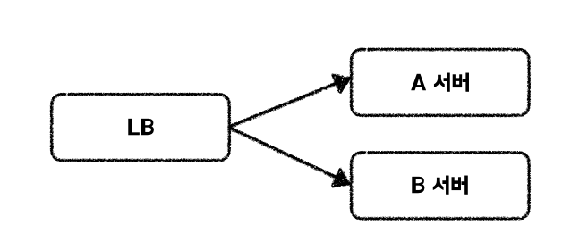

## ✔️ 헬스 체크 (Health Check)
<mark>**현재 서버의 상태가 정상인지 파악하는 것을 의미**</mark>합니다. API 엔드포인트를 호출하거나 특정 포트로 TCP 연결을 시도하는 방식을 사용할 수 있으며, `스프링 액추에이터(Spring Actuator)`를 활용하여 헬스체크 기능을 사용할 수 있습니다.

## ✔️ 헬스 체크의 필요성
서버가 헬스체크 기능을 제공하면 최신 코드를 배포할 때 신규 배포가 정상적으로 이뤄졌는지 확인할 수 있으며, 장애를 감지하여 대응할 수 있다는 이점이 있습니다.

장애 대응의 예시로, 로드 밸런서가 존재하고 트래픽 분산 대상 서버 2대(A, B)가 있을 때, A 서버의 헬스체크 결과가 비정상으로 판단되면 로드 밸런서는 A 서버를 트래픽 분산 대상에서 제외하고, 이후 B 서버로만 요청을 전달할 수 있습니다.

비정상 서버는 CPU, 메모리, I/O 자원이 고갈되었거나 내부 오류 상태일 가능성이 높습니다. 이러한 상태에서 요청이 전달되면, 정상 서버가 존재함에도 사용자는 오류 응답을 받을 수 있습니다. 또한, <mark>**클라이언트가 재시도를 수행할 경우 전체 트래픽이 증가할 위험**</mark>도 있습니다.