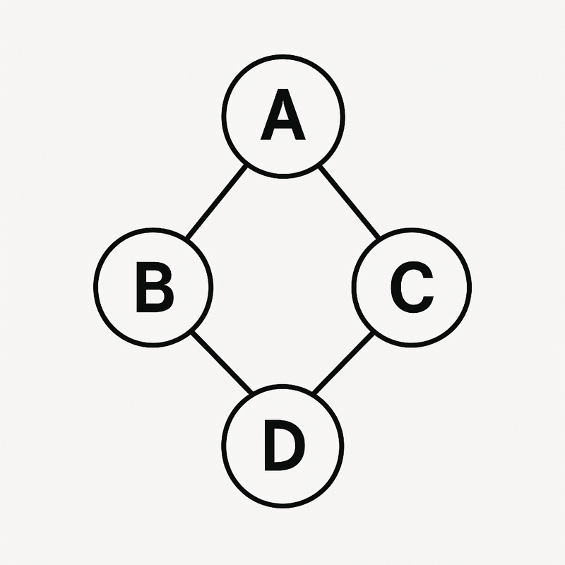

## ✔️ 객체 지향 프로그래밍(OOP, Object-Oriented Programming)
상태(필드)와 행위(메서드)를 가진 객체를 중심으로 프로그램을 설계하는 프로그래밍 패러다임입니다. 객체에 역할과 책임을 부여하고, 이 객체들이 서로 협력하는 방식으로 프로그램을 구성합니다.

## ✔️ 객체 지향 프로그래밍의 특징
### 캡슐화 (Encapsulation)
객체의 상태와 행위를 하나의 단위로 묶는 것을 말합니다. 내부 구현은 숨기고 외부에서 접근할 수 있는 인터페이스만 제공함으로써 객체의 무결성을 보호하고 코드의 유지보수성을 높일 수 있습니다.

### 추상화 (Abstraction)
불필요한 세부 사항을 감추고 핵심적인 기능만 간추려내는 것을 말합니다. 객체의 공통적인 특징은 추출하여 인터페이스 또는 추상 클래스로 정의하고, 구체적인 세부 사항은 구현체에게 위임함으로써 객체의 핵심 기능에만 집중할 수 있습니다.

### 다형성 (Polymorphism)
하나의 인터페이스가 여러 형태로 동작할 수 있는 것을 말합니다. 오버로딩과 오버라이딩을 사용하여 같은 메서드명이더라도 객체에 따라 다르게 동작하도록 할 수 있습니다.

### 상속 (Inheritance)
상위 클래스의 특징을 하위 클래스가 물려받아 확장하는 것을 말합니다. 기존 기능을 수정하지 않고 새로운 기능을 추가할 수 있어 확장성이 뛰어나고, 중복을 제거하여 코드의 재사용성을 높일 수 있습니다.

## ✔️ TDA(Tell Don't Ask) 원칙
객체의 데이터를 직접 요청하지 말고, 객체에게 필요한 동작을 수행하도록 메시지를 보내라는 원칙입니다. `TDA 원칙`을 따르면 캡슐화를 지킬 수 있고, 객체 스스로 데이터를 다루기 때문에 <mark>**객체의 응집도를 높이고 객체 간 결합도를 낮출 수 있습니다.**</mark>

### 위반 예시
```java
public class Account {

    private BigDecimal balance;
    
    public Account(BigDecimal balance) {
        this.balance = balance;
    }

    public BigDecimal getBalance() {
        return this.balance;
    }
    
    public void setBalance(BigDecimal balance) {
        this.balance = balance;
    }
}

Account account = new Account(BigDecimal.TEN);
BigDecimal withdrawalAmount = BigDecimal.ONE;

BigDecimal balance = account.getBalance(); // 객체의 데이터를 직접 가져와서 사용
if (balance.compareTo(withdrawalAmount) < 0) {
    throw new IllegalStateException("잔액이 부족합니다.");
}

balance = balance.subtract(withdrawalAmount);
account.setBalance(balance);
```

### 준수 예시
```java
public class Account {

    private BigDecimal balance;

    public Account(BigDecimal balance) {
        this.balance = balance;
    }

    public void withdraw(BigDecimal withdrawalAmount) {
        if (balance.compareTo(withdrawalAmount) < 0) {
            throw new IllegalStateException("잔액이 부족합니다.");
        }
        this.balance = balance.subtract(withdrawalAmount);
    }
}

Account account = new Account(BigDecimal.TEN);
BigDecimal withdrawalAmount = BigDecimal.ONE;

account.withdraw(withdrawalAmount); // 객체에 메시지 전달
```

## ✔️ 추상 클래스와 인터페이스의 차이
### 추상 클래스(Abstract Class)
공통된 기능을 재사용하려는 목적으로 사용됩니다. 일반 메서드와 추상 메서드를 포함할 수 있고, 인스턴스 변수를 가질 수 있습니다.

### 인터페이스(Interface)
구현을 강제하려는 목적으로 사용됩니다. 추상 메서드와 JDK 8부터 default 메서드를 포함할 수 있고, 상수만 가질 수 있습니다.

<mark>is-a 관계</mark>이거나 <mark>코드의 재사용이 중요한 경우</mark> **추상 클래스**를 사용하고, <mark>can-do 관계</mark>이거나 <mark>다중 상속이 필요한 경우</mark> **인터페이스**를 사용할 수 있습니다.

## ✔️ 다형성에서 오버로딩(Overloading)과 오버라이딩(Overriding)의 차이
### 오버로딩(Overloading)
클래스 내에서 같은 이름의 메서드를 여러 개 정의하는 것을 말합니다. 중요한 점은 매개변수의 개수, 타입, 순서가 달라야 합니다. 반환 타입만 다른 경우는 오버로딩이 성립하지 않습니다.

### 오버라이딩(Overriding)
상위 클래스의 메서드를 하위 클래스에서 재정의하는 것을 말합니다. 상위 클래스의 메서드 시그니처(메서드명, 매개변수 타입, 개수, 순서)와 반환 타입이 동일해야 하며, <mark>**접근 제어자는 상위 클래스와 같거나 더 넓은 범위로**</mark> 변경할 수 있습니다.

## ✔️ 다이아몬드 문제 (Diamond Problem)
다중 상속에서 발생하는 모호성 문제를 의미합니다.



예를 들어, A 클래스에 `hello()` 메서드가 있고, B와 C 클래스는 A 클래스를 상속받아 `hello()` 메서드를 오버라이딩합니다. 이때 B, C 클래스를 상속받는 D 클래스에서 `hello()` 메서드를 호출하면 어떤 클래스의 메서드를 호출해야 할지 모호해지는 문제가 발생합니다.

C++와 같이 다중 상속을 지원하는 언어는 이러한 문제를 적절히 해결해야 하며, Java에서는 클래스에 대한 다중 상속을 지원하지 않고 인터페이스에서만 허용됩니다.