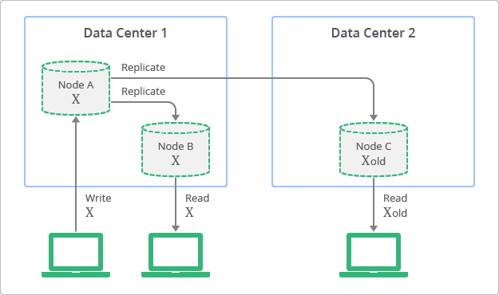
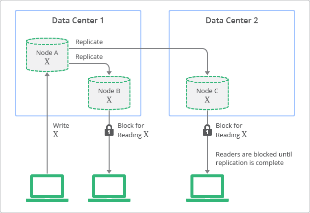

## ✔️ 최종적 일관성 (Eventual Consistency)
분산 시스템에서 고가용성을 유지하기 위해서 사용하는 일관성 모델입니다. 데이터가 수정되면, 그 변경 내용은 비동기적으로 다른 노드에 전파되기 때문에 일시적으로 각 노드의 데이터가 다를 수 있습니다. 하지만 시간이 지나면 모든 노드에 변경 사항이 전달되어 결국에는 모든 노드가 동일한 데이터를 가지게 되는 것을 의미합니다.

만약, 사용자가 특정 노드에 데이터를 수정하면 다른 노드에 변경 사항이 복제되는 상황을 가정하겠습니다.

위 구성은 <mark>**복제를 수행하고 있는 노드에 대해 조회 연산을 허용하여 높은 가용성을 유지**</mark>할 수 있으며, 최종적으로는 모든 노드가 같은 데이터를 가지고 있는 최종적 일관성을 달성할 수 있습니다. 하지만, <mark>**일시적인 데이터 불일치가 발생**</mark>하여 클라이언트는 오래된 데이터를 읽을 수 있다는 단점이 있습니다.

## ✔️ 강한 일관성 (Strong Consistency)
최종적 일관성과는 다르게, 특정 연산이 끝난 직후 모든 노드가 동일한 데이터를 갖도록 보장하는 것을 의미합니다. 즉, 사용자가 데이터를 수정한 직후 다른 노드에서 해당 데이터를 읽더라도, 반드시 최신 값을 얻게 됩니다.

예를 들어, 위 구성에서는 <mark>**복제가 완료되기 전까지 다른 노드의 읽기 연산을 차단**</mark>하여 강한 일관성을 달성할 수 있습니다. 하지만, 클라이언트로부터의 요청을 처리할 수 없다는 점에서 가용성이 희생된다는 단점이 있습니다.