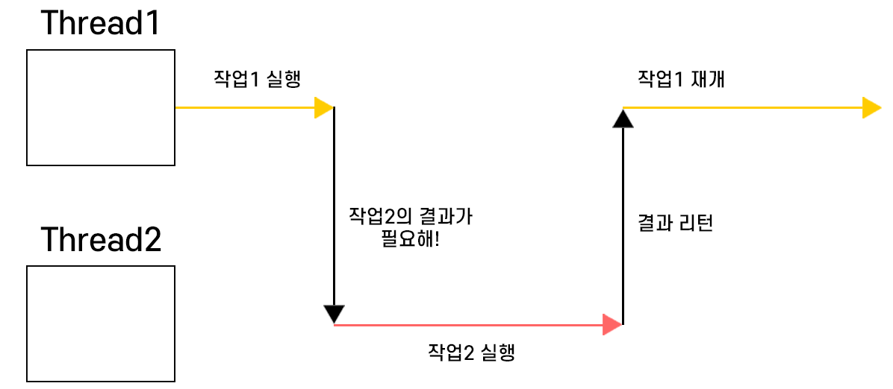
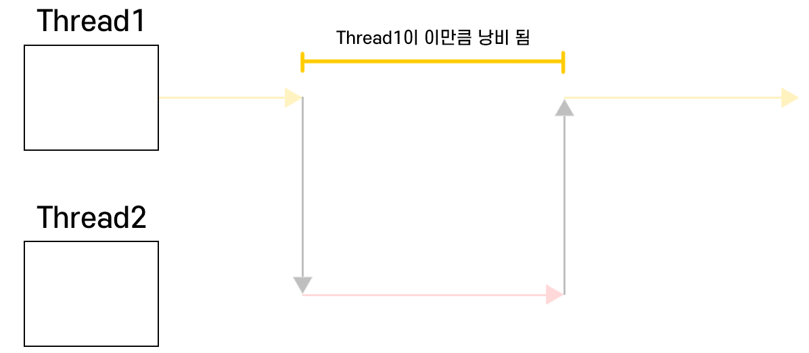
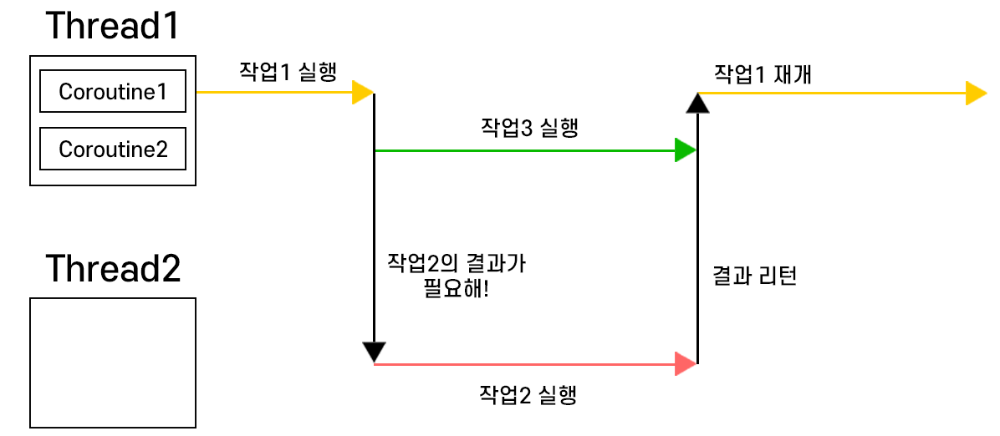
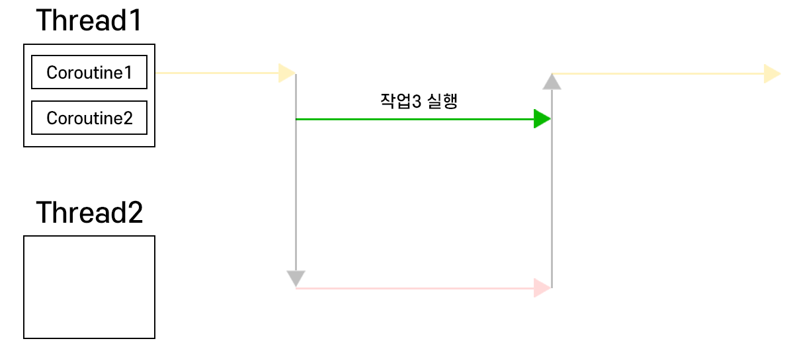
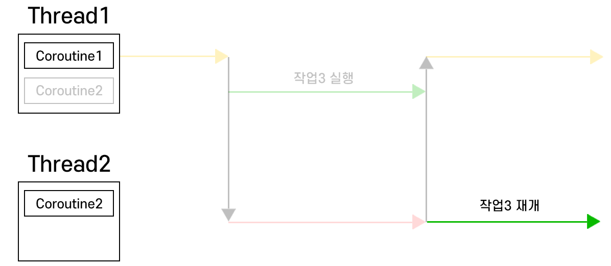
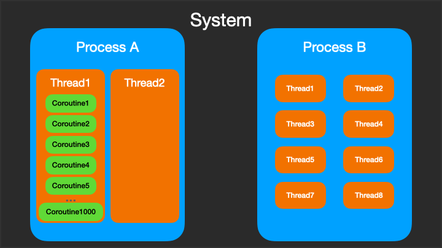

## ✔️ 메모리 사용량 차이
### 스레드
<mark>**각 스레드는 자체 스택 메모리를 필요로 하며, JVM에서 기본적으로 약 1MB의 스택 크기를 할당**</mark>합니다. 이 메모리는 스레드가 생성될 때 예약되며 스레드가 종료될 때까지 유지됩니다.
### 코루틴
코루틴은 스레드 내에서 실행되며 자체 스택을 필요로 하지 않습니다. 일반적으로 <mark>**코루틴은 단지 몇 KB의 메모리만 사용**</mark>합니다.

## ✔️ 컨텍스트 스위칭 비용
### 스레드
스레드 간 전환은 운영체제 수준의 컨텍스트 스위칭을 필요로 하며, 이는 CPU 레지스터, 메모리 맵 등의 상태를 저장하고 복원하는 비용이 큽니다.
### 코루틴
코루틴 간 전환은 <mark>**운영체제의 개입 없이 사용자 공간(user space)에서 발생**</mark>하며, 단순히 실행 지점과 로컬 변수 상태만 heap 메모리에 저장하면 됩니다.

## ✔️ 생성 및 관리 비용
### 스레드
새 스레드를 생성하는 것은 운영체제에 시스템 호출을 필요로 하며, 커널 수준의 리소스가 할당됩니다.
### 코루틴
코루틴 생성은 단순한 객체 할당과 유사하며, 운영체제 리소스를 직접 소비하지 않습니다.

## ✔️ 일시 중단 메커니즘
### 스레드
스레드는 블로킹 작업(I/O 등) 중에는 완전히 차단되어 다른 작업을 수행할 수 없습니다.


`작업2`의 결과가 리턴될 때까지 `Thread1`이 아무것도 안 하고 대기(blocking)합니다.


### 코루틴
코루틴은 일시 중단 지점(`suspend` 함수)에서 실행을 중단하고 기본 스레드를 해제하여 다른 코루틴이 사용할 수 있게 합니다. 이로써 수천 개의 코루틴을 소수의 스레드에서 효율적으로 실행할 수 있습니다.


`Thread1`이 결과를 기다리는 동안 대기하지 않고 `작업3`을 실행



#### 만약 작업 1이 재개되기 전까지 작업 3이 안 끝나면?


즉, 이렇게 코루틴은 스레드가 blocking 되어 낭비되는 일이 없도록, 루틴을 교환해가며 실행하기 때문에 빠르고 가볍습니다.


## ✔️ 코드 비교 예시
### 스레드
```java
// 1000개의 스레드를 생성하면 약 1GB의 메모리가 필요함
for (i in 1..1000) {
    Thread {
        // 각 스레드마다 작업 수행
        Thread.sleep(1000) // 스레드 블로킹
        println("Task $i completed")
    }.start()
}
```

### 코루틴
```kotlin
runBlocking {
    // 1000개의 코루틴을 생성해도 몇 MB의 메모리만 사용
    for (i in 1..1000) {
        launch {
            // 각 코루틴마다 작업 수행
            delay(1000) // 코루틴만 일시 중단, 스레드는 다른 코루틴 실행 가능
            println("Task $i completed")
        }
    }
}
```