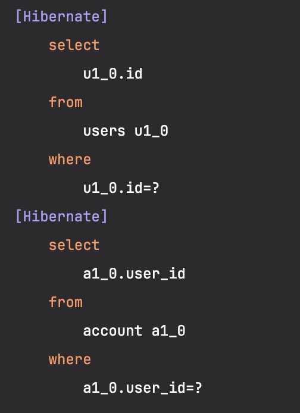

양방향 `@OneToOne`일 때 연관관계의 주인이 아닌 엔티티를 조회할 경우 Lazy Loading이 동작하지 않습니다.

JPA는 <mark>**연관된 엔티티가 없으면 null로 초기화하고, 있으면 Lazy Loading이 설정되어 있을 경우 프록시 객체로 초기화**</mark>합니다. 하지만 데이터베이스의 테이블 관점에서 보면, 연관관계의 주인이 아닌 엔티티는 연관관계를 참조할 FK가 없기 때문에 연관관계의 존재 여부를 알지 못합니다. 그래서 <mark>**JPA는 null 혹은 프록시 객체 중 무엇으로 초기화할지 결정할 수 없게 되고, 결과적으로 연관된 엔티티의 존재 여부를 확인하는 추가 쿼리를 실행**</mark>하기 때문에 Lazy Loading이 동작하지 않습니다.

JPA의 한계이기 때문에 단방향으로 모델링하거나 Lazy Loading이 정말 필요한 것인지 다시 검토해 보아야 합니다.

```java
// 연관 관계 주인이 아님
@Entity(name = "users")
public class User {
    @Id
    @GeneratedValue(strategy = GenerationType.IDENTITY)
    private Long id;

    @OneToOne(mappedBy = "user", fetch = FetchType.LAZY)
    private Account account;
}

// 연관 관계 주인
@Entity
public class Account {
    @Id
    @GeneratedValue(strategy = GenerationType.IDENTITY)
    private Long id;

    @OneToOne(fetch = FetchType.LAZY)
    @JoinColumn(name = "user_id") // 생략 가능
    private User user;
}
```
```java
@Test
void lazyTest() {
    userRepository.save(new User());

    userRepository.findById(1L).orElseThrow();
}
```


JPA에서 <mark>**연관관계의 주인(Owning side)**</mark>이라는 말은 <mark>**외래 키(Foreign Key)를 실제로 컬럼으로 가지고 있는 쪽을 의미**</mark>합니다.

`User` 엔티티에서 `mappedBy = "user"`라고 명시되어 있으므로, 위 코드에서 연관관계의 주인은 `Account` 엔티티입니다.

`Account` 테이블에는 `user_id`라는 외래키 컬럼이 존재하지만, `User` 테이블에는 `account_id` 같은 컬럼은 없습니다.
따라서 JPA 입장에서는 `User`를 조회할 때, 그에 해당하는 `Account`가 존재하는지를 확인하기 위해서는 직접 쿼리를 날려서 찾아봐야 합니다.
왜냐하면 `User` 테이블에는 `Account`가 있는지 직접적으로 알 수 있는 컬럼(FK)이 없기 때문입니다.

즉, 연관관계의 주인이 아닌 `User` 엔티티는 (DB 테이블에) 외래 키를 직접 가지고 있지 않기 때문에, `JPA`는 연관된 엔티티가 존재하는지 여부를 알 수 없고, 추가 쿼리를 통해 확인할 수 밖에 없습니다.

### ❗문제: @OneToOne(fetch = LAZY)가 기대한 대로 동작하지 않는 이유
일대일 양방향 매핑에서 소유자가 아닌 쪽(`Account`)에서는 외래키가 없으므로, `Hibernate`는 해당 관계가 존재하는지 알 수 없습니다.
따라서 연관 대상이 없을 수도 있다는 판단을 하려면, 무조건 추가 쿼리로 확인해야 합니다. 이로 인해 항상 `EAGER` 로딩처럼 동작하게 됩니다.

### ✅ 해결책 1 – `optional = false` 설정 (`Hibernate` 특정 버전 한정)
```java
// 연관 관계 주인이 아님
@Entity(name = "users")
public class User {
  @Id
  @GeneratedValue(strategy = GenerationType.IDENTITY)
  private Long id;

  @OneToOne(mappedBy = "user", fetch = FetchType.LAZY, optional = false)
  private Account account;
}
```
이 설정은 `Account`가 null이 아님을 보장하므로 프록시 초기화가 가능해집니다.  
❗하지만 모든 `Hibernate` 버전에서 지원되는 것은 아닙니다. 적용 여부는 버전 별 동작 확인이 필요합니다.

### ✅ 해결책 2 – @MapsId 이용한 단방향 공유 PK 매핑 (가장 안정적)
```java
@Entity(name = "users")
public class User {
    @Id
    @GeneratedValue(strategy = GenerationType.IDENTITY)
    private Long id;
    
    // no reference to Account
}

@Entity
public class Account {
    @Id
    @GeneratedValue(strategy = GenerationType.IDENTITY)
    private Long id;

    @OneToOne // FetchType fetch() default FetchType.EAGER;
    @MapsId
    @JoinColumn(name = "id")
    private User user;
}
```
`User`와 `Account`가 동일한 PK를 공유하며, `Account`가 `User`의 `ID`를 외래키로도 사용합니다.
이렇게 하면 불필요한 외래키 컬럼 없이 단방향 매핑으로 구성할 수 있고, 필요할 때 `EntityManager.find(Account.class, user.getId())`처럼 직접 호출하여 지연 로딩처럼 사용할 수 있습니다

`@OneToOne`에 fetch 타입을 명시하지 않았기 때문에, 기본값인 `FetchType.EAGER`로 동작합니다.  
즉, `Account`를 조회하면 자동으로 `User`도 함께 조회됩니다.

## 📌 fetch 타입 기본 값
| 관계 어노테이션 | FetchType 기본 값    |
|----------------|-------------------|
| `@OneToOne`    | `FetchType.EAGER` |
| `@ManyToOne`   | `FetchType.EAGER` |
| `@OneToMany`   | `FetchType.LAZY`  |
| `@ManyToMany`  | `FetchType.LAZY`  |